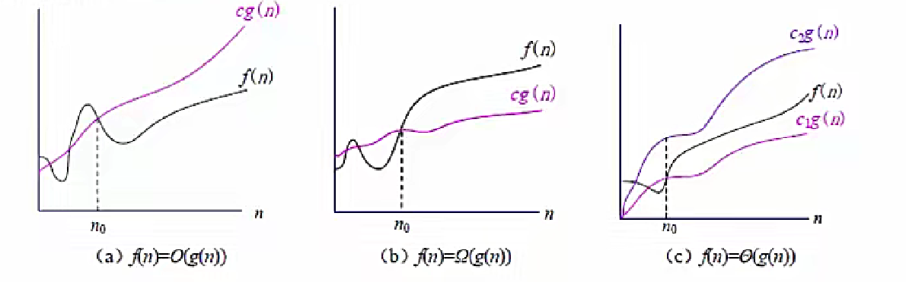
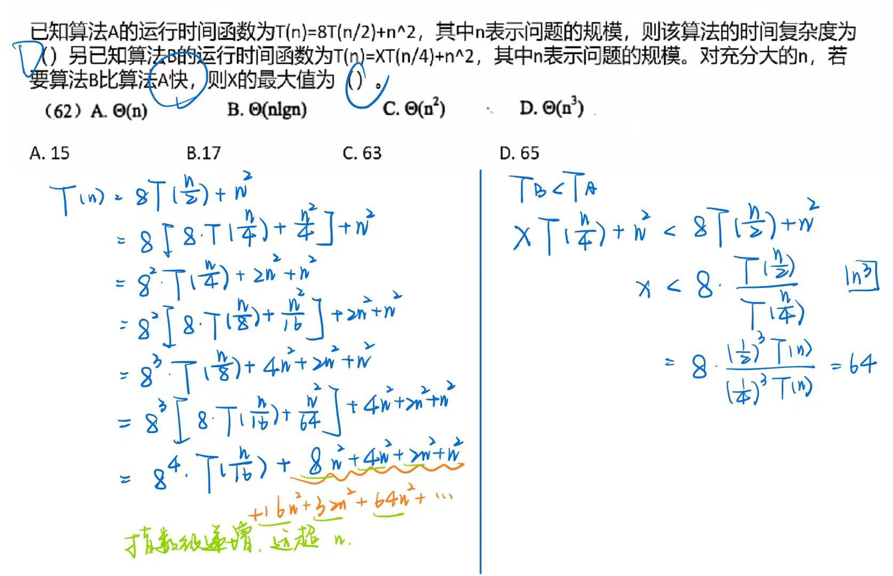
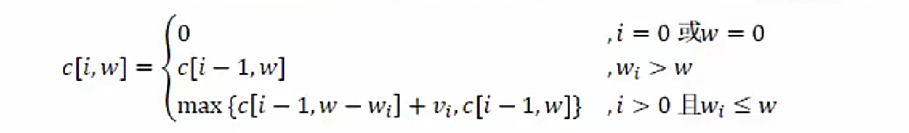
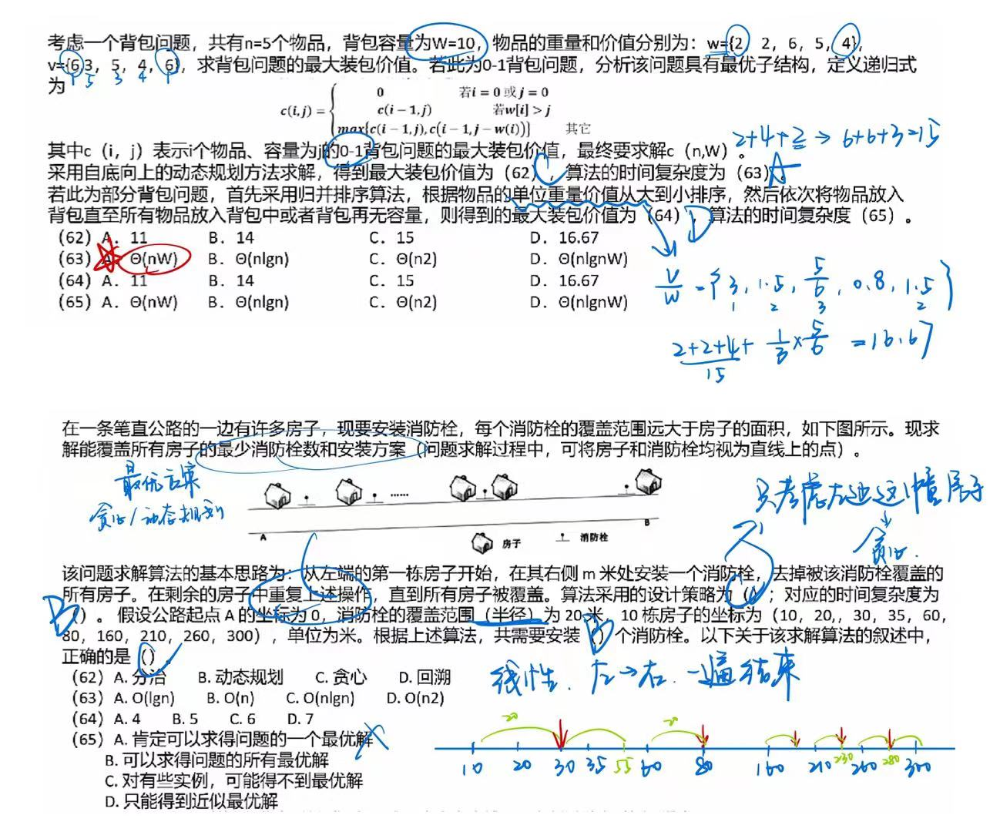

# 算法分析与设计

## 算法特性

算法（Algorithm）是**对特定问题求解步骤的一种描述，它是指令的有限序列，其中每一条指令表示一个或多个操作**。此外，一个算法还具有下列 5 个重要特性。

1. 有穷性。一个算法必须总是（对任何合法的输入值）在执行有穷步之后结束，且每一步都可在有穷时间内完成。
2. 确定性。算法中的每一条指令必须有确切的含义，理解时不会产生二义性。并且在任何条件下，算法只有唯一的一条执行路径，即对于相同的输入只能得出相同的输出。
3. 可行性。一个算法是可行的，即算法中描述的操作都可以通过已经实现的基本运算执行有限次来实现。
4. 输入。一个算法**有零个或多个**输入，这些输入取自于某个特定的对象的集合。
5. 输出。一个算法**有一个或多个**输出，这些输出是同输入有着某些特定关系的

## 时间复杂度

算法的时间复杂度分析：主要是**分析算法的运行时间**，即算法**执行所需要的基本操作数。不同规模的输入所需要的基本操作数是不相同**。在算法分析中，**可以建立以输入规模n为自变量的函数T(n)来表示算法的时间复杂度**。 

即使对于**相同的输入规模，数据分布不相同也影响了算法执行路径的不同**，因此所需要的执行时间也不同。根据不同的输入，将算法的时间复杂度分析分为3种情况：最佳情况、最坏情况、平均情况。 

渐进符号：以输入规模n为自变量建立的时间复杂度实际上还是较复杂的，例如`an²+bn+c`，不仅与输入规模有关，还与系数a、b和c有关。此时可以**对该函数做进一步的抽象，仅考虑运行时间的增长率或称为增长的量级**，如忽略上式中的低阶项和高阶项的系数，仅考虑n²。**当输入规模大到只有与运行时间的增长量级有关时，就是在研究算法的渐进效率**。也就是说，**从极限角度看，只关心算法运行时间如何随着输入规模的无限增长而增长**。下面简单介绍3种常用的标准方法来简化算法的渐进分析。 

1. O 记号。定义为：给定一个函数 g (n)，`O (g (n))=f (n)`: 存在正常数 c 和 n0，使得对所有的 n≥n0，有 `0≤f (n)≤g (n)}`，如图（a）所示。**O (g (n)) 表示一个函数集合，往往用该记号给出一个算法运行时间的渐进上界。考试中一般只涉及到 O 符号**。
2. Ω 记号。定义为：给定一个函数 g (n)，`Ω(g (n))=f (n)`: 存在正常数 c 和 n0，使得**对所有的 n≥n0，有 0≤g (n)≤f (n)}**，如图（b）所示。**Ω(g (n)) 表示一个函数集合，往往用该记号给出一个算法运行时间的渐进下界**。
3. Θ 记号。定义为：给定一个函数 g (n)，`Θ(g (n))=f (n)`: 存在正常数 c1、c2 和 n0，使得**对所有的 n≥n0 ，有 `0≤c1g (n)≤f (n)≤c2g (n)`**，如图（c）所示。**Θ(g (n)) 表示一个函数集合，往往用该记号给出一个算法运行时间的渐进上界和渐进下界，即渐进紧致界**。



#### 常数级

```python
sum = 0
n = 100
sum = (1+n)*/2
print(sum)
```

### 平方级

```js
for(const i = 0, i < n, i++) {
    for(const j = 0, j < n, j++) {
        ...
    }
    ...
}

```

#### 线性级

```c
int 1;
for(i = 0; i < n; i++) {
    ...
}
```

### 对数级

> 两两归并，折半查找之类

```c
int count = 1;
while (count < n) {
    count = count * 2;
    ...
}
```

...

## 递归

递归是指**子程序（或函数）直接调用自己**或通过一系列调用语句**间接调用自己**，是一种描述问题和解决问题的常用方法。递归有两个基本要素：**边界条件，即确定递归到何时终止，也称为递归出口；递归模式，即大问题是如何分解为小问题的，也称为递归体**。 

阶乘函数可递归地定义为：

```
n! = { i      , n = 0 // 边界条件，递归结束
	   n(n-1)!, n > 0

```

阶乘函数的自变量n的定义域是非负整数。递归式的**第一式给出了这个函数的一个初始值**，是递归的边界条件。递归式的**第二式是用较小自变量的函数值来表示较大自变量的函数值的方式来定义n的阶乘**，是递归体。n!可以递归地计算如下： 

```c
int Factorial(int num){
    if(num==0) 
         return 1; 
    if(num>0) 
        return num * Factorial(num - 1); 
}
```

递归算法的时间复杂度分析方法：将递归式中**等式右边的项根据递归式进行替换，称为展开**。展开后的项被再次展开，如此下去，直到得到一个求和表达式，得到结果。
下面书上例子有误，应该是 T (n)=T (n - 1)+n

例：求*T*(*n*)={1 (*n*=1); T(n−1)  (n>1) }的解。

解：*T*(*n*)=*T*(*n*−1)+*n*
=*T*(*n*−2)+(*n*−1)+*n*
=⋮
=1+2+⋯+(*n*−1)+*n*
=*n*(*n*+1)/2



## 分治法

> 归并排序、折半查找...
>
> 子问题互相独立且相同

分治法的设计思想是**将一个难以直接解决的大问题分解成一些规模较小的相同问题**，以便各个击破，分而治之。如果规模为 n 的问题可分解成 k 个子问题，1<k≤n，这些子问题互相独立且与原问题相同。分治法产生的子问题往往是原问题的较小模式，这就为递归技术提供了方便。
一般来说，分治算法在**每一层递归上都有 3 个步骤**。

1. **分解**。将原问题分解成一系列子问题。
2. **求解**。递归地求解各子问题。若子问题足够小则直接求解。
3. **合并**。将子问题的解合并成原问题的解。

凡是涉及到**分组解决**的都是分治法，例如归并排序算法完全依照上述分治算法的 3 个步骤进行。

1. 分解。将 n 个元素分成各含 n/2 个元素的子序列。
2. 求解。用归并排序对两个子序列递归地排序。
3. 合并。合并两个已经排好序的子序列以得到排序结果。

## 动态规划法

> 子问题不一定独立，也不一定相同
>
> 用于求全局最优解，最优子结构

动态规划算法与分治法类似，其**基本思想也是将待求解问题分解成若干个子问题，先求解子问题，然后从这些子问题的解得到原问题的解**。与分治法不同的是，适合用动态规划法求解的问题，**经分解得到的子问题往往不是独立的**。若用分治法来解这类问题，则相同的子问题会被求解多次，以至于最后解决原问题需要耗费指数级时间。

然而，不同子问题的数目常常只有**多项式量级**。如果**能够保存已解决的子问题的答案，在需要时再找出已求得的答案**，这样就可以避免大量的重复计算，从而得到多项式时间的算法。为了达到这个目的，可以用**一个表来记录所有已解决的子问题的答案**。不管该子问题以后是否被用到，**只要它被计算过，就将其结果填入表中**。这就是动态规划法的基本思路。

动态规划算法**通常用于求解具有某种最优性质的问题**。在这类问题中，可能会有许多可行解，每个解都对应于一个值，我们希望找到**具有最优值（最大值或最小值）的那个解**。当然，最优解可能会有多个，动态规划算法能找出其中的一个最优解。设计一个动态规划算法，通常按照以下几个步骤进行。

1. **找出最优解的性质，并刻画其结构特征**：分析最优解具备哪些特性，从结构层面明确其组成等情况，为后续步骤打基础 。比如在背包问题中，要先确定最优装载方案在物品选择组合等方面呈现出的性质。
2. **递归地定义最优解的值**：通过递归的形式来描述最优解的计算方式。像在计算斐波那契数列（可利用动态规划优化）时，用 \(F(n)=F(n - 1)+F(n - 2)\)（\(n>1\)），\(F(0)=0,F(1)=1\) 这样递归定义数列值。 
3. **以自底向上的方式计算出最优值**：从规模最小的子问题开始计算，逐步向上推出更大规模问题的最优值。例如计算斐波那契数列第 \(n\) 项，从最开始的 \(F(0)\) 和 \(F(1)\) 出发，依次算出 \(F(2),F(3),...,F(n)\) 。
4. 根据计算最优值时得到的信息，**构造一个最优解** ：若只需求最优值，此步骤可省；若要得到具体的最优解方案，就需依据前面计算过程留存的信息来构建。比如在任务调度问题中，根据之前计算各阶段任务安排的最优值情况，确定具体的任务执行顺序。

#### 适用动态规划法的问题性质

1. **最优子结构**：若**问题最优解包含子问题最优解**，就具备该性质。如矩阵连乘问题，整个矩阵链相乘的最优计算顺序中，其子矩阵链相乘的顺序也是最优的。此时动态规划可能适用，**但贪心算法也可能可行**。
2.  **重叠子问题**：递归求解原问题时，**反复求解相同子问题，而非不断产生新子问题**。如在计算斐波那契数列中，计算 \(F(n)\) 时，\(F(n - 1)\) 和 \(F(n - 2)\) 会被多次重复计算 ，这就是重叠子问题。 

#### 🔺典型应用：0-1 背包问题

> 0-1 每个物品全放或全不放
>
> 🔺时间复杂度：`O(nW)`

有 n 个物品，第 i 个物品**价值为 `vi`，重量为 `wi`**，其中 `vi` 和 `wi` 均为非负数，背包的容量为 W，W 为非负数。现需要考虑如何选择装入背包的物品，使装入背包的物品总价值最大。

满足约束条件的任一集合` (x1, x2, …, xn)` 是问题的一个可行解，问题的目标是要求问题的一个最优解。考虑一个实例，假设 n = 5，W = 17，每个物品的价值和重量如表所示，可将物品 1、2 和 5 装入背包，背包未满，获得价值 22，此时问题解为`（1, 1, 0, 0, 1）`；也可以将物品 4 和 5 装入背包，背包装满，获得价值 24，此时解为`（0, 0, 0, 1, 1）`。

| 物品编号 | 1    | 2    | 3    | 4    | 5    |
| -------- | ---- | ---- | ---- | ---- | ---- |
| 价值 v   | 4    | 5    | 10   | 11   | 13   |
| 重量 w   | 3    | 4    | 7    | 8    | 9    |

1. 刻画 0 - 1 背包问题的最优解的结构。
   可以将背包问题的求解过程看作是进行一系列的决策过程，即**决定哪些物品应该放入背包，哪些物品不放入背包**。如果一个问题的**最优解包含了物品 n**，即 `xn = 1`，那么**其余 `x1, x2, …, xn - 1` 一定构成子问题 `1, 2, …, n - 1` 在容量为 `W - wn` 时的最优解**。如果这个最优解不包含物品 n，即 `xn = 0`，那么**其余 `x1, x2, …, xn - 1` 一定构成子问题 `1, 2, …, n - 1` 在容量为 W 时的最优解**。
2. 递归定义最优解的值。
   根据上述分析的最优解的结构递归地定义问题最优解。设 **c [i, w] 表示背包容量为 w 时 i 个物品导致的最优解的总价值**，得到下式。显然，问题要求 c [n, W]。



 ## 贪心法

> 动态规划法是从全局角度考虑的，一定能得到全局的最优解
>
> 贪心法不一定

和动态规划法一样，贪心法也**经常用于解决最优化问题**。与与动态规划法不同的是，贪心法在解决问题的策略上是**仅根据当前已有的信息做出选择，而且一旦做出了选择，不管将来有什么结果，这个选择都不会改变**。换而言之，贪心法**并不是从整体最优考虑，它所做出的选择只是在某种意义上的局部最优**。这种局部最优选择**并不能保证总能获得全局最优解，但通常能得到较好的近似最优解**。

贪心法问题一般具有两个重要的性质：

1. **最优子结构**。当一个问题的最优解包含其子问题的最优解时，称此问题具有最优子结构。问题具有最优子结构是该问题可以采用动态规划法或者贪心法求解的关键性质。
2. **贪心选择性质**。指问题的整体最优解可以通过一系列局部最优的选择，即贪心选择来得到。这是贪心法和动态规划法的主要区别。证明一个问题具有贪心选择性质也是贪心法的一个难点。

#### 🔺典型应用：背包问题

> 每个物品可以部分放入

背包问题的定义与 0 - 1 背包问题类似，但是**每个物品可以部分装入背包**，即在 0 - 1 背包问题中，xi = 0 或者 xi = 1；而在背包问题中，0≤xi≤1。

为了更好地分析该问题，考虑一个例子：n = 5，W = 100，下表给出了各个物品的重量、价值和单位重量的价值。假设物品已经按其单位重量的价值从大到小排好序。

| 物品 i | 1    | 2    | 3    | 4    | 5    |
| ------ | ---- | ---- | ---- | ---- | ---- |
| wi     | 30   | 10   | 20   | 50   | 40   |
| vi     | 65   | 20   | 30   | 60   | 60   |
| vi/wi  | 2.1  | 2    | 1.5  | 1.2  | 1    |

为了得到最优解，**必须把背包装满**。现在用贪心策略求解，首先要选出**度量的标准**。

1. 按**最大价值**先放背包的原则。
2. 按**最小重量**先放背包的原则。
3. 按**最大单位重量价值**先放背包的原则。

## 回溯法

概念：有“**通用的解题法**”之称，可以**系统地搜索一个问题的所有解或任一解**。在包含问题的所有解的解空间树中，按照**深度优先的策略**，从根节点出发搜索解空间树。搜索至任一结点时，总是**先判断该结点是否肯定不包含问题的解**，如果不包含，则跳过对以该结点为根的子树的搜索，**逐层向其祖先结点回溯**；否则，进入该子树，继续按深度优先的策略进行搜索。

可以理解为先进行深度优先搜索，一直向下探测，当此路不通时，返回上一层探索另外的分支，重复此步骤，这就是回湖，意为先一直探测，当不成功时再返回上一层。

一般用于**解决迷宫类**的问题。


例：



---

(2018 加上之后没考过，了解即可)

## 其他算法

### 分支限界法

原理：在分支限界法中，**每一个活结点只有一次机会成为扩展结点**。活结点一旦成为扩展结点，就**一次性产生其所有儿子结点**（广度优先）。在这些子结点中，导致**不可行解或导致非最优解的儿子结点被舍弃，其余儿子结点被加入活结点表中**。此后，**从活结点表中取下一结点成为当前扩展结点**，并重复上述结点扩展过程。这个过程一直持续到找到所需的解或活结点表为空时为止。

> 活结点：还没有被搜索的节点
>
> 扩展节点：正在被搜索的节点

与回溯法的区别：

1. 求解目标是找出满足约束条件的一个解，或是在满足约束条件的解中找出使某一目标函数值达到**极大或极小的解，即在某种意义下的最优解**。
2. 以**广度优先或以最小耗费（最大收益）优先的方式**搜索解空间树。

从活节点表中选择下一个扩展节点的类型：

队列式（FIFO）分支限界法：按照**队列先进先出（FIFO）原则**选取下一个节点为扩展节点。

优先队列式分支限界法：按照**优先队列中规定的优先级**选取优先级最高的节点成为当前扩展节点。

### 概念算法

原理：在算法执行某些步骤时，**可以随机地选择下一步该如何进行，同时允许结果以较小的概率出现错误**，并以此为代价，**获得算法运行时间的大幅度减少（降低算法复杂度）**。 

> 违反了算法五个特性中的 确定性、正确性

基本特征是对所求解问题的**同一实例用同一概率算法求解两次，可能得到完全不同的效果**。 

√ 如果一个问题没有有效的确定性算法可以在一个合理的时间内给出解，但是该问题能接受小概率错误，那么采用概率算法就可以快速找到这个问题的解。 

四类概率算法：数值概率算法（数值问题的求解）、蒙特卡洛算法（求问题的精确解）、拉斯维加斯算法（不会得到不正确的解）、舍伍德算法（总能求得问题的一个正确解）。 

概率算法的特征：

1. 概率算法的输入包括两部分，一部分是原问题的输入，另一部分是一个供算法进行随机选择的随机数序列。 
2. 概率算法在运行过程中，包括一处或多处随机选择，根据随机值来决定算法的运行路径。
3. 概率算法的结果不能保证一定是正确的，但能限制其出错概率。
4. 概率算法在不同的运行过程中，对于相同的输入实例可以有不同的结果，因此，对于相同的输入实例，概率算法的执行时间可能不同。 

### 近似算法

原理：解决**难解问题的一种有效策略**，其基本思想是**放弃求最优解，而用近似最优解代替最优解**，以换取算法设计上的简化和时间复杂度的降低。 

虽然它可能找不到一个最优解，但它**总会给待求解的问题提供一个解**。 

为了具有**实用性**，近似算法必须能够给出**算法所产生的解与最优解之间的差别或者比例的一个界限**，它保证任意一个实例的近似最优解与最优解之间的相差程度。显然，这个差别越小，近似算法越具有实用性。 

衡量近似算法性能两个标准：

1. **算法的时间复杂度**。近似算法的时间复杂度必须是多项式阶，这是近似算法的基本目标。 
2. **解的近似程度**。近似最优解的近似程度也是设计近似算法的重要目标。近似程度与近似算法本身、问题规模，乃至不同的输入实例有关。 

 ## 数据挖掘算法（以大数据为基础）

分析**爆炸式增长的各类数据的技术**，以发现**隐含在这些数据中的有价值的信息和知识**。数据挖掘利用机器学习方法对多种数据进行分析和挖掘。其核心是算法，主要功能包括**分类、回归、关联规则和聚类**等。 

分类（了解即可）

- 是一种有**监督的学习过程**，根据**历史数据**预测未来数据的模型。 

- 分类的数据对象属性：一般属性、分类属性或目标属性。 

- 分类设计的数据：训练数据集、测试数据集、未知数据。 

- 数据分类的两个步骤：**学习模型**（基于训练数据集采用分类算法建立学习模型）、**应用模型**（应用测试数据集的数据到学习模型中，根据输出来评估模型的好坏以及将未知数据输入到学习模型中，预测数据的类型）。  

- 分类算法：决策树归纳（自顶向下的递归树算法）、朴素贝叶斯算法、后向传播BP、支持向量机SVM。 

### 频繁模式和关联规则挖掘

挖掘**海量数据中的频繁模式和关联规则**可以有效地指导企业发现交叉销售机会、进行**决策分析和商务管理**等。（沃尔玛 - 啤酒尿布故事） 

首先要求出数据集中的频繁模式，然后由频繁模式产生关联规则。 

关联规则挖掘算法：类Apriori算法、基于频繁模式增长的方法如FP - growthh，使用垂直数据格式的算法，如ECLAT。 

### 聚类 

> 分类是依据已有的规则，是有监督的学习过程
>
> 聚类是无意识的过程，观察出的特征

是一种**无监督学习过程。根据数据的特征，将相似的数据对象归为一类**，不相似的数据对象归到不同的类中。物以类聚，人以群分。

典型算法：基于划分的方法、基于层次的方法、基于密度的方法、基于网格的方法、基于统计模型的方法。

### 数据挖掘的应用

数据挖掘在多个领域已有成功的应用。在银行和金融领域，可以进行贷款偿还预测和顾客信用政策分析、针对定向促销的顾客分类与聚类、洗黑钱和其他金融犯罪侦破等；在零售和电信业，可以进行促销活动的效果分析、顾客忠诚度分析、交叉销售分析、商品推荐、欺骗分析等。 

## 智能优化算法（以数学为基础）

优化技术是一种**以数学为基础**，用于**求解各种工程问题优化解**的应用技术。

人工神经网络ANN：一个**以有向图为拓扑结构的动态系统，通过对连续或断续的输入作状态响应而进行信息处理**。从信息处理角度对**人脑神经元网络进行抽象**，建立某种简单模型，按不同的连接方式组成不同的网络。

遗传算法：源于模拟达尔文的“优胜劣汰、适者生存”的进化论和孟德尔·摩根的遗传变异理论，**在迭代过程中保持已有的结构，同时寻找更好的结构**。其本意是**在人工适应系统中设计一种基于自然的演化机制**。 

模拟退火算法SA：求解**全局优化**算法。基本思想来源于物理退火过程，包括三个阶段：**加温阶段、等温阶段、冷却阶段**。将固体加温至充分高，再让其徐徐冷却，加温时，固体内部粒子随温升变为无序状，内能增大，而徐徐冷却时粒子渐趋有序，在每个温度都达到平衡态，最后在常温时达到基态，内能减为最小。 

禁忌搜索算法TS：模拟**人类智力过程的一种全局搜索算法**，是对局部邻域搜索的一种扩展。从一个初始可行解出发，选择一系列的特定搜索方向（移动）作为试探，选择实现让特定的目标函数值变化最多的移动。为了避免陷入局部最优解，TS搜索中采用了一种**灵活的“记忆”技术，对已经进行的优化过程进行记录和选择，指导下一步的搜索方向**，这就是Tabu表的建立。 

### 蚁群算法 

是一种用来寻找优化路径的概率型算法。

单个蚂蚁的行为比较简单，但是蚁群整体却可以体现一些智能的行为。例如**蚁群可以在不同的环境下，寻找最短到达食物源的路径**。这是因为蚁群内的蚂蚁可以通过某种信息机制实现信息的传递。后又经进一步研究发现，蚂蚁会在其经过的路径上释放一种可以称之为**“信息素”的物质**，蚁群内的蚂蚁对“信息素”具有感知能力，它们**会沿着“信息素”浓度较高路径行走**，而每只路过的蚂蚁都会在路上留下“信息素”，这就形成一种类似正反馈的机制，这样经过一段时间后，整个蚁群就会沿着最短路径到达食物源了。

用**蚂蚁的行走路径表示待优化问题的可行解，整个蚂蚁群体的所有路径构成待优化问题的解空间。路径较短的蚂蚁释放的信息素量较多**，随着时间的推进，较短的路径上累积的信息素浓度逐渐增高，选择该路径的蚂蚁个数也愈来愈多。最终，整个蚂蚁会在正反馈的作用下集中到最佳的路径上，此时对应的便是待优化问题的最优解。 

### 粒子群优化算法PSO

设想这样一个场景：一群鸟在随机搜索食物。在这个区域里只有一块食物。所有的鸟都不知道食物在哪里。但是**它们知道当前的位置离食物还有多远**。那么找到食物的最优策略是什么呢。**最简单有效的就是搜寻目前离食物最近的鸟的周围区域。**

PSO从这种模型中得到启示并用于解决优化问题。PSO中，**每个优化问题的解都是搜索空间中的一只鸟**。我们称之为“**粒子**”。所有的粒子都有一个由**被优化的函数决定的适应值(fitness value)**，每个粒子还有一个**速度决定他们飞翔的方向和距离**。然后粒子们就追随当前的最优粒子在解空间中搜索。

PSO**初始化为一群随机粒子(随机解)**。然后通过迭代找到最优解。在每一次迭代中，粒子通过跟踪两个“极值”来更新自己。第一个就是**粒子本身所找到的最优解，这个解叫做个体极值pBest**。另一个极值是**整个种群目前找到的最优解，这个极值是全局极值gBest**。另外也可以不用整个种群而只是用其中一部分作为粒子的邻居，那么在所有邻居中的极值就是局部极值。 


