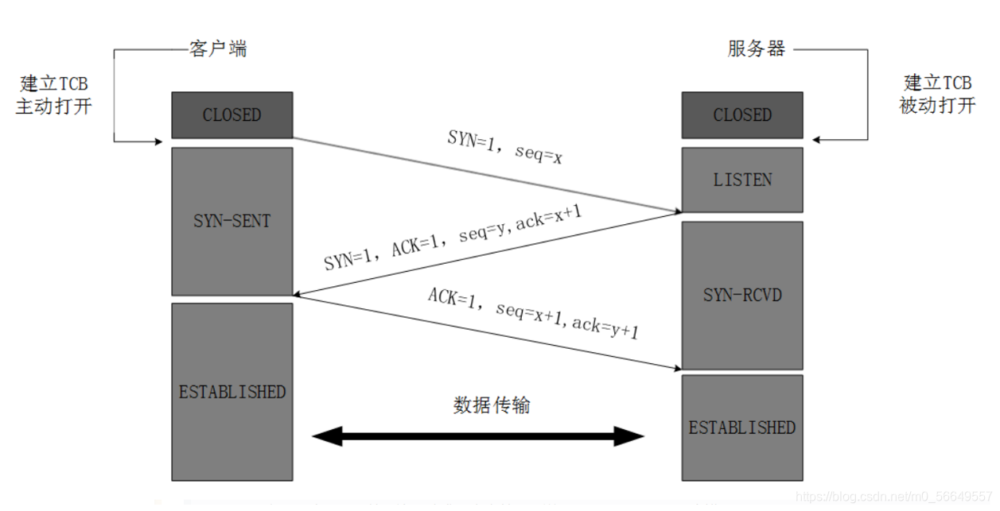

# 计算机网络

### 计算机网络的功能和分类

计算机网络是计算机技术与通信技术相结合的产物，它实现了远程通信、远程信息处理和资源共享。

计算机网络的功能：**数据通信、资源共享、负载均衡、高可靠性**。（资源子网、通信子网）

> 负载均衡：访问量比较大，将其均匀负载到多台计算机上

计算机网络按分布范围和拓扑结构划分如下图所示： 


总线型（利用率低、干扰大、价格低）

> 总线理解为一条网线，不能同时有两个发送方，会产生冲突；可以有多个接收方

星型（交换机形成的局域网、中央单元负荷大）

> 中央单元：e.g. 路由器

环型（流动方向固定、效率低扩充难）

树型（总线型的扩充、分级结构）

分布式（任意节点连接管理难成本高）


## OSI 七层模型

| 层            | 功能                                                         | 单位   | 协议                                                         | 设备                  |
| ------------- | ------------------------------------------------------------ | ------ | ------------------------------------------------------------ | --------------------- |
| 1. 物理层     | **在链路上透明地传输位**。需要完成的工作包括线路配置、确比特定数据传输模式、确定信号形式、对信号进行编码、连接传输介质。为此定义了建立、维护和拆除物理链路所具备的机械特性、电气特性、功能特性以及规程特性。（提供信道之间的传输） | 比特   | EIA/TIA RS-232、RS-449、V.35、RJ-45、FDDI                    | 中继器、集线器（HUB） |
| 2. 数据链路层 | 把**不可靠的信道变为可靠的信道**。为此将比特组成，在链路上提供点到点（终端）的帧传输，并进行差错控制、流量控制等。 | 帧     | SDLC、HDLC、LAPB、PPPSTP、帧中继等、IEEE802、ATM<br/>（局域网） | 交 换器、网桥         |
| 3. 网络层     | 在**源节点-目的节点之间进行路由选择、拥塞控制、顺序控制、传送包，保证报文的正确性**。网络层控制着通信子网的运行，因而它又称为通信子双层。（IP地址） | IP分组 | IP、ICMP、IGMP、ARP、RARP                                    | 路由器                |
| 4. 传输层     | 提供🔺**端-端间可靠的、透明的数据传输**，保证报文顺序的正确性、数据的完整性。（端口号 ） | 报文段 | TCP、UDP                                                     | 网关                  |
| 5. 会话层     | 建立**通信进程的逻辑名字与物理名字之间的联系**，提供**进程之间建立、管理和终止会话的方法，处理同步与恢复**问题。 |        | RPC、 SQL、 NFS                                              | 网关                  |
| 6. 表示层     | 实现**数据转换**（包括格式转换、压缩、加密等），提供标准的应用接口、公用的通信服务，公共数据表示方法。 |        | JPEG、 ASCII、GIF、MPEG、DES                                 | 网关                  |
| 7. 应用层     | 对用户不透明的**提供各种服务**，如E-mail。                   | 数据   | Telnet、 FTP、 HTTP、SMTP、POP3、DNS、DHCP等                 | 网关                  |

#### 局域网和广域网协议

以太网规范**`IEEE 802.3`**（有线） 是重要的局域网协，包括：
```
IEEE 802.3    标准以太网   10Mb/s   传输介质为细同轴电缆双绞线
IEEE 802.3u   快速以太网   100Mb/s  双绞线
IEEE 802.3z   千兆以太网   1000Mb/s 光纤或双绞线
IEEE 802.3ae  万兆以太网   10Gb/s   光纤
```

无线局域网 WLAN 技术标准：**`IEEE 802.11`**（无线）

> 局域网是数据链路层，说明不能上网，因为这是网络层做的事情
>
> 以太网是局域网的一个最广泛的应用

广域网协议包括：PPP 点对点协议、ISDN 综合业务数字网、xDSL（DSL数字用户线路的统称HDSL、SDSL、MVL、ADSL）、DDN 数字专线、x.25、FR帧中继、ATM异步传输模式。

## TCP/IP 协议

网络协议三要素：🔺**语法、语义、时序**。其中语法部分规定传输数据的格式，语义部分规定所要完成的功能，时序部分规定执行各种操作的条件、顺序关系等。


> 基于 TCP 的是可靠传输：POP3, FTP, HTTP, Telnet, SMTP
>
> 基于 UDP 的是不可靠传输：DHCP, TFTP, SNMP, DNS

#### 🔺网络层协议

🔺IP：网络层最重要的核心协议，在源地址和目的地址之间传送数据报，**无连接、不可靠**。（发归发，不知道对方有没有收到）

ICMP(control)：因特网控制报文协议，用于在 IP 主机、路由器之间传递控制消息。控制消息是指网络通不通、主机是否可达、路由是否可用等网络本身的消息。

ARP 和 RARP：地址解析协议，ARP 是将 IP 地址转换为物理地址，RARP 是将物理地址转换为 IP 地址。

> ARP 在网络层，网络层是 IP 地址

IGMP(group)：网络组管理协议，允许因特网中的计算机参加多播，是计算机用做向相邻多目路由器报告多目组成员的协议，支持组播（一对多）。
#### 🔺传输层协议

TCP：整个 TCP/IP 协议族中最重要的协议之一，在 IP 协议提供的不可靠数据数据基础上，采用了重发技术，为应用程序提供了一个**可靠的、面向连接的、全双工的数据传输服务**。一般用于**传输数据量比较少，且对可靠性要求高**的场合。

UDP：是一种**不可靠、无连接**的协议，有助于**提高传输速率**，一般用于传输数据量大，对可靠性要求不高，但要求速度快的场合。（音频、视频传输）

> TCP 通过三次握手建立连接，四次挥手释放连接




#### 应用层协议

🔺基于TCP的FTP、HTTP等都是可靠传输。基于UDP的DHCP、DNS等都是不可靠传输

FTP：可靠的文件传输协议，用于因特网上的控制文件的双向传输。

HTTP：超文本传输协议，用于从WWW服务器传输超文本到本地浏览器的传输协议。使用SSL加密后的安全网页协议为HTTPS。

SMTP（发送邮件）和POP3（接收邮件）：简单邮件传输协议，是一组用于由源地址到目的地址传送邮件的规则，邮件报文采用ASCI格式表示。

Telnet：远程连接协议，是因特网远程登录服务的标准协议和主要方式。

------------------------------TCP ↑-----------------------------------UDP ↓---------------------------------------

TFTP：不可靠的、开销不大的小文件传输协议。

SNMP：简单网络管理协议，由一组网络管理的标准协议，包含一个应用层协议、数据模型和一组资源对象。该协议能够支持网络管理系统，泳衣监测连接到网络上的设备是否有任何引起管理师行关注的情况。

DHCP：动态主机配置协议（动态 IP 地址），基于UDP，基于C/S模型，为主机动态分配IP地址，有三种方式：固定分配、动态分配、自动分配。

DNS：域名解析协议，**通过域名解析出IP地址**。

### 🔺协议端口号对照表


例：


