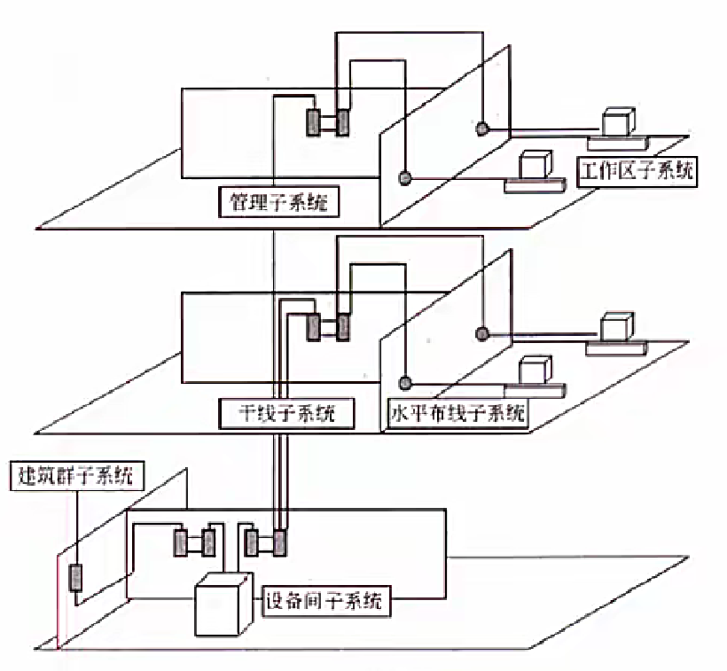

# 计算机网络

### 计算机网络的功能和分类

计算机网络是计算机技术与通信技术相结合的产物，它实现了远程通信、远程信息处理和资源共享。

计算机网络的功能：**数据通信、资源共享、负载均衡、高可靠性**。（资源子网、通信子网）

> 负载均衡：访问量比较大，将其均匀负载到多台计算机上

计算机网络按分布范围和拓扑结构划分如下图所示： 


总线型（利用率低、干扰大、价格低）

> 总线理解为一条网线，不能同时有两个发送方，会产生冲突；可以有多个接收方

星型（交换机形成的局域网、中央单元负荷大）

> 中央单元：e.g. 路由器

环型（流动方向固定、效率低扩充难）

树型（总线型的扩充、分级结构）

分布式（任意节点连接管理难成本高）


## OSI 七层模型

| 层            | 功能                                                         | 单位   | 协议                                                         | 设备                  |
| ------------- | ------------------------------------------------------------ | ------ | ------------------------------------------------------------ | --------------------- |
| 1. 物理层     | **在链路上透明地传输位**。需要完成的工作包括线路配置、确比特定数据传输模式、确定信号形式、对信号进行编码、连接传输介质。为此定义了建立、维护和拆除物理链路所具备的机械特性、电气特性、功能特性以及规程特性。（提供信道之间的传输） | 比特   | EIA/TIA RS-232、RS-449、V.35、RJ-45、FDDI                    | 中继器、集线器（HUB） |
| 2. 数据链路层 | 把**不可靠的信道变为可靠的信道**。为此将比特组成，在链路上提供点到点（终端）的帧传输，并进行差错控制、流量控制等。 | 帧     | SDLC、HDLC、LAPB、PPPSTP、帧中继等、IEEE802、ATM<br/>（局域网） | 交 换器、网桥         |
| 3. 网络层     | 在**源节点-目的节点之间进行路由选择、拥塞控制、顺序控制、传送包，保证报文的正确性**。网络层控制着通信子网的运行，因而它又称为通信子双层。（IP地址） | IP分组 | IP、ICMP、IGMP、ARP、RARP                                    | 路由器                |
| 4. 传输层     | 提供🔺**端-端间可靠的、透明的数据传输**，保证报文顺序的正确性、数据的完整性。（端口号 ） | 报文段 | TCP、UDP                                                     | 网关                  |
| 5. 会话层     | 建立**通信进程的逻辑名字与物理名字之间的联系**，提供**进程之间建立、管理和终止会话的方法，处理同步与恢复**问题。 |        | RPC、 SQL、 NFS                                              | 网关                  |
| 6. 表示层     | 实现**数据转换**（包括格式转换、压缩、加密等），提供标准的应用接口、公用的通信服务，公共数据表示方法。 |        | JPEG、 ASCII、GIF、MPEG、DES                                 | 网关                  |
| 7. 应用层     | 对用户不透明的**提供各种服务**，如E-mail。                   | 数据   | Telnet、 FTP、 HTTP、SMTP、POP3、DNS、DHCP等                 | 网关                  |

#### 局域网和广域网协议

以太网规范**`IEEE 802.3`**（有线） 是重要的局域网协，包括：
```
IEEE 802.3    标准以太网   10Mb/s   传输介质为细同轴电缆双绞线
IEEE 802.3u   快速以太网   100Mb/s  双绞线
IEEE 802.3z   千兆以太网   1000Mb/s 光纤或双绞线
IEEE 802.3ae  万兆以太网   10Gb/s   光纤
```

无线局域网 WLAN 技术标准：**`IEEE 802.11`**（无线）

> 局域网是数据链路层，说明不能上网，因为这是网络层做的事情
>
> 以太网是局域网的一个最广泛的应用

广域网协议包括：PPP 点对点协议、ISDN 综合业务数字网、xDSL（DSL数字用户线路的统称HDSL、SDSL、MVL、ADSL）、DDN 数字专线、x.25、FR帧中继、ATM异步传输模式。

## TCP/IP 协议

网络协议三要素：🔺**语法、语义、时序**。其中语法部分规定传输数据的格式，语义部分规定所要完成的功能，时序部分规定执行各种操作的条件、顺序关系等。


> 基于 TCP 的是可靠传输：POP3, FTP, HTTP, Telnet, SMTP
>
> 基于 UDP 的是不可靠传输：DHCP, TFTP, SNMP, DNS

#### 🔺网络层协议

🔺IP：网络层最重要的核心协议，在源地址和目的地址之间传送数据报，**无连接、不可靠**。（发归发，不知道对方有没有收到）

ICMP(control)：因特网控制报文协议，用于在 IP 主机、路由器之间传递控制消息。控制消息是指网络通不通、主机是否可达、路由是否可用等网络本身的消息。

ARP 和 RARP：地址解析协议，ARP 是将 IP 地址转换为物理地址，RARP 是将物理地址转换为 IP 地址。

> ARP 在网络层，网络层是 IP 地址

IGMP(group)：网络组管理协议，允许因特网中的计算机参加多播，是计算机用做向相邻多目路由器报告多目组成员的协议，支持组播（一对多）。
#### 🔺传输层协议

TCP：整个 TCP/IP 协议族中最重要的协议之一，在 IP 协议提供的不可靠数据数据基础上，采用了重发技术，为应用程序提供了一个**可靠的、面向连接的、全双工的数据传输服务**。一般用于**传输数据量比较少，且对可靠性要求高**的场合。

UDP：是一种**不可靠、无连接**的协议，有助于**提高传输速率**，一般用于传输数据量大，对可靠性要求不高，但要求速度快的场合。（音频、视频传输）

> TCP 通过三次握手建立连接，四次挥手释放连接


#### 应用层协议

🔺基于TCP的FTP、HTTP等都是可靠传输。基于UDP的DHCP、DNS等都是不可靠传输

FTP：可靠的文件传输协议，用于因特网上的控制文件的双向传输。

HTTP：超文本传输协议，用于从WWW服务器传输超文本到本地浏览器的传输协议。使用SSL加密后的安全网页协议为HTTPS。

SMTP（发送邮件）和POP3（接收邮件）：简单邮件传输协议，是一组用于由源地址到目的地址传送邮件的规则，邮件报文采用ASCI格式表示。

Telnet：远程连接协议，是因特网远程登录服务的标准协议和主要方式。

------------------------------TCP ↑-----------------------------------UDP ↓---------------------------------------

TFTP：不可靠的、开销不大的小文件传输协议。

SNMP：简单网络管理协议，由一组网络管理的标准协议，包含一个应用层协议、数据模型和一组资源对象。该协议能够支持网络管理系统，泳衣监测连接到网络上的设备是否有任何引起管理师行关注的情况。

DHCP：动态主机配置协议（动态 IP 地址），基于UDP，基于C/S模型，为主机动态分配IP地址，有三种方式：固定分配、动态分配、自动分配。

DNS：域名解析协议，**通过域名解析出IP地址**。

### 🔺协议端口号对照表


例：


## 传输介质

### 双绞线

将多根铜线按规则缠绕在一起，能够减少干扰；分为**无屏蔽双绞线 UTP 和屏蔽双绞线 STP**，都是由一对铜线簇组成。也即我们常说的**网线**；双绞线的**传输距离在100m以内**。

> 无屏蔽双绞线少了层屏蔽层
>
> 屏蔽层是为了抗干扰，可靠性强


**无屏蔽**双绞线UTP：**价格低，安装简单，但可靠性相对较低**，分为 CAT3 （3类UTP，速率为 10Mbps）、CAT4（4类UTP，与3类差不多，无应用）、CAT5（5类UTP，速率为100Mbps，用于快速以太网）、CAT5E（超5类UTP，速率为1000Mbps）、CAT6（6类UTP，用来替代CAT5E，速率也是1000Mbps）

**屏蔽**双绞线STP：比之UTP增加了一层屏蔽层，可以**有效的提高可靠性，但对应的价格高，安装麻烦**，一般用于对传输可靠性要求很高的场合。

### 网线

网线有如下两种安装标准：都是八根不同颜色的网线，按照不同的顺序排序，插入水晶头（RJ-45）中区分在第1236四根网线的位置不同。


### 光纤

由纤芯和包层组成，传输的🔺**光信号**在纤芯中传输，然而**从PC端出来的信号都是电信号，要经过光纤传输的话，就必须将电信号转换为光信号**。

> 🔺网线和双绞线传的是**电信号**

多模光纤 MMF：纤芯半径较大，因此**可以同时传输多种不同的信号**，光信号在光纤中以全反射的形式传输，采用**发光二极管LED为光源，成本低，但是传输的效率和可靠性都较低，适合于短距离传输**，其传输距离与传输速率相关，速率为 100Mbps 时为 2KM，速率为 1000Mbps 时为 550m。


单模光纤 SMF：纤芯半径很小，**一般只能传输一种信号，采用激光二极管LD作为光源，并且只支持激光信号的传播**，同样是以全反射形式传播，只不过反射角很大，看起来像一条直线，**成本高，但是传输距离远，可靠性高**。传输距离可达 5KM。


> 🔺c.f. 多模光纤、单模光纤：信号，光源 --> 可靠性、传输距离

### 无线信道

分为**无线电波**和**红外光波**


## 通信方式和交换方式

### 通信方向

数据通信是指发送方发送数据到接收方，这个传输过程可以分类如下

- 单工：只能由设备A发给设备B，即数据流只能**单向流动**。
- 半双工：设备A和设备B**可以互相通信**，但是**同一时刻**数据流只能**单向流动**。
- 全双工：设备A和设备B在**任意时刻都能互相通信**。


### 同步方式

- 异步传输：发送方每发送一个字符，需要**约定一个起始和停止位插入到字符的起始和结尾处**，这样当接收方接收到该字符时能够识别，但是这样会造成**资源浪费，传输效率降低**。

- 同步传输：以数据块为单位进行传输，当发送方要发送数据时，**先发送一个同步帧**（建立连接），接收方收到后做好接收准备，开始接收数据块，**结束后又会有结束帧确认**，这样一次传输一个数据块，**效率高**。

---

- 串行传输：只有**一根数据线**，数据只能1bit挨个排队传送，适合**低速设备、远距离**的传送，一般用于广域网中。

- 并行传输：有**多根数据线**，可以同时传输多个bit数据，适合**高速设备**的传送，常用语计算机内部各硬件模块之间。

### 🔺交换方式

> 交换方式：A B 通信，数据是如何传输的

- 电路交换：通信一方进行呼叫，另一方接收后，在二者之间会**建立一个专用电路**，特点为**、实时性高、链路利用率低**，一般用于语音视频通信。

- 报文交换：**以报文为单位，存储转发模式**，（**接收到数据后先存储，进行差错校验**，没有错误则转发，有错误则丢弃），因此会**有延时，但可靠性高，是面向无连接**的。

- 分组交换：**以分组为单位，也是存储转发模式**，因为分组的**长度比报文小**，所以**时延小于报文交换**，又可分为三种方式：
  - 数据报：是**现在主流**的交换方式，**各个分组携带地址信息，自由的选择不同的路由路径**传送到接收方，接收方接收到分组后再根据地址信息**重新组装**成原数据，是面向无连接的，但是不可靠的。
  - 虚电路：发送方发送一个分组，接收方收到后**二者之间就建立了一个虚拟的通信线路**，二者之间的分组数据交互都通过这条线路传送，在**空闲**的时候这条线路**也可以传输其他数据**，是面向连接的，可靠的。（使用率较高）
  - 信元交换：**异步传输模式ATM采用的交换方式**，本质是按照虚电路方式进行转发，只不过信元是**固定长度的分组**，共53B，其中5B为头部，48B为数据域，也是面向连接的，可靠的。

> 电路交换、虚电路、信元交换 都是面向连接，可靠的。
>
> 和数据报相关的，都是无连接的：报文交换、数据报

例：


## IP 地址

机器中存放的 **IP 地址是32位的二进制代码，每隔8位**插入一个空格，可提高可读性，为了便于理解和设置，一般会采用**点分十进制**方法来表示：将32位二进制代码**每8位二进制转换成十进制，就变成了4个十进制数**（IPv4），而后在每个十进制数间隔中插入 . ，如下所示，最终为128.11.3.31：


因为每个十进制数都是由8个二进制数转换而来，因此**每个十进制数的取值范围为0-255**（掌握二进制转十进制的快速计算方法，牢记2的幂指数值，实现快速转换）。

### IP 地址分类

IP 地址分四段，每段八位，共 32 位二进制数组成。

在逻辑上，这 32 位 IP 地址分为**网络号和主机号**，依据网络号位数的不同，可以将 IP 地址分为以下几类：


### IP 地址表示

无分类编址：即不按照 A  B C 类规则，自动规定网络号，无分类编址格式为：**IP地址/网络号**，示例：128.168.0.11/20 表示的 IP 地址为 128.168.0.11，其网络号占20位，因此主机号占32-20=12位，也可以划分子网。（按需分配，自己规定网络号）

#### 特殊IP地址

公有地址：**通过它直接访问因特网。是全网唯一私有地址**。

🔺私有地址：属于**非注册地址，专门为组织机构内邵使用**，不能直接访问因特网，下表所示为私有地址范围：


其他特殊地址如下表所示：


## 子网划分

子网划分：一般公司在申请网络时，会直接获得一个范围很大的网络，如一个B类地址，因为**主机数之间相差的太大了，不利于分配**，我们一般采用**子网划分的方法来划分网络**，即**自定义网络号位数**，就能自定义主机号位数，就能**根据主机个数来划分出最适合的方案，不会造成资源的浪费**。

因此就有子网的概念，一般的IP地址按标准划分为ABC类后，可以进行再一步的划分，将**主机号拿出几位作为子网号**，就可以划分出多个子网，此时IP地址组成为：🔺**网络号+子网号+主机号**。

> 主机号是根据主机的位数来的，若主机位数是 30 位，那主机号最少就是 5 位（2^5 - 2 >= 30）；这样网络号就是 27 位（32-5），网络号又是 网络号+子网号，子网号为 3 位（1个 C 类地址，网络号为 24 位，27-24=3）
>
> 因此这个 C 类地址被划分成 2^3 个子网，每个子网是 2^5-2 个主机

🔺**网络号和子网号都为1，主机号都为0，这样的地址为子网掩码**。 e.g. 255.255.255.224

要注意的是：子网号可以为全0和全1，**主机号不能为全0或全1，因此，主机数需要-2**，而子网数不用。

还可以**聚合网络为超网**，就是划分子网的逆过程，将**网络号取出几位作为主机号**，此时，这个网络内的主机数量就变多了，成为一个更大的网络。

> 属于同一个网段的 IP 地址 --> 网络号必然相等


例：


## IPv6

主要是为了解决IPv4地址数不够用（2^32 用完了）的情况而提出的设计方案，IPv6具有以下特性：

- IPv6地址长度为128位，地址空间增大了2~96倍；
- 灵活的IP报文头部格式，使用一系列固定格式的扩展头部取代了IPv4中可变长度的选项字段。IPv6中选项部分的出现方式也有所变化，使路由器可以简单撸过选项而不做任何处理，加快了报文处理速度；
- IPv6简化了报文头部格式，加快报文转发，提高了吞吐量；
- 提高安全性，身份认证和隐私权是IPv6的关键特性；
- 支持更多的服务类型；
- 允许协议继续演变，增加新的功能，使之适应未来技术的发展。

🔺IPv4和IPv6的过渡期间，主要采用三种基本技术：

1. 双协议栈：主机同时运行IPv4和IPv6**两套协议栈**，同时支持两套协议，一般来说IPv4和IPv6地址之间存在某种转换关系，如IPv6的低32位可以直接转换为IPv4地址，实现互相通信。
2. 隧道技术：这种机制用来在IPv4网络之上建立一条能够传输IPv6数据报的隧道，例如可以将IPv6数据报当做IPv4数据报的数据部分加以封装，只需要加一个IPv4的首部，就能在IPv4网络中传输IPv6报文。
3. 翻译技术：利用一台专门的翻译设备（如转换网关），在纯IPv4和纯IPv6网络之间转换IP报头的地址，国时根据协议不同对公組做想腐的语义翔说:从而使纯IPv4和纯IPv6站点之间能够透明通信。

## 网络规划与设计

三层模型将网络划分为🔺**核心层、汇聚层和接入层**，每一层都有着特定的作用。

核心层提供不同区域之间的最佳路由和**高速数据传送**；

汇聚层**将网络业务连接到接入层**，并且**实施与安全、流量、负载和路由相关的策略**；

接入层为用户提供了在本地网段访问应用系统的能力，还要解决相邻用户之间的互访需要，接入层要负责一些**用户信息**（例如用户IP地址、MAC地址和访问 日志等）的收集工作和**用户管理功能**（包括认证和计费等）。


### 建筑物综合布线系统PDS

> 网络规划设计的一个物理模型，也叫结构化动线

1. 工作区子系统：实现工作区终端设备到水平子系统的信息插座之间的互联。（电脑连到插座）
2. 水平布线子系统：实现信息插座和管理子系统之间的连接。（连接一层所有房间的布线）
3. 设备间子系统：实现中央主配线架与各种不同设备之间的连接。
4. 垂直干线子系统：实现各楼层设备间子系统（机房）之间的互连。（连接多层，各楼层设备间子系统互联）
5. 管理子系统：连接各楼层水平布线子系统和垂直干缆线，负责连接控制其他子系统为连接其他子系统提供连接手段。（水平和垂直）

> 1-5 负责一栋楼里布线 ↑；6 负责多栋 ↓

1. 建筑群子系统：各个建筑物通信系统之间的互联

> 🔺考试的时候问
>
> 1. 哪一个子系统不是，哪一个子系统是
> 2. 某一个子系统连接的是什么东西



例：


### 廉价磁盘冗余阵列

RAID 即磁盘冗余阵列技术（组装磁盘），将数据分散存储在不同磁盘中，可并行读取，可冗余存储（可靠性），提高磁盘访问速度，保障数据安全性。

🔺RAID0 将数据分散的存储在不同磁盘中，**磁盘利用率100%，访问速度最快，但是没有提供冗余和错误修复技术**；（完全不可靠）

🔺RAID1 在成对的独立磁盘上产生互为备份的数据，**增加存储可靠性，可以纠错，但磁盘利用率只有50%**；（每份数据都备份了）


RAID2 将数据条块化的分布于不同硬盘上，使用**海明码校验**；

RAID3 使用**奇偶校验**，并用单块磁盘存储奇偶校验信息（可靠性低于RAID5）；

🔺RAID5 在所有磁盘上交叉的存储数据及**奇偶校验**信息（所有**校验信息存储总量为一个磁盘容量**但**分布式存储在不同的磁盘上**），读/写指针可同时操作；

> 磁盘利用率为 (n-1)/n；可靠性是允许一块磁盘坏


RAID0+1 是两个RAID0，若一个磁盘损坏，则当前RAID0无法工作，即有一半的磁盘无法工作

RAID1+0 是两个RAID1，不允许同一组中的两个磁盘同时损坏，与RAID1原理类似，磁盘利用率都只有50%，但安全性更高。 


## 网络存储技术

> 解决设备该如何访问磁盘，磁盘如何共享

1. 直接附加存储（DAS）：是指将存储设备通过SCSI接口直接连接到一台服务器上使用，其本身是硬件的堆叠，存储操作依赖于服务器，不带有任何存储操作系统。(direct)（类似于个人 PC）
   - 存在问题：在**传递距离、连接数量、传输速率**等方面都受到**限制**。**容量难以扩展升级**；数据处理和传输能力降低（数据难以共享）；服务器异常会波及存储器。
2. 网络附加存储（NAS）：通过网络接口与网络直接相连，由用户通过网络访问，有独立的存储系统如下图所示。NAS存储设备类似于一个专用的文件服务器，去掉了通用服务器大多数计算功能，而仅仅提供文件系统功能。以数据为中心，将存储设备与服务器分离，其存储设备在功能上完全独立于网络中的主服务器。客户机与存储设备之间的数据访问不再需要文件服务器的干预，同时它允许客户机与存储设备之间进行直接的数据访问，所以不仅**响应速度快**，而且**数据传输速率也很高**。（类似于 FTP，云盘，通过网络tcp ip接口访问磁盘，已文件的形式访问）（速度看网速）
   - NAS的性能特点是进行小文件级的共享存取；支持即插即用；可以很经济的解决存储容量不足的问题，但难以获得满意的性能。


3. 存储区域网（SAN）：SAN是通过专用交换机将磁盘阵列与服务器连接起来的高速专用子网。它没有采用文件共享存取方式，而是采用**块（block）级别存储**。SAN是通过专用高速网将一个或多个网络存储设备和服务器连接起来的专用存储系统，其最大特点是将存储设备从传统的以太网中分离了出来，成为独立的存储区域网络SAN 的系统结构。根据数据传输过程采用的协议，其技术划分为FCSAN（光纤通道）、IPSAN（IP网络）和IB SAN（无线带宽）技术。（不会占用原来的网络带宽，效率又提升了，同时成本也提升）

## 其他考点

网络地址翻译NAT：公司内有很多电脑，在公司局域网内可以互联通信，但是要访问外部因特网时，只提供固定的少量IP地址能够访问因特网，将公司所有电脑这个大的地址集合映射到能够访问因特网的少量IP地址集合的过程就称为NAT。
很明显，使用了NAT后，一个公司只有少量固定IP地址可以上网，大大减少了IP地址的使用量。（访问互联网时会建立一个映射关系，把私有地址转成固定访问公网地址，为了解决 IPv4 地址短缺的问题）

默认网关：一台主机可以有多个网关（路由的概念，经过的第一个路由器就是网关）。默认网关的意思是一台主机如果找不到可用的网关，就把数据包发给默认指定的网关，由这个网关来处理数据包。现在主机使用的网关，一般指的是默认网关。默认网关的IP地址必须与本机IP地址在同一个网段内，即同网络号。

虚拟局域网VLAN：是一组逻辑上的设备和用户，这些设备和用户并不受物理位置的限制，可以根据功能、部门及应用等因素将它们组织起来，相互之间的通信就好像它们在同一个网段中一样。
VLAN工作在0SI参考模型的第2层和第3层，一个VLAN就是一个**广播域**，VLAN之间的通信是通过第3层的路由器来完成的。（一般通过协议的方式，把设备虚拟划分在一个局域网上，不同局域网互相通信需要通过路由器，三层）
与传统的局域网技术相比较，VLAN技术更加灵活，它具有以下优点：网络设备的移动、添加和修改的管理开销减少；可以控制广播活动；可提高网络的安全性。

虚拟专用网VPN：是在公用网络上建立专用网络的技术。其之所以称为虚拟网（通过协议，相当于建了一个虚拟的专用网），主要是因为整个VPN网络的任意两个节点之间的连接并没有传统专网所需的端到端的物理链路，而是架构在公用网络服务商所提供的网络平台，如Internet、ATM（异步传输模式）、Frame Relay（帧中继）等之上的逻辑网络，用户数据在逻辑链路中传输。
PPP：安全认证介绍：PPP的NCP可以承载多种协议的三层数据包。PPP使用LCP控制多种链路的参数（建立、认证、压缩、回拨）。

PPP的认证类型：pap认证是通过二次握手建立认证(明文不加密)，chap挑战握手认证协议，通过三次握手建立认证(密文采用MD5加密)。PPP的双向验证，采用的是chap的主验证风格。PPP的加固验证，采用的是两种(pap,chap)验证同时使用

🔺冲突域（物理层的概念）和广播域（数据链路层的概念，一个局域网就是一个广播域）：路由器可以阻断广播域和冲突域，交换机只能阻断冲突域，因此一个路由器下可以划分多个广播域和多个冲突域；一个交换机下整体是一个广播域，但可以划分多个冲突域；而物理层设备集线器下整体作为一个冲突域和一个广播域。  


例：


