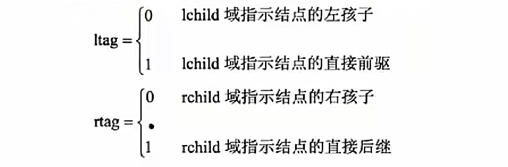

# 数据结构

 ## 线性结构

### 顺序表和链表

每个元素**最多只有一个出度和一个入度**，表现为一条线状。线性表按存储方式分为顺序表和链表。

> 树只能有一个出度，和 n 个入度
>
> 图可以有 n 个出度，和 n 个入度

存储结构：

- 顺序存储：用一组地址连续的存储单元依次存储线性表中的数据元素，使得**逻辑上相邻的元素物理上也相邻**。
- 链式存储：存储各数据元素的结点的地址并不要求是连续的，数据元素**逻辑上相邻，物理上分开**。

> 线性结构反应的是逻辑关系，物理地址不一定相邻
>
> 顺序存储因为物理地址上也相邻，便于定位
>
> 链式存储引用指针，查看下一元素的物理位置    **数据域 | 指针域**


顺序存储和链式存储对比：

| 性能类别 | 具体项目 | 顺序存储                         | 链式存储                             |
| -------- | -------- | -------------------------------- | ------------------------------------ |
| 空间性能 | 存储密度 | =1，更优                         | <1                                   |
|          | 容量分配 | 事先确定                         | 动态改变，更优                       |
| 时间性能 | 查找运算 | O(n/2)                           | O(n/2)                               |
|          | 读运算   | O(1)，更优                       | O([n+1]/2)，最好情况为1，最坏情况为n |
|          | 插入运算 | O(n/2)，最好情况为0，最坏情况为n | O(1)，更优                           |
|          | 删除运算 | O([n-1]/2)                       | O(1)，更优                           |

在空间方面，因为**链表还需要存储指针，因此有空间浪费存在**。（顺序表利用率 100%）

在时间方面，当🔺**需要对元素进行破坏性操作（插入、删除）时，链表效率更高**，因为其只需要修改指针指向即可，而顺序表因为地址是连续的，当删除或插入一个元素后，后面的其他节点位置都需要变动。

> 顺序表每个元素是相邻的，中间没有空余的存储空间了，需要把后面所有的元素整体往后移动，才有空间插入数据
>
> 链表插入数据只需把前一元素指针指向新元素，新元素指针指向后一元素即可

而当需要对元素进行🔺**不改变结构操作时（读取、查找），顺序表效率更高**，因为其物理地址是连续的，如同数组一般只需按索引号就可快速定位，而链表需要从头节点开始，一个个的查找下去。

### 栈和队列

**队列是先进先出**，分队头和队尾；

**栈是先进后出**，只有栈顶能进出。


#### 循环队列

设循环队列 Q 的容量为 `MAXSIZE`，初始时队列为空，且 `Q.rear` 和 `Q.front` 都等于 0

元素入队时修改队尾指针，即令`Q.rear=(Q.rear+1)%MAXSIZE`

元素出队时修改队头指针，即令`Q.front=(Q.front+1)%MAXSIZE`

> 队头指向第一个元素，是为了读操作
>
> 队尾指针指向最后一个元素的下一个元素，为了写操作，指向空闲区域能直接写

根据队列操作的定义，当出队操作导致队列变为空时，有`Q.rear==Q.front`；

若入队操作导致队列满，则`Q.rear==Q.front`。


在队列空和队列满的情况下，循环队列的队头、队尾指针指向的位置是相同的，此时仅仅根据 `Q.rear` 和 `Q.front` 之间的关系无法断定队列的状态。为了区别队空和队满的情况，可采用以下两种处理方式：

其一是设置一个标志，以区别头、尾指针的值相同时队列是空还是满；

其二是**牺牲一个存储单元，约定以“队列的尾指针所指位置的下一个位置是队头指针时”表示队列满**，如图所示而**头、尾指针的值相同时表示队列为空**。

> `Q.front=(Q.rear+1)%MAXSIZE`


例：


### 串

字符串是一种**特殊的线性表，其数据元素都为字符**。

空串：长度为0的字符串，没有任何字符。

空格串：由**一个或多个空格组成的串**，空格是空白字符，占一个字符长度。

子串：串中**任意长度的连续字符构成的序列称为子串**。含有子串的串称为主串，空串是任意串的子串。

串的模式匹配：子串的定位操作，用于**查找子串在主串中第一次出现的位置的算法**。

#### 模式匹配算法

也称为布鲁特一福斯算法，其基本思想是**从主串的第1个字符起与模式串的第1个字符比较**，若相等，则**继续逐个字符进行后续的比较；否则从主串中的第2个字符起与模式串的第1个字符重新比较**，直至模式串中每个字符依次和主串中的一个连续的字符序列相等时为止，此时称为匹配成功，否则称为匹配失败。

> 写两个循环，从第一个字符开始有一个不匹配；就回退，从第二个字符再开始比，以此类推


#### KMP 算法

对基本模式匹配算法的改进之处在于：每当匹配过程中出现**相比较的字符不相等时，不需要回溯主串的字符位置指针**，而是利用**已经得到的“部分匹配”结果将模式串向右“滑动”尽可能远的距离**，再继续进行比较。

当模式串中的字符`pj`与主串中相应的字符`Si`不相等时，因其前j个字符`("po...pj-1")`已经获得了成功的匹配，所以若模式串中`"p0..pk-1"`与`"pj-k...pj-1"`相同，这时可令`pk`与`Si`进行比较，从而使`i`无须回退。


在KMP 算法中，依据模式串的next 函数值实现子串的滑动。若令`next[j]=k`，则`next[j]`表示当模式串中的`pj`与主串中相应字符不相等时，令模式串的`next[j]`与主串的相应字符进行比较。


例：


### 数组

数组是**定长线性表在维度上的扩展**，即**线性表中的元素又是一个线性表**。N维数组是一种“同构”的数据结构，其**每个数据元素类型相同、结构一致**。


其可以表示为行向量形式或者列向量形式线性表，单个关系最多只有一个前驱和一个后继，本质还是线性的。

数组结构的特点：**数据元素数目固定；数据元素类型相同；数据元素的下标关系具有上下界的约束且下标有序。**

数组数据元素固定，一般不做插入和删除运算，**适合于采用顺序结构**。

🔺数组存储地址的计算，特别是二维数组，要注意理解，假设每个数组元素占用存储长度为len，起始地址为a，存储地址计算如下（默认从0开始编号）

（考试的时候取特殊值）

| 数组类型          | 存储地址计算                                                 |
| ----------------- | ------------------------------------------------------------ |
| 一维数组`a[n]`    | `a[i]`的存储地址为：`a + i * len`                            |
| 二维数组`a[m][n]` | `a[i][j]`的存储地址（按行存储）为：`a + (i * n + j) * len` <br/>`a[i][j]`的存储地址（按列存储）为：`a + (j * m + i) * len` |

### 矩阵

特殊矩阵：矩阵中的元素(或非0元素)的分布有定的规律。常见的特殊矩阵有对称矩阵、三角矩阵和对角矩阵。

稀疏矩阵：在一个矩阵中，若非零元素的个数远远少于零元素个数，且非零元素的分布没有规律。

存储方式为三元组结构，即存储每个非零元素的（行，列，值）。


例：


### 广义表

广义表是线性表的推广，是由**0个或多个单元素或子表组成的有限序列**。

广义表与线性表的区别：**线性表都是结构上不可分的单元素**，而广义线性表的元素**既可以单元素，也可以是有结构的表**。

广义表一般记为：`LS=(a1,a2,…,n)`

其中LS是表名，`ai`是表元素，它可以是表（称为子表），也可以是数据元素（称为原子）。其中n是**广义表的长度（也就是最外层包含的元素个数）**，n=0的广义表为空表；而**递归定义的重数就是广义表的深度，即定义中所含括号的重数**（单边括号的个数，原子的深度为0，空表的深度为1）。

`head()`和`tail()`：**取表头（广义表第一个表元素**，可以是子表也可以是单元素）和**取表尾（广义表中，除了第一个表元素之外的其他所有表元素构成的表**，非空广义表的表尾必定是一个表，即使表尾是单元素）操作。

## 树与二叉树

树是n个节点的有限集合`(n>=0)`，当`n=0`时称为空树，在任一颗非空树中，**有且仅有个根节点**。其余结点可分为**`m(m>=0)`个互不相交的有限子集`T1, T2, ..., Tm`，其中，每个`Ti`又都是一棵树**，并且称为根结点的子树。

树的基本概念如下

- **双亲、孩子和兄弟**。结点的子树的根称为该结点的孩子；相应地，该结点称为其子结点的双亲。**具有相同双亲的结点互为兄弟**。
- **结点的度**。**一个结点的子树的个数**记为该结点的度（只算出度，不算入度）。例如A的度为3，B的度为2，C的度为0，D的度为1。
- **叶子结点**。叶子结点也称为终端结点，指度为0的结点。例如，E、F、C、G都是叶子结点。
- **内部结点**。**度不为0的结点**，也称为分支结点或非终端结点。除根结点以外，分支结点也称为内部结点。例如，B、D都是内部结点。
- **结点的层次**。根为第一层，根的孩子为第二层，依此类推，若某结点在第i层，则其孩子结点在第i+1层。例如，A在第1层，B、C、D在第2层，E、F和G在第3层。
- **树的高度**。一棵树的**最大层数**记为树的高度(或深度)。例如，图中所示树的高度为3。
- **有序（无序）树**。若将树中结点的各子树看成是从左到右具有次序的，即不能交换，则称该树为有序树，否则称为无序树。


二叉树是n个节点的有限集合它或者是空树，或者是由一个根节点及**两颗互不相交的且分别称为左、右子树的二又树所组成**。


**两种特殊的二叉树**如下图所示：


> 完全二叉树，假设高度为 k，第 k-1 层是满的，第 k 层从左到右不间断

🔺二叉树有一些性质如下，要求掌握，在实际考试中可以用特殊值法验证。

- 二叉树**第`i`层`(i>=1)`上至多有`2^(i-1)`个节点**（最多就是满二叉树）

- 深度为`k` 的二又树至多有**`2^k-1`个节点**`(k>=1)`（等差数列求和）

- 对任何一棵二叉树，若其**终端节点数为`n0`，度为2 的节点数为`n2`，则`n0=n2+1`**

  > n1 + 2n2 = n0 + n1 + n2 - 1（总的分支数=总结点数-1） --> n0=n2+1

​	此公式可以画一个简单的二又树使用特殊值法快速验证，也可以证明如下设一棵二叉树上**叶结点数为`n0`，单分支结点数为`n1`，双分支结点数为`n2`**，则总结点数=`n0+n1+n2`。在一棵二叉树中，所有结点的分支数（即度数）应等于单分支结点数加上双分支结点数的2倍，即总的分支数=`n1+2n2`，。由于二叉树中除根结点以外每个结点都有唯一的一个分支指向它，因此二叉树中：**总的分支数=总结点数-1**（还有个根节点）。

- 具有**n个节点的完全二叉树的深度为`|log2 n|+ 1`**。（以2为底，n的对数，向下取整）

### 二叉树的存储结构

#### 二叉树的顺序存储结构

顺序存储，就是用一组**连续的存储单元存储二又树中的节点**，按照**从上到下，从左到右的顺序依次存储每个节点**。

对于**深度为k的完全二又树**，除第k层外，其余每层中节点数都是上一层的两倍，由此，从一个节点的编号可推知其双亲、左孩子、右孩子结点的编号。假设有**编号为`i`的节点**，则有：

若**`i=1`，则该节点为根节点**，无双亲；若**`i>1`，则该节点的双亲节点为`|i/2|`**。

若**`2i<=n`，则该节点的左孩子编号为`2i`，否则无左孩子**。

若**`2i+1<=n`，则该节点的右孩子编号为`2i+1`，否则无右孩子**。

显然，顺序存储结构对完全二叉树而言既简单又节省空间，而**对于一般二又树则不适用**。因为在顺序存储结构中，以节点在存储单元中的位置来表示节点之间的关系，那么对于一般的二又树来说，也必须按照完全二又树的形式存储也就是要**添上一些实际并不存在的“虚节点”，这将造成空间的浪费**。

#### 二叉树的链式存储结构

由于二叉树中节点包含有数据元素、左子树根、右子树根及双亲等信息，因此可以用三叉链表或二叉链表（即一个节点含有三个指针或两个指针）来存储二叉树，链表的头指针指向二叉树的根节点


### 二叉树的遍历

一颗非空的二叉树由根节点、左子树、右子树三部分组成，遍历这三部分也就遍历了整颗二又树。这三部分遍历的**基本顺序是先左子树后右子树，但根节点顺序可变**，以**根节点访问的顺序为准有下列三种遍历方式**：

先序(前序)遍历：根左右。

中序遍历：左根右。

后序遍历：左右根。

层次遍历：按层次，从上到下，从左到右。

反向构造二叉树：仅仅有前序和后序是无法构造二叉树的，**必须要是和中序遍历的集合才能反向构造出二叉树**。

构造时，**前序和后序遍历可以确定根节点，中序遍历用来确定根节点的左子树节点和右子树节点**，而后按此方法进行递归，直至得出结果。


例：


### 线索二叉树

引入线索二叉树是为了保存**二叉树遍历时某节点的前驱节点和后继节点的信息**，二叉树的链式存储只能获取到某节点的左孩子和右孩子结点，无法获取其遍历时的前驱和后继节点，因此可以**在链式存储中再增加两个指针域，使其分别指向前驱和后继节点，但这样太浪费存储空间**，考虑下述实现方法：

**若`n`个节点的二叉树使用二叉链表存储，则必然有`n+1`个空指针域**，利用这些空指针域来存放节点的前驱和后继节点信息，为此，需要增加两个标志，以区分指针域存放的到底是孩子结点还是遍历节点，如下：

| ltag | lchild | data | rchild | rtag |
| ---- | ------ | ---- | ------ | ---- |

若二叉树的二叉链表采用上述结构，则称为**线索链表，其中指向前驱、后继节点的指针称为线索**，加上线索的二叉树称为线索二叉树。

>  若`n`个节点的二叉树使用二叉链表存储，则必然有`n+1`个空指针域
>
> ↑
>
> `n`个节点二叉链表存储，一共有`2n`个指针域，没有指针指向根节点，所以用了`n-1`个，空指针域为 `2n-(n+1)=n+1`个



### 🔺 最优二叉树

**最优二叉树又称为哈夫曼树**，是一类带🔺**权路径长度最短的树**，相关概念如下路径：

路径：树中**一个结点到另一个结点之间的通路**。

结点的路径长度：**路径上的分支数目**。

树的路径长度：**根节点到达每一个叶子节点之间的路径长度之和**。

权：节点**代表的值**。

结点的带权路径长度：**该结点到根结点之间的路径长度乘以该节点的权值**。

🔺树的带权路径长度（树的代价）：**树的所有叶子节点的带权路径长度之和**。


哈夫曼树的求法：给出一组权值，将其中**两个最小的权值作为叶子节点，其和作为父节点，组成二叉树，而后删除这两个叶子节点权值，并将父节点的值添加到该组权重中**。重复进行上述步骤，直至所有权值都被使用完。


若需要构造**哈夫曼编码**（要保证**左节点值小于右节点的值，才是标准的哈夫曼树**）将标准哈夫曼树的**左分支设为0，右分支设为1**，写出每个叶节点的编码，会发现，哈夫曼编码前缀不同，因此不会混淆，同时也是最优编码。

例：


### 🔺查找二叉树

查找二叉树（排序二叉树）上的每个节点都存储一个值，且**每个节点的所有左孩子结点值都小于父节点值，而所有右孩子结点值都大于父节点值**，是一个有规律排列的二叉树，这种数据结构可以方便查找、插入等数据操作。

**二叉排序树的查找效率取决于二叉排序树的深度**，对于结点个数相同的二叉排序树，平衡二叉树的深度最小，而**单枝树的深度是最大的，故效率最差**。

平衡二叉树又称为**AVL树**，它或者是一棵空树，或者是具有下列性质的二叉树它的**左子树和右子树都是平衡二叉树，且左子树和右子树的高度之差的绝对值不超过1**。若将二叉树结点的**平衡因子(Balance Factor，BF)定义为该结点左子树的高度减去其右子树的高度**，则平衡二叉树上所有结点的平衡因子只可能是-1、0和1。只要树上有一个结点的平衡因子的绝对值大于1，则该二叉树就是不平衡的。


例：


## 图

无向图：图的结点之间连接线是**没有箭头的，不分方向**。

有向图：图的结点之间**连接线是箭头，区分A到B，和B到A是两条线**。

完全图：无向完全图中，**节点两两之间都有连线**，n个结点的连线数为`(n-1)+(n-2)+...+1= n*(n-1)/2`;有向完全图中，节点两两之间都有互通的两个箭头，个节点的连线数为`n*(n-1)`。

度、出度和入度：顶点的度是**关联与该顶点的边的数目**。在有向图中，顶点的度为**出度和入度之和**。

路径：存在一条通路，可以从一个顶点到达另一个顶点。

子图：有两个图`G=(V,E)`和`G'=(V',E')`如果**V'包含于V且E'包含于E，则称G'为G 的子图**。

连通图和连通分量：**针对无向图**。若从顶点v到顶点u之间是**有路径的，则说明v和u之间是连通的**，若无向图中**任意两个顶点之间都是连通的，则称为连通图**。无向图G的**极大连通子图称为其连通分量**。 

强连通图和强连通分量：针对**有向图**。若有向图**任意两个顶点间都互相存在路径**，即存在v到u，也存在u到v的路径，则称为强连通图，有向图中的**极大连通子图称为其强连通分量**。

网：**边带权值的图称为网**。

### 图的存储

#### 邻接矩阵

假设一个图中有**n个节点，则使用n阶矩阵来存储这个图中各节点的关系，规则是若节点 i 到节点 j 有连线，则矩阵 Ri,j=1，否则为0**，示例如下图所示


#### 邻接链表

用到了两个数据结构，先用一个**一维数组将图中所有顶点存储起来**，而后，对此一维数组的**每个顶点元素，使用链表挂上其出度到达的结点的编号和权值**，示例如下图所示：


存储特点：图中的**顶点数决定了邻接矩阵的阶和邻接表中的单链表数目，边数的多少决定了单链表中的结点数，而不影响邻接矩阵的规模**，因此采用何种存储方式与有向图、无向图没有区别，要看图的边数和顶点数，完全图适合采货用邻接矩阵存储。

### 图的遍历

图的遍历是指从图的任意节点出发，沿着某条搜索路径对图中所有节点进行访问且只访问一次，分为以下两种方式：

#### 深度优先遍历

从任一顶点出发，遍历到底，直至返回，再选取任一其他节点出发，重复这个过程直至遍历完整个图；

#### 广度优先遍历

先访问完一个顶点的所有邻接顶点，而后再依次访问其邻接顶点的所有邻接顶点，类似于层次遍历。

图例


| 遍历方法 | 说明                                                         | 示例                             |
| -------- | ------------------------------------------------------------ | -------------------------------- |
| 深度优先 | 1. 首先访问出发顶点 V <br/>2. 依次从 V 出发搜索 V 的任意一个邻接点 W <br/>3. 若 W 未访问过，则从该点出发继续深度优先遍历 | `V1, V2, V4, V8, V5, V3, V6, V7` |
| 广度优先 | 1. 首先访问出发顶点 V <br/>2. 然后访问与顶点 V 邻接的全部访问顶点 W、X、Y... <br/>3. 然后再依次访问 W、X、Y...邻接的未访问的顶点 | `V1, V2, V3, V4, V5, V6, V7, V8` |

### 图的最小生成树

假设有**n个节点，那么这个图的最小生成树有n-1条边**（不会形成环路，是树非图），这n-1条边应该会将所有顶点都连接成一个树，并且**这些边的权值之和最小**，因此称为最小生成树，共有下列两种算法：

> 图会形成环路，树不会形成环路

#### 普里姆算法

从**任意顶点出发**，找出**与其邻接的边权值最小的**，此时**此边的另外一个顶点自动加入树集合**中，而后**再从这个树集合的所有顶点中找出与其邻接的边权值最小的**，同样此边的另外一个 顶点加入树集合中，依次递归，直至图中所有顶点都加入树集合中，此时此树就是该图的最小生成树。普里姆算法的**时间复杂度为`O(n^2)`，与图中的边数无关，因此该算法适合于求边稠密的网**的最小生成树。


#### 克鲁斯卡尔算法（推荐）

这个算法是**从边出发的**，因为本质是选取权值最小的 n-1 条边，因此，就**将边按权值大小排序，依次选取权值最小的边，直至囊括所有节点**，要注意，**每次选边后要检查不能形成环路**。克鲁斯卡尔算法的**时间复杂度为`O(eloge)`，与图中的顶点数无关，因此该算法适合于求边稀疏的网**的最小生成树。


### 拓扑序列

若**图中一个节点入度为0，则应该最先执行此活动**，而后**删除掉此节点和其关联的有向边**，再去找图中**其他没有入度的结点，执行活动，依次进行**，示例如下（有点类似于进程的前趋图原理）：

> 找出可依次执行的安全序列


例：


## 查找

### 顺序查找

顺序查找的思想：将待查找的关键字为 key 的元素从头到尾与表中元素进行比较，如果中间存在关键字为 key 的元素，则返回成功；否则，则查找失败。

平均查找长度为


时间复杂度为 O(n)

### 折半查找

只适用于待查找序列中的元素是**有序排列**的情况。

设查找表的元素存储在一维数组r[1...n]中，在表中元素**已经按照关键字递增（或递减）方式排序**的情况下，进行折半查找的方法是：

1. 首先将待查元素的关键字(key)值与表r中间位置上(下标为mid)记录的关键字进行比较，若相等，则查找成功；
2. 若**`key>r[mid].key`，则说明待查记录只可能在后半个子表r[mid+1..n]中**，下一步应在后半个子表中查找；
3. 若**`key<r[mid].key`，说明待査记录只可能在前半个子表r[1..mid-1]中**，下一步应在r的前半个子表中查找；
4. 重复上述步骤，逐步缩小范围，直到查找成功或子表为空失败时为止要注意两点：**中间值位置求出若为小数，应该向下取整**，即4.5=4，非四舍五入中间值已经比较过不相等，在划分下一次比较区间时，**无需将中间值位置再纳入下一次比较区间**。


### 哈希表

哈希表**通过一个以记录的关键字为自变量的函数（称为哈希函数）得到该记录的存储地址**，所以在哈希表中进行查找操作时，需要用**同一哈希函数计算得到待查记录的存储地址**，然后到相应的存储单元去获得有关信息再判定查找是否成功。


哈希函数产生了冲突的解决方法如下：

1. **开放定址法**：`Hi=(H(key)+di)% m i=1,2, k(k≤m-1)`

   其中，H(key)为哈希函数；m为哈希表表长；**di为增量序列**。

   常见的增量序列有以下3 种：

   (1) d=1,2,3，…, m-1，称为线性探测再散列。

   (2) d= 1^2-1^2,2^2,-2^2,3^2,…,+-k^2(k >= m/2)，称为二次探测再散列。

   (3) di=伪随机数序列，称为随机探测再散列。

2. **链地址法**：在查找表的**每一个记录中增加一个链域**，链域中存放**下一个具有相同哈希函数值的记录的存储地址**。利用链域，就把**若干个发生冲突的记录链接在一个链表内**。当链域的值为NULL时，表示已没有后继记录了。因此，对于发生冲突时的查找和插入操作就跟线性表一样了。
3. **再哈希法**：在**同义词发生地址冲突时计算另一个哈希函数地址**，直到冲突不再发生。这种方法不易产生聚集现象，但增加了计算时间。
4. 建立一个**公共溢出区**。无论由哈希函数得到的哈希地址是什么，一旦发生冲突都填入到公共溢出区中。

 例：


## 排序算法原理

### 直接插入排序（🔺从第二个元素开始，依次比较，插入比它小的元素后面）

要注意的是，前提条件是前 i-1 个元素是有序的第 i 个元素**依次**从第 i-1 个元素往前**比较**，直到找到一个比第 i 个元素值小的元素，而后插入，插入位置及其后的元素依次向后移动。

当给出一队**无序**的元素时，首先，应该**将第1个元素看做是一个有序的队列**，而后从第2个元素起，按插入排序规则，**依次与前面的元素进行比较**，直到**找到一个小于他的值**，才插入。


### 希尔排序（🔺分组依次比较-分组插入排序）

希尔排序又称“**缩小增量排序**”，是**对直接插入排序方法的改进**。

希尔排序的基本思想是：先将整个待排记录席列**分割成若干子序列**，然后**分别进行直接插入排序**，待整个序列中的记录**基本有序**时，再对全体记录进行一次直接插入排序。

具体做法是：先取一个小于n的整数`d1`作为第一个增量，把文件的全部记录分成`d1`个组，将所有距离为`d1`倍数的记录放在同一个组中，在各组内进行直接插入排序；然后取第二个增量`d2(d2<d1)`，重复上述分组和排序工作，依此类推，直至所取的增量`di=1(di<di-1<...<d2<d1)`，即所有记录放在同一组进行直接插入排序为止。

> 最后一轮的增量肯定是 1

按上述，希尔排序实际是为了解决大数据的排序问题当待排序的数据很多时，使用直接插入排序效率很低，因此，采取分组的方法，使问题细化，可以提高效率，适用于多数据。


### 简单选择排序（🔺找最值，换到队首/尾）

n个记录进行简单选择排序的基本方法是：通过**`n-i(1≤i≤n)`次关键字之间的比较，从`n-i+1`个记录中选出关键字最小的记录，并和第`i`个记录进行交换**，当i等于n 时所有记录有序排列。

按上述，**本质就是每次选择出最小的元素进行交换**，主要是选择比较过程交换过程只有一次。

> 设置中间变量，一一对比，把最小的值记录在 temp 中
>
> 每次过程：n-1次比较，1次交换


### 堆排序（🔺树-拿堆顶，用堆中最后一个元素替换）

对于 n 个元素的关键字序列`{K1，K2，…，Kn}`，当且仅当满足下列关系时称其为堆，其中`2i`和` 2i+1`需不大于 n（左右孩子节点都小于父亲节点：大根堆）。

```
Ki <= K2i && Ki <= K2i+1 （小根堆）父亲节点小于左右孩子
或
Ki >= K2i && Ki >= K2i+1 （大根堆）孩子节点小于父亲节点
```

堆排序的基本思想是：对一组待排序记录的关键字，首先按堆的定义排成一个序列（即建立初始堆），从而可以输出堆顶的最大关键字（对于大根堆而言），然后将剩余的关键字再调整成新堆，便得到次大的关键字，如此反复，直到全部关键字排成有序序列为止。

#### 建立初始堆

初始堆的建立方法是：将待排序的关键字分放到一棵完全二叉树的各个结点中（此时完全二叉树并不一定具备堆的特性），显然，所有 i> |n/2| 的结点Ki都没有子结点，以这样的 Ki为根的子树已经是堆，因此初始建堆可从完全二叉树的第 i (i=|n/2|)个结点 Ki 开始，通过调整,逐步使以`K|n/2|、K|n/2|+1、...、K2、K1` 为根的子树满足堆的定义。

为序列(55,60,40,10,80,65,15,5,75) **建立初始大根堆**的过程如图所示：


由上图可知，首先将给出的数组按完全二叉树规则建立，而后，找到此完全二叉树的**最后一个非叶子节点（也即最后一颗子树）**，比较**此非叶子节点和其两个孩子结点的大小**，若小，则与其孩子结点中最大的结点进行交换；依据此规则再去找倒数第二个非叶子节点；这是只有一层的情况，**当涉及到多层次时又打破了之前的堆，因此，又要进行变换**。

#### 排序

建立初始堆后，开始排序，每次**取走堆顶元素（必然是最大的）**，而后**将堆中最后一个元素移入堆顶**，而后按照初始建堆中的方法**与其孩子结点比较大小，依次向下判断交换成为一个新的堆**（由上而下对比），再取走堆顶元素，重复此过程。

堆排序**适用于在多个元素中找出前几名的方案设计**，因为堆排序是选择排序，而且选择出前几名的效率很高。


### 冒泡排序（🔺找最值，每次比较，每次都可能交换）

n个记录进行冒泡排序的方法是：首先将**第一个记录的关键字和第二个记录的关键字进行比较，若为逆序，则交换这两个记录的值**，然后比较第二个记录和第三个记录的关键字依此类推，直至第 n-1 个记录和第 n 个记录的关键字比较过为止。上述过程称为**一趟冒泡排序，其结果是关键字最大的记录被交换到第 n 个记录的位置上**。然后进行第二趟冒泡排序，**对前 n-1 个记录进行同样的操作，其结果是关键字次大的记录被交换到第 n-1 个记录的位置上**。**最多进行 n-1 趟所有记录有序排列**。若**在某趟冒泡排序过程没有进行相邻位置的元素交换处理，则可结束排序过程**。

示例给的是**从后往前排序，也是可以的**，需要**从最后两个元素开始进行比较，将较小的元素交换到前面去**，依次进行比较交换。比较是为了交换，交换次数很多。又分冒泡排序和简单选择排序。

> 🔺c.f. 选择 & 冒泡
>
> 选择排序设置中间变量，多次比较，1次交换
>
> 冒泡排序多次比较，多次交换


### 快速排序（🔺所有数据和基准值比较，天然分成两部分）

快速排序是**将 n 个记录分成两块，再递归**，实际分成两块的方法如图所示：**设定一个基准为57**，设定**两个指针high=1，low=n，从low指向的第n个元素开始，与基准值进行比较，若小于基准值，则与基准进行交换low--**，此时，**转而从high指向的第1个元素开始和基准值进行比较，若大于基准值，则和基准值进行交换**，此时，又转而从low一指向的值和基准进行比较，重复上述过程。

要注意的是：每次都是和基准值进行比较，因此**最终是以基准值为中间，将队列分成两块**。**只有当和基准值发生了交换，才变换high和low指针的计数**，否则会一直low--下去。

上图中，最终以57为界，左边都是小于57的元素右边都是大于57的元素，**完成一次快速排序，接着对两块再分别进行递归即可**。（把基准值左右两边的数据，再次进行快速排序）


 ### 归并排序（🔺两两分组，两两归并）

所谓“归并”，是将**两个或两个以上的有序文件合并成为一个新的有序文件**。归并排序的一种实现方法是把**一个有n个记录的无序文件看成是由n 个长度为1的有序子文件组成的文件**，然后进行**两两归并**，得到[n/2]个长度为2或1的有序文件，再两两归并，如此重复，直至最后形成包含n个记录的有序文件为止。这种反复将两个有序文件归并成一个有序文件的排序方法称为**两路归并排序**。

要仔细理解上述过程，一般归并排序都是用来**合并多个线性表的**，对**单列数据，二路归并排序可以对元素进行两两合并**，示例如下：

对第三次归并，将52与28比较，28小，放入新表头，52再与33比较，33放入新表，52再与72比较，52放入新表，57再与72比较，57放入新表…


### 基数排序（多个不同的权重）

基数排序是**基于多个关键字来进行多轮排序**的，本质也是将问题细分，如图例子，分别按个位、十位、百位的大小作为关键字进行了三轮排序，最终得出结果。

基数排序是一种借助多关键字排序思想对单逻辑关键字进行排序的方法。基数排序不是基于关键字比较的排序方法，它适合于元素很多而关键字较少的序列。基数的选择和关键字的分解是根据关键字的类型来决定的，例如关键字是十进制数，则按个位、十位来分解。

 

### 🔺内部排序算法总结

1. 若**待排序的记录数目n较小，可采用直接插入排序和简单选择排序**。由于直接插入排序所需的记录移动操作较简单选择排序多，因此**当记录本身信息量较大时，用简单选择排序方法较好**。
2. 若待排序记录按关键字**基本有序，则宜采用直接插入排序或冒泡排序**。
3. 当**n很大且关键字的位数较少时，采用链式基数排序较好**。
4. 若**n较大，则应采用时间复杂度为`O(nlogn)`的排序方法**，例如快速排序、堆排序或归并排序。

| 排序方法                                                     | 时间复杂度                              | 空间复杂度                                          | 稳定性 |
| ------------------------------------------------------------ | --------------------------------------- | --------------------------------------------------- | ------ |
| **直接插入**<br>从第二个元素开始，依次与前面的元素 比较，插入比它小的元素后面 | `O(n^2)`                                | `O(1)`                                              | 稳定   |
| **简单选择**<br/>找最小值，换到队首，多次比较，1次交换       | `O(n^2)`                                | `O(1)`                                              | 不稳定 |
| **冒泡排序**<br/>从最后两个元素比较，小的换到前面去，多次比较，多次交换 | `O(n^2)`                                | `O(1)`                                              | 稳定   |
| **希尔排序**<br/>分组依次比较，分组插入排序，依据增量序列分组 | `O(n^1.3)`<br/>和增量序列有关           | `O(1)`                                              | 不稳定 |
| **快速排序**<br/>所有数据和基准值比较，天然分成两部分        | `O(nlogn)`<br/>二分思想，和折半查找类似 | `O(nlogn)`<br/>每趟排序都需要一个辅助空间来存基准值 | 不稳定 |
| **堆排序**<br/>树-拿堆顶，用堆中最后一个元素替换             | `O(nlogn)`<br/>划分思想，大根堆、小根堆 | `O(1)`                                              | 不稳定 |
| **归并排序**<br/>两两分组，两两归并                          | `O(nlogn)`<br/>划分思想，两两归并       | `O(n)`<br/>需要辅助空间存新表                       | 稳定   |
| **基数排序**<br/>基于多个关键字来进行多轮排序                | `O(d(n+rd))`                            | `O(nd)`                                             | 稳定   |

> 稳定性：若排序的时候有两个元素是重复数据，排序过后，这两个元素的相对位置能否不改变
>
> 直接插入、冒泡排序是稳定的，因为它们只会和比自己小的元素交换位置，一样大的数值不会进行交换
>
> 快速排序、堆排序不稳定，交换思想，不知道换到哪里去了

例：


