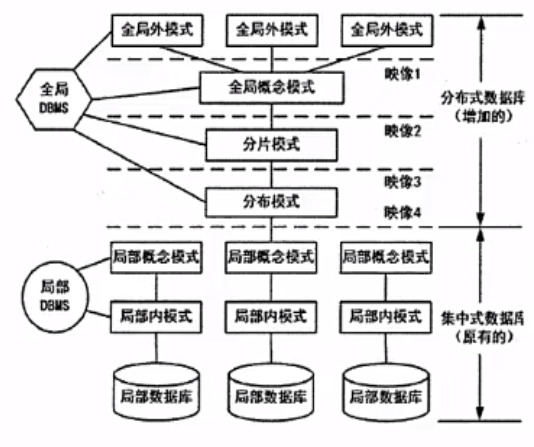
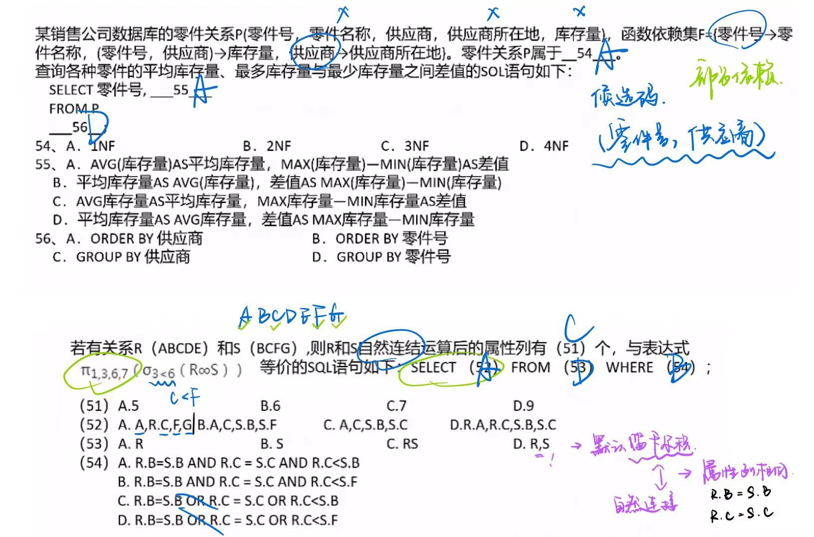

# 数据库技术基础

## 概述

数据：是数据库中存储的基本对象，是描述事物的符号记录。

数据的种类：文本、图形、图像、音频、视频。（一切信息化的东西都是数据）

数据库DB：长期存储在计算机内、有组织的、可共享的大量数据的集合

数据库的基本特征：数据按一定的数据模型组织（现在主流的数据库都是关系模型，有行有列有表）、描述和存储；可为各种用户共享；冗余度较小；数据独立性较高；易扩展

数据库系统DB：是一个采用了数据库技术，有组织地、动态地存储大量相关数据，方便多用户访问的**计算机系统**。其由下面四个部分组成：数据库（统一管理、长期存储在计算机内的，有组织的相关数据的集合）、硬件（构成计算机系统包括存储数据所需的外部设备）、软件（操作系统、**数据库管理系统**及应用程序）、人员（系统分析和数据库设计人员、应用程序员、最终用户、数据库管理员DBA）。

**数据库管理系统**DBMS（属于数据库系统的软件）的功能：实现对共享数据有效的组织、管理和存取。包括数据定义、数据库操作、数据库运行管理、数据的存储管理、数据库的建立和维护等。

## 三级模式-两级映像

内模式：管理如何存储**物理的数据**，对应具体**物理存储文件**

模式：又称为概念模式，就是我们通常使用的**基本表**，根据应用、需求将物理数据划分成一张张表。

外模式：对应数据库中的**视图**这个级别，将表进行一定的处理后再提供给用户使用

外模式-模式映像（保证数据的**逻辑独立性**）：是表和视图之间的映射，存在于概念级和外部级之间，若表中数据发生了修改，只需要修改此映射，而无需修改应用程序。

模式-内模式映像（保证了数据的**物理独立性**）：是表和数据的物理存储之间的映射存在于概念级和内部级之间，若修改了数据存储方式，只需要修改此映射，而不需要去修改应用程序。

> 映像目的：为了数据库中数据改变的时候，应用程序无需改变


## 数据库设计

🔺 流程、干什么了、产出

需求分析：即分析数据存储的要求，**产出物有数据流图数据字典、需求说明书**。

概念结构设计：就是**设计E-R图**，也即实体-联系图，与物理实现无关，说明有哪些实体，实体有哪些属性。

逻辑结构设计：**将E-R图，转换成关系模式**，也即转换成实际的表和表中的列属性，这里要考虑很多**规范化**的东西。

物理设计：根据生成的表等概念，**生成物理数据库**。 


## 数据模型

- **关系模型是二维表的形式表示的实体-联系模型**，是将实体-联系模型转换而来的，经过开发人员设计的；

- **概念模型是从用户的角度进行建模**的（ER图），是现实世界到信息世界的第一抽象是真正的实体-联系模型。

- 网状模型表示实体类型及其实体之间的联系，一个事物和另外几个都有联系形成一张网。

- 面向对象模型是采用面向对象的方法设计数据库，以对象为单位，每个对象包括属性和方法，具有类和继承等特点。

🔺数据模型三要素：**数据结构**（所研究的对象类型的集合）、**数据操作**（增删改查，对数据库中各种对象的实例允许执行的操作的集合）、**数据的约束条件**（一组完整性规则的集合，年龄 < 150 之类的）。

### 🔺E-R 图

用E-R图来描述概念数据模型，世界是由一组称作实体的基本对象和这些对象之间的联系构成的。

在E-R模型中，使用**椭圆表示属性**（一般没有）、**长方形表示实体**、**菱形表示联系**，**联系的两端要填写联系类型**，示例如下图：


实体：**客观存在并可相互区别的事物**。可以是具体的人、事、物或抽象概念如人、汽车、图书、账户、贷款。

弱实体和强实体：弱实体依赖于强实体的存在而存在（通过上图圆圈连接，“经理”、“部门经理”就是弱实体）

实体集：具有相同类型和共享相同属性的实体的集合，如学生、课程

属性：**实体所具有的特性**

属性分类：简单属性和复合属性（由多个简单属性组成的，e.g.家庭住址：国家+省份+市+街道...）；单值属性和多值属性；NULL属性；派生属性（可由其他属性计算得来）

域：属性的取值范围称为该属性的域

码（key）：唯一标识实体的属性集（键）。

联系：现实世界中**事物内部以及事物之间的联系**，在E-R图中反映为**实体内部的联系和实体之间的联系**。

联系类型：**一对一`1:1`、一对多`1:N`、多对多`M:N`**。

### 数据模型

关系模型中数据的逻辑结构是**二维表**，由行列组成。用表格结构表达实体集，用外键标识实体间的联系。

**元组（Tuple）**：在关系模型中，元组是表中的一行。

**属性（Attribute）**：元组中的一个分量，类似于表中的一列。


优点：建立在严格的数学概念基础上;概念单一、结构简单、清晰，用户易懂易用；存取路径对用户透明，从而数据独立性、安全性好，简化数据库开发工作。

缺点：由于存取路径透明，查询效率往往不如非关系数据模型

#### 🔺ER 模型转换为关系模型

**每个实体都对应一个关系模式**（强实体）；联系分为三种：

- `1:1`联系中，联系可以**放到任意的两端实体中，作为一个属性**（要保证`1:1`的两端关联），也可以转换为一个单独的关系模式；
- `1:N`的联系中，联系可以单独作为一个关系模式，也可以**在N端中加入1端实体的主键**
- `M:N`的联系中，联系**必须作为一个单独的关系模式，其主键是M和N端的联合主键**。

## 关系代数

- 并：结果是两张表中所有记录数合并，相同记录只显示一次（不会重复显示 c.f. 笛卡尔积）
- 交：结果是两张表中相同的记录
- 差：R-S，结果是 R 表中有而 S 表中没有的那些记录


- 笛卡尔积：`S1*S2`，产生的结果包括 S1 和 S2 的所有属性列，并且 S1 中每条记录依次和 S2 中所有记录组合成一条记录，最终属性列为`S1+S2`属性列，记录数为`S1*S2`记录数。（会重复显示）

  

- 投影：实际是按条件选择某关系模式中的**某列**，列也可以用数字表示。（select *）

- 选择：实际是按条件选择某关系模式中的**某条**记录。（where xxx）

  

- 自然连接的结果**显示全部的属性列**，但是**相同属性列只显示一次**，显示两个关系模式中**属性相同（A C）且值相同（A C 的值）**的记录。

  

🔺例：


### 函数依赖

给定一个 X，能唯一确定一个 Y，就称 X 确定 Y，或者说依赖于 X，例如`Y=X*X`函数。
函数依赖又可扩展以下两种规则：

- 部分函数依赖：A可确定C，(A,B)也可确定C，(A,B)中的一部分(即A)可以确定C，称为部分函数依赖。
- 传递函数依赖：当A和B不等价时，A可确定B，B可确定C，则A可确定C，是传递函数依赖；若A和B等价，则不存在传递，直接就可确定C。

> A-->B = A 决定 B = B 依赖于 A


#### 函数依赖的公理系统(Armstrong)

设关系模式 R<U，F>，U 是关系模式 R 的属性全集，F 是关系模式 R 的一个函数依赖集。对于R<U，F> 来说有以下的：


#### 键与约束

超键：能**唯一标识**此表的属性的组合。（只要求唯一标识：学号、学号+姓名、学号+年级...都是超键，可以有冗余属性）

候选键：超键中**去掉冗余的属性**，剩余的属性就是候选键。（学号）

主键：**任选一个候选键**，即可作为主键。

外键：**其他表中的主键**。

主属性：**候选键内的属性为主属性**，其他属性为非主属性。

实体完整性约束：即**主键约束，主键值不能为空，也不能重复**。

参照完整性约束：即外键约束，**外键必须是其他表中已经存在的主键的值，或者为空**。

用户自定义完整性约束：**自定义表达式约束**，如设定年龄属性的值必须在0到150之间。

## 🔺范式

### 第一范式 `1NF`

关系中的**每一个分量必须是一个不可分的数据项**。通俗地说，第一范式就是表中不允许有小表的存在。

以下表不算第一范式：（薪资表有复合属性）


### 第二范式 `2NF`

如果**关系R属于1NF**，且**每一个非主属性完全函数依赖于任何一个候选码**，则R属于2NF。

通俗地说，2NF就是在1NF的基础上，表中的**每一个非主属性不会依赖复合主键中的某一个列**。（**部分**函数依赖只存在于联合主键中，对于单属性的主键来讲，必然是第二范式）

按照定义，上面的学生表就不满足2NF，因为学号不能完全确定课程号和成绩（每个学生可以选多门课）。

### 第三范式 `3NF`

在满足1NF的基础上，表中不存在非主属性对码的传递依赖。

继续上面的实例，学生关系模式就不属于3NF，因为学生无法直接决定系主任和系名，是由学号->系编号，再由系编号->系主任，系编号->系名，因此存在非主属性对主属性的传递依赖，

#### 实例：

用一个单一的关系模式学生来描述学校的教务系统：学生(学号,学生姓名,系号,系主任姓名,课程号,成绩)


### BC范式BCNF

指**在第三范式的基础上进一步消除主属性对于码的部分函数依赖和传递依赖**。

通俗的来说，就是**在每一种情况下，每一个依赖的左边决定因素都必然包含候选键**。


上图中，候选键有两种情况：组合键 (S,T) 或者 (SJ)，依赖集为 {SJ-T，T-J}，可知，STJ 三个属性都是主属性，因此其达到了3NF（无非主属性），然而，第二种情况，即 **(S,J) 为候选键**的时候，对于依赖 **T->J，T 在这种情况不是候选键**，即 T-J 的决定因素不包含任意候选码，因此上图不是 BCNF。

要使上图关系模式转换为BCNF也很简单，只需要**将依赖T->J变为TS->J**，即可这样其左边决定因素就包含了候选键之一S。


🔺例：

> 🔺候选码能唯一标识整个属性，通过候选码能把所有属性都推导出来
>
> 1. 凡是从未在右边出现过的属性，必然是候选码之一
> 2. 以该属性为基础，依次扩展，看能否遍历所有属性

> 🔺只要是候选关键字中的属性，都是主属性


## 模式分解

范式之间的转换一般都是通过**拆分属性**，即**模式分解**，将具有部分函数依赖和传递依赖的属性分离出来，来达到一步步优化。

### 属性1：函数依赖

1. 保持函数依赖分解

   对于关系模式R，有依赖集F，若对R进行分解，**分解出来的多个关系模式，保持原来的依赖集不变**（🔺依赖的两边在同一个子集里），则为保持函数依赖的分解。另外，注意要消除掉冗余依赖（如传递依赖）

   实例：设原关系模式R(A,B,C)，依赖集F(A->B,B->C,A->C)，将其分解为两个关系模式R1(A,B)和R2(B,C)，此时R1中保持依赖A->B，R2保持依赖B->C，说明分解后的R1和R2是保持函数依赖的分解。（A->C这个函数依赖实际是一个冗余依赖，可以由前两个依赖传递得到，所以不用管）

2. 保持函数依赖的判断

​	如果F上的**每一个函数依赖都在其分解后的某一个关系上成立**，则这个分解是保持依赖的（这是一个**充分条件**）。也即我们课堂上说的简单方法，看函数每个依赖的左右两边属性是否都在同一个分解的模式中。 

​	如果上述判断失败，并不能断言分解不是保持依赖的，还要使用下面的通用方法来做进一步判断。

算法二：

对F上的每一个a>β使用下面的过程：

```
result := a
while (result 发生变化) do
for each 分解后的 Ri
	t = (result∩R)+ ∩Ri
	result = result∪t
```

例：


### 属性2：无损分解

无损分解：分解后的关系模式**能够还原出原关系模式**，就是无损分解，不能还原就是有损。

当分解为**两个关系模式**，可以通过以下定理判断是否无损分解

**定理**：如果R的分解为`p={R1，R2}`，F为R所满足的函数依赖集合，分解p具有无损连接性的**充分必要条件**是`R1∩R2->(R1-R2)`或者`R1∩R2->(R2-R1)`。

当分解为三个及以上关系模式时，可以通过表格法求解：


例：


## 事务并发

事务：由一系列操作组成，这些操作，要么全做，要么全不做，拥有四种特性：

- （操作）**原子性**：要么全做，要么全不做。（全部操作做完了以后 commit）

- （数据）**一致性**：事务发生后数据是一致的，例如银行转账，不会存在A账户转出，但是B账户没收到的情况。

- （执行）**隔离性**：任一事务的更新操作直到其成功提交的整个过程对其他事务都是不可见的，不同事务之间是隔离的，互不干涉。

- （改变）**持续性**：事务操作的结果是持续性的。

事务是并发控制的前提条件，并发控制就是**控制不同的事务并发执行**，提高系统效率，但是并发控制中**存在下面三个问题**：（加锁！！！）

- **丢失更新**：事务1对数据A进行了修改并写回事务2也对A进行了修改并写回此时事务2写回的数据会覆盖事务1写回的数据，就丢失了事务1对A的更新。即对数据A的更新会被覆盖。
- **不可重复读**：事务2读A，而后事务1对数据A进行了修改并写回，此时若事务2再读A，发现数据不对。即一个事务重复读A两次，会发现数据A有误。（读了两次不一样）
- **读脏数据**：事务1对数据A进行了修改后，事务2读数据A，而后事务1回滚，数据A恢复了原来的值，那么事务2对数据A做的事是无效的，读到了脏数据（读到了 rollback）。


### 封锁协议

- **X锁是排它锁（写锁）**。若事务T对数据对象A加上X锁，则只允许T读取和修改A，**其他事务都不能再对A加任何类型的锁**，直到T释放A上的锁。

- **S锁是共享锁（读锁）**。若事务T对数据对象A加上S锁，则只允许T读取A，但不能修改A，**其他事务只能再对A加S锁**（也即能读不能修改），直到T释放A上的s锁。

共分为三级封锁协议，如下级封锁协议：

一级封锁协议：事务在**修改数据R之前必须先对其加X锁**，直到事务结束才释放。**可解决丢失更新问题**。


二级封锁协议：一级封锁协议的基础上加上事务T在**读数据R之前必须先对其加s锁，读完后即可释放s锁**。**可解决丢失更新、读脏数据问题**。


三级封锁协议：一级封锁协议加上事务T在读取数据R之前先对其加S锁，直到**事务结束才释放**。**可解决丢失更新、读脏数据、数据重复读问题**。


## 数据库技术

### 数据库安全

| 措施           | 说明                                                         |
| -------------- | ------------------------------------------------------------ |
| 用户标识和鉴定 | 最外层的安全保护措施，可以使用用户帐户、口令及随机数检验等方式 |
| 存取控制       | 对用户进行授权，包括操作类型（如查找、插入、除、修改等动作）和数据对象（主要是数据范围）的权限。（🔺 授权 GRANT，收回授权 REVOKE） |
| 密码存储和传输 | 对远程终端信息用密码传输                                     |
| 视图的保护     | 对视图进行授权                                               |
| 审计           | 使用一个专用文件或数据库，自动将用户对数据库的所有操作记录下来 |

| 故障关系               | 故障原因               | 解决方法                                                     |
| ---------------------- | ---------------------- | ------------------------------------------------------------ |
| 事物本身的可预期故障   | 本身逻辑               | 在程序中预先设置 Rollback 语句（容错语句，代码本身漏洞）     |
| 事务本身的不可预期故障 | 算术溢出、违反存储保护 | 由DBMS的恢复子系统通过日志，撤消事务对数据库的修改，回退到事务初始状态 |
| 系统故障               | 系统停止运转           | 通常使用检查点法                                             |
| 介质故障               | 外存被破坏             | 一般使用日志重做业务                                         |

### 数据库备份

- 静态转储：即**冷备份**，指在转储期间**不允许对数据库进行任何存取、修改操作**；（数据库不在运行，停下来直接拷贝）

​	优点是非常快速的备份方法、容易归档（直接物理复制操作）

​	缺点是只能提供到某一时间点上的恢复，不能做其他工作，不能按表或按用户恢复。

- 动态转储：即**热备份**，在转储期间**允许对数据库进行存取、修改操作，因此转储和用户事务可并发执行**；（数据库可以运行）

  优点是可在表空间或数据库文件级备份，数据库扔可使用，可达到秒级恢复；

  缺点是不能出错，否则后果严重，若热备份不成功，所得结果几乎全部无效。

- 完全备份：备份所有数据。 
- 差量备份：仅备份上一次**完全备份之后变化的数据**。（🔺c.f. 差量 | 增量备份）
- 增量备份：备份上一次**备份之后变化的数据**。
- 日志文件：在事务处理过程中，DBMS把事务开始、事务结束以及对数据库的插入、删除和修改的每一次操作写入日志文件。一日发生故障，DBMS的恢复子系统利用日志撤销事务对数据库的改变，回退到事务的初始状态。

### 分布式数据库

局部数据库位于不同的物理位置，使用一个**全局DBMS**将所有**局部数据库联网管理**。

> 🔺c.f.
>
> 集中式数据库：数据库都存在一个地方；
>
> 分布式数据库：数据库在物理上存在不同的地方，但在逻辑上属于一个整体，通过一个全局的数据库管理系统。



#### 分片模式

- 水平分片：将表中**水平的记录**分别存放在不同的地方。

- 垂直分片：将表中的**垂直的列值**分别存放在不同的地方。（属性分开）

#### 分布透明性

- 分片透明性：用户或应用程序**不需要知道逻辑上访问的表具体是如何分块存储的**。

- 位置透明性：应用程序**不关心数据存储物理位置的改变**。

- 逻辑透明性：用户或应用程序**无需知道局部使用的是哪种数据模型**。

- 复制透明性：用户或应用程序**不关心复制的数据从何而来**。

### 仓库技术

数据仓库是一个**面向主题的、集成的、非易失的、且随时间变化**的数据集合，用于支持管理决策。

> 🔺c.f.
>
> 数据库：数据都是同源的
>
> 数据仓库：会把这个行业的所有信息全部抽成在仓库中，强调异构（用于大数据决策）

- 面向主题：按照一定的**主题域**（分析目标）进行组织的。

- 集成的：数据仓库中的数据是在对原有分散的数据库数据抽取、清理的基础上经过系统加工、汇总和整理得到的，必须消除源数据中的不一致性，以保证数据仓库内的信息是关于整个企业的一致的全局信息。

> 数据都是异构的，不一样；但要转换成一样的

- 相对稳定的：数据仓库的数据主要供企业决策分析之用，所涉及的数据操作主要是数据查询，一旦某个数据进入数据仓库以后，一般情况下将被长期保留，也就是数据仓库中一般有大量的查询操作，但修改和删除操作很少，通常只需要定期的加载、刷新。

> 只会做插入操作，不查询修改，保留每一次的插入修改记录，可以看到变化趋势

- 反映历史变化：数据仓库中的数据通常包含历史信息，系统记录了企业从过去某一时点（如开始应用数据仓库的时点）到目前的各个阶段的信息，通过这些信息，可以对企业的发展历程和未来趋势做出定量分析和预测。

#### 数据仓库体系结构

- 数据源：是数据仓库系统的基础，是整个系统的数据源泉。（一个个不同的异构数据库）

> ETL 变换：抽取 extraction、转换 transformation、加载 load
>
> 异构数据 --> 同源数据

- **数据的存储与管理**：是整个数据仓库系统的**核心**。

- OLAP（联机分析处理）服务器：对分析需要的数据进行有效集成，按多为模型组织，以便进行多角度、多层次的分析，并发现趋势。

- 前端工具：主要包括各种报表工具、查询工具、数据分析工具、数据挖掘工具以及各种基于数据仓库或数据集市的应用开发工具。


#### 商业智能 --> 数据仓库技术

BI系统主要包括🔺**数据预处理、建立数据仓库、数据分析和数据展现**四个主要阶段。

- 数据预处理是整合企业原始数据的第一步，它包括数据的抽取（Extraction）、转换（Transformation）和加载（Load）三个过程（ETL过程）；
- 建立**数据仓库**则是**处理海量数据的基础**；
- **数据分析**是**体现系统智能的关键**，一般采用联机分析处理（OLAP）和数据挖掘两大技术。**联机分析处理**不仅进行数据汇总/聚集，同时还提供切片、切块、下钻、上卷和旋转等数据分析功能，用户可以方便地对海量数据进行多维分析。**数据挖掘**的目标则是挖掘数据背后隐藏的知识，通过关联分析、聚类和分类等方法建立分析模型，预测企业未来发展趋势和将要面临的问题；
- 在海量数据和分析手段增多的情况下，**数据展现**则主要保障系统分析结果的可视化。

### 反规范化技术

**反规范化技术**：规范化设计后（一般企业 3NF，不宜过细，否则影响查询），数据库设计者希望**牺牲部分规范化来提高性能**。（把表合并成一个大表）

采用反规范化技术的**益处**：**降低连接操作的需求、降低外码和索引的数目，还可能减少表的数目，能够提高查询效率**。（便于查询）

**可能带来的问题**：数据的**重复存储**，浪费了磁盘空间；可能出现数据的完整性问题，为了保障数据的一致性，增加了数据维护的复杂性，会**降低修改速度**。（不规范化带来的问题）

具体方法：

1. 增加冗余列：在**多个表中保留相同的列**，通过增加数据冗余减少或避免查询时的连接操作。
2. 增加派生列：在表中增加可以**由本表或其它表中数据计算生成的列**，减少查询时的连接操作并避免计算或使用集合函数。
3. 重新组表：如果许多用户需要查看两个表连接出来的结果数据，则把**这两个表重新组成一个表来减少连接而提高性能**。
4. 水平分割表：根据一列或多列数据的值，把**数据放到多个独立的表中**，主要用于表数据规模很大、表中数据相对独立或数据需要存放到多个介质上时使用。（比如把 18 岁以上的学生全部查出来组个表，不用每次都查整个学生表）
5. 垂直分割表：对表进行分割，将主键与部分列放到一个表中，**主键与其它列放到另一个表中**，在查询时减少I/O次数。

### 大数据

特点：大量化、多样化、价值密度低、快速化。

大数据和传统数据的比较如下

| 比较维度     | 传统数据                       | 大数据                                     |
| ------------ | ------------------------------ | ------------------------------------------ |
| 数据量       | GB 或 TB 级                    | PB 级以上                                  |
| 数据分析需求 | 现有数据的分析与检测（数据库） | 深度分析（关联分析、回归分析）（数据仓库） |
| 硬件平台     | 高端服务器                     | 集群平台                                   |

要处理大数据，一般使用集群平台，称为大数据处理系统，其特征为：高度可扩展性、高性能、高度容错、支持异构环境、较短的分析延迟、易用且开放的接口、较低成本、向下兼容性。


例：


## SQL 语言


🔺 补充

`FOR ALL ENTRIES`，它通常用于优化表连接操作，特别是在处理大量数据时。

 `PUBLIC` 是一个特殊的数据库角色（在某些数据库系统中），它代表所有数据库用户。当权限被授予 `PUBLIC` 时，意味着数据库中的所有用户都将获得该权限。

- **用途**：用于简化权限管理，避免逐个为用户授予权限。

- **示例**：

  sql复制

  ```sql
  GRANT SELECT ON my_table TO PUBLIC;
  ```

  这条语句表示授予所有用户对 `my_table` 的查询权限。

`WITH CHECK OPTION` 是用于视图定义的选项。当在视图定义中使用时，它确保通过视图进行的插入或更新操作必须满足视图的定义条件。

- **用途**：防止用户通过视图插入或更新不符合视图定义的数据。

- **示例**：

  sql复制

  ```sql
  CREATE VIEW young_employees AS
  SELECT * FROM employees
  WHERE age < 30
  WITH CHECK OPTION;
  ```

  在这个例子中，如果用户尝试通过 `young_employees` 视图插入一个年龄大于或等于30岁的员工，数据库会拒绝该操作，因为这不符合视图的定义条件。

`WITH GRANT OPTION` 是在授予权限时使用的选项。它允许被授权的用户将相同的权限授予其他用户。

- **用途**：用于扩展权限的传递性，允许用户将权限进一步分配给其他用户。

- **示例**：

  sql复制

  ```sql
  GRANT SELECT ON my_table TO user1 WITH GRANT OPTION;
  ```

  这条语句表示授予用户 `user1` 对 `my_table` 的查询权限，并且 `user1` 还可以将查询权限授予其他用户。

例：




