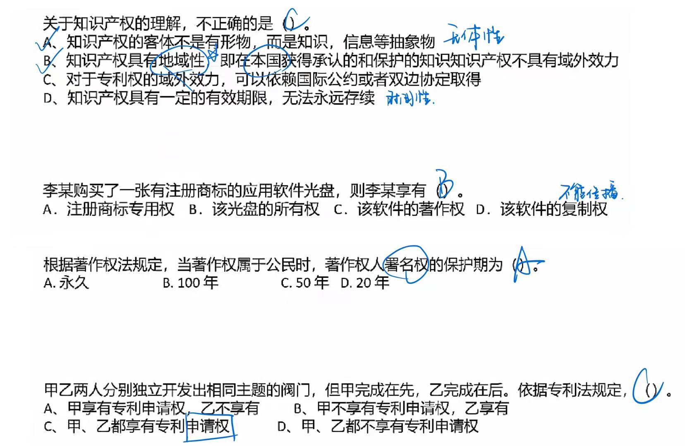

# 知识产权和标准化

知识产权是指公民、法人、非法人单位对自己的**创造性智力成果和其他科技成果依法享有的民事权**。是**智力成果的创造人**依法享有的权利和在**生产经营活动中标记所有人**依法所享有的权利的总称。包含**著作权、专利权、商标权、商业秘密权、植物新品种权、集成电路布图设计权和地理标志权**等。

无体性：知识产权的**对象是没有具体形体，是智力创造成果**，是一种抽象的财富。

专有性：指**除权利人同意或法律规定外，权利人以外的任何人不得享有或使用该项权利**。

地域性：指知识产权**只在授予其权利的国家或确认其权利的国家产生**，并目**只能在该国范围内受法律保护，而其他国家则不受保护**。

时间性：**仅在法律规定的期限内受到保护**，一旦超过期限，权利自行消灭相关知识产品即成为整个社会的共同财富，为全人类所共同使用。（很多公司核心商业秘密不申请专利是因为只有 20 年期限）

## 🔺保护期限

知识产权具有**地域限制**，保护期限如下

> 类别：
>
> 1. 普通作品：公民作品、单位作品（除了软件作品之外，都是普通作品）
> 2. 软件作品：公民软件产品、单位软件产品
> 3. 商标：注册商标
> 4. 专利：发明专利权、实用新型和外观设计专利权
> 5. 商业秘密

| 客体类型                 | 权力类型                                                     | 保护期限                                                     |
| ------------------------ | ------------------------------------------------------------ | ------------------------------------------------------------ |
| 公民作品                 | 署名权（署的都是个人名）、修改权、保护作品完整权             | 没有限制                                                     |
|                          | 发表权、使用权和获得报酬权                                   | 作者**终生**及其**死亡后的50年（第50年的12月31日）**         |
| 单位作品                 | 发表权、使用权和获得报酬权                                   | 50年（首次发表后的第50年的12月31日），若其间未发表，不保护。 |
| 公民软件产品             | 署名权、修改权                                               | 没有限制                                                     |
|                          | 发表权、复制权、发行权、出租权、信息网络传播权、翻译权、使用许可权、获得报酬权、转让权 | 作者终生及其死亡后50年（第50年12月31日）。**合作开发，以最后死亡作者为准。** |
| 单位软件产品             | 发表权、复制权、发行权、出租权、信息网络传播权、翻译权、使用许可权、获得报酬权、转让权 | 50年（首次发表后的第50年的12月31日），若其间未发表，不保护   |
| 注册商标                 |                                                              | 有效期**10年**（若注册人死亡或倒闭1年后，未转移则可注销，期满后6个月内必须续注），**可无限续注** |
| 发明专利权               |                                                              | 保护期为20年（从申请日开始）                                 |
| 实用新型和外观设计专利权 |                                                              | 保护期为10年（从申请日开始）                                 |
| 商业秘密                 |                                                              | 不确定：公开后公众可用                                       |

## 知识产权人的确定

### 职务作品（劳动合同）

| 情况说明           | 判断说明                                                     | 归属                                         |
| ------------------ | ------------------------------------------------------------ | -------------------------------------------- |
| 作品 \| 职务作品   | 利用单位的物质技术条件进行创作并由单位承担责任的             | 除署名权外其他**著作权归单位**               |
|                    | 有合同约定，其著作权属于单位                                 | 除署名权外其他著作权归单位                   |
|                    | 其他                                                         | 作者拥有著作权，单位有权在业务范围内优先使用 |
| 软件 \| 职务作品   | 属于本职工作中明确规定的开发目标                             | 单位享有著作权（利用单位条件进行创造）       |
|                    | 属于从事本职工作活动的结果                                   | 单位享有著作权                               |
|                    | 使用了单位资金、专用设备、未公开的信息等物质、技术条件，并由单位或组织承担责任的软件 | 单位享有著作权                               |
| 专利权 \| 职务作品 | 本职工作中作出的发明创造                                     | 单位享有专利                                 |
|                    | 履行本单位交付的本职工作之外的任务所作出的发明创造           | 单位享有专利                                 |
|                    | **🔺离职、退休或调动工作后1年内，与原单位工作相关**           | 单位享有专利                                 |

### 委托作品（委托合同）

单位和委托的区别在于，当**合同中未规定著作权的归属时，著作权默认归于单位**，而**委托创作中，著作权默认归属于创作方个人**。

| 情况说明             | 判断说明                                                     | 归属                                                  |
| -------------------- | ------------------------------------------------------------ | ----------------------------------------------------- |
| 作品软件 \| 委托创作 | 有合同约定，著作权归委托方                                   | 委托方                                                |
|                      | 合同中未约定著作权归属                                       | 创作方                                                |
| 作品软件 \| 合作开发 | 只进行组织、提供咨询意见、物质条件或者进行其他辅助工作       | 不享有著作权                                          |
|                      | 共同创作的                                                   | 共同享有，按人头比例。 成果可分割的，可分开申请。 |
| 商标                 | 谁**先申请**谁拥有（除知名商标的非法抢注） 同时（同一天）申请，则根据谁**先使用**（需提供证据） 无法提供证据，协商归属，无效时使用**抽签**（但不可不确定） |                                                       |
| 专利                 | 谁**先申请**谁拥有  同时申请则**协商归属**，但不能够同时驳回双方的专利申请 |                                                       |

### 侵权判定

🔺中国公民、法人或者其他组织的作品，**不论是否发表，都享有著作权**。

开发软件所用的**思想、处理过程、操作方法或者数学概念不受保护**。

著作权法**不适用于**下列情形：法律、法规、国家机关的决议、命令和其他具有立法、行政、司法性质决定的文件，及其官方正式译文；时事新闻；历法、通用数表、通用表格和公式。

| 不侵权                                       | 侵权                                                         |
| -------------------------------------------- | ------------------------------------------------------------ |
| - 个人学习、研究或者欣赏；                   | - 未经许可，发表他人作品；                                   |
| - 适当引用；                                 | - 未经合作作者许可，将与他人合作创作的作品当作自己单独创作的作品发表的； |
| - 公开演讲内容                               | - 未参加创作，在他人作品署名；                               |
| - 用于教学或科学研究                         | - 歪曲、篡改他人作品的；                                     |
| - 复制馆藏作品；                             | - 剽窃他人作品的；                                           |
| - 免费表演他人作品；                         | - 使用他人作品，未付报酬；                                   |
| - 室外公共场所艺术品临摹、绘画、摄影、录像； | - 未经出版者许可，使用其出版的图书、期刊的版式设计的。       |
| - 将汉语作品译成少数民族语言作品或盲文出版。 |                                                              |

例：

## 标准划分

根据标准制定机构和适用范围的不同，可分为**国际标准、国家标准、行业标准、区域/地方标准和企业标准**

1. 国际标准：是指国际标准化组织（ISO）、国际电工委员会（IEC）和国际电信联盟（ITU）制定的标准，以及国际标准化组织确认并公布的其他国际组织引定的标准。**国际标准在世界范围内统一使用，提供各国参考。**
2. 国家标准：是指由**国家标准准化主管机构制定或批准发布，在全国范围内统一适用的标准**。比如：**GB**（国标）——**中华人民共和国国家标准**；强制性国家标准代号为GB，**推荐性**国家标准代号为**GB/T**，国家标准**指导性**文件代号为**GB/Z**，**国军标**代号为**GJB**。ANSI（American Nationa Standards Institute）——美国国家标准协会标准；
3. 行业标准：是由**某个行业机构、团体等制定的，适用于某个特定行业业务领域的标准**。比如：IEEE——美国电气电子工程师学会标准；GA——公共安全标准；YD——通信行业标准；
4. 区域/地方标准：是由**某一区域/地方内的标准化主管机构制定、批准发布的，适用于某个特定区域/地方的标准**。比如：EN——欧洲标准准；DB——我国地方标准；
5. 企业标准：是**企业范围内根据需要协调、纺:一的技术要求、管理要求和工作要求所制定的标准，适用于本企业内部的标准**。一般以Q字开头，比如Q/320101 RER 007--2012，其中320101代表地X，RER代表企业名称代号，001代表该企业该标准的序号，2012代表年号。

