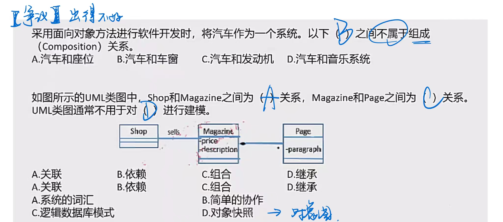

# 面向对象技术

## 面向对象基本概念

**对象**：由**数据及其操作所构成的封装体**，是系统中用来**描述客观事务的一个实体**，是构成系统的一个基本单位。一个对象通常可以由**对象名、属性和方法**3个部分组成。

> 对象特性
>
> 1. 清晰的边界
> 2. 良好定义的行为
> 3. 可扩展性

**类**：现实世界中**实体的形式化描述**，类将该实体的属性（数据）和操作（函数）封装在一起。**对象是类的实例，类是对象的模板**。 

- **类的分类**：类可以分为三种，**实体类、接口类（边界类）和控制类**。    
  -  实体类的对象表示**现实世界中真实的实体**，如人、物等。 
  -  接口类（边界类）的对象**为用户提供一种与系统合作交互的方式**，分为人和系统两大类。人的接口可以是显示屏、窗口、Web 窗体、对话框、菜单、列表框、其他显示控制、条形码、二维码或者用户与系统交互的其他方法；系统接口涉及到把数据发送到其他系统，或者从其他系统接收数据。
  -  控制类的对象用来**控制活动流，充当协调者**。

**抽象**：通过**特定的实例抽取共同特征以后形成概念的过程**。它**强调主要特征，忽略次要特征**。一个对象是现实世界中一个实体的抽象，一个类是一组对象的抽象，抽象是一种单一化的描述，它强调给出与应用相关的特性，抛弃不相关的特性。 

**封装**：是一种**信息隐藏技术**，将相关的概念组成一个单元模块，并通过一个名称来引用。面向对象封装是将数据和基于数据的操作封装成一个整体对象，对数据的访问或修改只能通过对象对外提供的接口进行。

**继承**：表示**类之间的层次关系（父类与子类）**，这种关系使得某类对象可以继承另外一类对象的特征，又可分为单继承和多继承。

**多态**：**不同的对象收到同一个消息时产生完全不同的结果**。包括🔺**参数多态（不同类型参数多种结构类型）、包含多态（父子类型关系）、过载多态（类似于重载，一个名字不同含义）、强制多态（强制类型转换）**四种类型。多态由继承机制支持，将通用消息放在抽象层，具体不同的功能实现放在低层。 

> 多态是有继承机制来支持

**接口**：描述对操作规范的说明，其**只说明操作应该做什么**，并没有定义操作如何做。

**消息**：体现**对象间的交互**，通过它向目标对象发送操作请求。 

**覆盖**：子类在原有父类接口的基础上，用**适合于自己要求的实现去置换父类中的相应实现**。即在子类中重定义一个与父类同名同参的方法。

**函数重载**：与覆盖要区分开，函数重载与子类父类无关，且**函数是同名不同参数**。

**绑定**：是一个把**过程调用和响应调用所需要执行的代码加以结合**的过程。在一般的程序设计语言中，绑定是**在编译时进行的，叫作静态绑定**。**动态绑定**则是**在运行时进行**的，因此，一个给定的过程调用和代码的结合直到调用发生时才进行。 

例：

## 分析设计测试

### 面向对象的分析

是为了**确定问题域，理解问题**。包含五个活动：🔺**认定对象、组织对象、描述对象间的相互作用、确定对象的操作、定义对象的内部信息**。

面向对象需求建模: 

> 🔺结构化的模型：数据模型 - ER 图、行为模型 - 状态转换图、功能模型 - 数据流图
>
> 🔺面向对象的模型：用例模型 - 用例图、分析模型 - （静态：类图、对象图；动态：活动图、序列图） 

### 面向对象的设计

是**设计分析模型和实现相应源代码**，设计问题域的解决方案，与技术相关。OOD同样应遵循抽象、信息隐蔽、功能独立、模块化等设计准则。

面向对象的**分析模型**主要由**顶层架构图、用例与用例图、领域概念模型构成**；**设计模型**则**包含以包图表示的软件体系结构图、以交互图表示的用例实现图、完整精确的类图、针对复杂对象的状态图和用以描述流程化处理过程的活动图等**。 

#### 面向对象的设计原则

1. **单一责任原则**：就一个类而言，应该**仅有一个引起它变化的原因**。即，当需要修改某个类的时候原因有且只有一个，让一个类只做一种类型责任。

2. **开放 - 封闭原则**：软件实体（类、模块、函数等）应该是**可以扩展的，即开放的**；但是**不可修改的，即封闭**的。

3. **里氏替换原则**：**子类型必须能够替换掉他们的基类型**。即，在任何父类可以出现的地方，都可以用子类的实例来赋值给父类型的引用。

4. **依赖倒置原则**：**抽象不应该依赖于细节，细节应该依赖于抽象**。即，高层模块不应该依赖于低层模块，二者都应该依赖于抽象。

5. **接口分离原则**：不应该强迫客户依赖于它们不用的方法。接口属于客户，不属于它所在的类层次结构。即：**依赖于抽象，不要依赖于具体**，同时在抽象级别不应该有对于细节的依赖。这样做的好处就在于可以最大限度地应对可能的变化。 

   > 内部功能和实现是相分离的

### 面向对象的测试

一般来说，对面向对象软件的测试可分为下列4个层次进行。

1. **算法层**：测试**类中定义的每个方法**，基本上相当于传统软件测试中的**单元测试**。
2. **类层**：测试封装在**同一个类中的所有方法与属性之间的相互作用**。在面向对象软件中类是基本模块，因此可以认为这是面向对象测试中所**特有**的模块测试。
3. **模板层**：测试**一组协同工作的类之间的相互作用**，大体上相当于传统软件测试中的**集成测试**，但是也有面向对象软件的特点（例如，对象之间通过发送消息相互作用）。
4. **系统层**：把**各个子系统组装成完整的面向对象软件系统**，在组装过程中同时进行测试。 

例：

## 统一建模语言 UML

**UML（统一建模语言）**：是一种**可视化的建模语言，而非程序设计语言**，支持从需求分析开始的软件开发的全过程。

> 在采用 UML 进行面向对象系统建模时，会用 UML 中构造型（stereotype）名称为 interface 来表示接口这一概念（并非具体类），**声明对象类所需要的服务**，而服务具体如何执行，由实现它的具体类完成。

从总体上来看，UML的结构包括**构造块、规则和公共机制**三个部分。

1. **构造块**：UML有三种基本的构造块，分别是**事物（thing）、关系（relationship）和图（diagram）**。事物是UML的重要组成部分，关系把事物紧密联系在一起，图是多个相互关联的事物的集合。
2. **公共机制**：公共机制是指达到特定目标的公共UML方法。
3. **规则**：规则是构造块如何放在一起的规定。 

### UML2.0图

书上是13种，有的说法还包含制品图，一共14种，了解即可，总分类如下：

> 框框起来的图叫交互图

#### 类图（类：数据类型、方法...）

静态图，为系统的**静态设计视图**，展现一组**对象、接口、协作和它们之间的关系**。

#### 对象图（只有对象）

静态图，展现**某一时刻一组对象及它们之间的关系**，为类图的某一快照。在没有类图的前提下，对象图就是静态设计视图。

#### 用例图（有小人）

静态图，展现了一组**用例、参与者以及它们之间的关系**。用例图中的参与者是人、硬件或其他系统可以扮演的角色；用例是参与者完成的一系列操作，用例之间的关系有**扩展、包含、泛化**（用例图独有）。

> 包含 include：在执行某一个操作的时候，必须先执行另一个操作
>
> 扩展 exclude：不是必要操作，如电子支付，钱够直接支付；钱不够，从银行卡转钱 --> 从银行卡赚钱就是 exclude 可做可不做
>
> 泛化：父子关系，一般和特殊

#### 序列图（有对象和生命线）

即顺序图，动态图，是场景的图形化表示，描述了**以时间顺序组织的对象之间的交互活动**。有**同步消息**（进行阻塞调用，调用者中止执行，等待控制权返回，需要等待返回消息，用实心三角箭头表示），**异步消息**（发出消息后继续执行，不引起调用者阻塞，也不等待返回消息，由空心箭头表示）、**返回消息**（由从右到左的虚线箭头表示）三种。

> 按照时间顺序传递消息

#### 通信图（有编号）

动态图，即**协作图，强调参加交互的对象的组织**。

> 按照序号顺序传递消息

#### 状态图（有状态变换）

动态图，展现了一个状态机，描述**单个对象在多个用例中的行为**，包括简单状态和组合状态。转换可以通过**事件触发器触发**，事件触发后相应的**监护条件**会进行检查。状态图中转换和状态是两个独立的概念，如下：图中方框代表状态，箭头上的代表触发事件，实心圆点为起点和终点。 

> 包含很多个状态的状态是超状态
>
> 连线上的 ringing 是 事件触发器

#### 活动图（有并发分岔）

动态图，是一种**特殊的状态图**，展现了**在系统内从一个活动到另一个活动的流程**。活动的分岔和汇合线是一条水平粗线。牢记下图中**并发分岔、并发汇合、监护表达式、分支、流**等名词及含义。每个分岔的分支数代表了可同时运行的线程数。活动图中能够并行执行的是在一个分岔粗线下的分支上的活动。

> 并发分岔：可以同时运行多少个线程

#### 构件图（组件图）（模块 export, import 接口，半圆圆圈）

静态图，为系统**静态实现视图，展现了一组构件之间的组织和依赖**。

> 一个构建可能是由多个类组成的，可复用的模块
>
> * 供接口 export、需接口 import

#### 部署图（物理模块）

静态图，为系统**静态部署视图**，部署图🔺**物理模块**的节点分布。它与构件图相关，通常一个结点包含一个或多个构件。其依赖关系类似于包依赖，因此部署组件之间的依赖是单向的类似于包含关系。

### UML 4+1 视图

> 视图是图的抽象，视图提出概念，图来实现

1. **逻辑视图**：也称为**设计视图**，它表示了设计模型中在架构方面具有重要意义的部分，即**类、子系统、包和用例实现的子集**。

2. **进程视图**：是**可执行线程和进程作为活动类的建模**，它是**逻辑视图的一次执行实例，描述了并发与同步结构**。

   > 逻辑视图的执行实例

3. **实现视图**：对组成基于系统的**物理代码的文件和构件进行建模**。

4. **部署视图**：把**构件部署到一组物理节点上**，表示软件到硬件的映射和分布结构。

5. **用例视图**：是**最基本的需求分析模型**。 

例：

## 事务关系

### 事务

**结构事物**：模型的静态部分，如类、接口、用例、构件等；

**行为事物**：模型的动态部分，如交互、活动、状态机；

**分组事物**：模型的组织部分，如包；

**注释事物**：模型的解释部分，依附于一个元素或一组元素之上对其进行约束或解释的简单符号。 

### 🔺关系

**依赖**：**一个事物的语义依赖于另一个事物的语义的变化而变化**。

**关联**：是一种结构关系，描述了一组链，链是对象之间的连接。分为**组合和聚合**，都是**部分和整体**的关系，其中组合事物之间关系更强。两个类之间的关联，实际上是两个类所扮演角色的关联，因此，两个类之间可以有多个由不同角色标识的关联。

> 组合：具有共同的生命周期，如果整体不存在，部分也不存在 - 人和人的大脑
>
> 聚合：没有共同的生命周期 - 雁群和大雁

**泛化**：**一般/特殊的关系**，子类和父类之间的关系。

**实现**：**一个类元指定了另一个类元保证执行的契约**。 

🔺（记住符号）

例：

## 设计模式

**架构模式**：软件设计中的**高层决策**，例如C/S结构就属于架构模式，架构模式反映了开发软件系统过程中所作的基本设计决策。

🔺**设计模式**：每一个设计模式描述了一个在我们周围**不断重复发生的问题，以及该问题的解决方案的核心**。这样，就能一次又一次地使用该方案而不必做重复劳动。设计模式的核心在于提供了相关问题的解决方案，使得人们可以更加简单方便地复用成功的设计和体系结构。四个基本要素：**模式名称、问题（应该在何时使用模式）、解决方案（设计的内容）、效果（模式应用的效果）**。 

**惯用法**：是最低层的模式，关注**软件系统的设计与实现，实现时通过某种特定的程序设计语言**来描述构件与构件之间的关系。每种编程语言都有它自己特定的模式，即语言的惯用法。例如引用－计数就是C++语言中的一种惯用法。 

> 🔺分类要记得
>
> `**xxxx**`的表示既可以是类模式，也可以是对象模式；无下划线的表示只是对象模式

| 创建型设计模式                     | 定义                                                         | 记忆关键字     |
| :--------------------------------- | ------------------------------------------------------------ | -------------- |
| Abstract Factory  抽象工厂模式 | 提供一个接口，可以创建一系列相关或相互依赖的对象，而无需指定它们具体的类（工厂方法的进一步抽象） | 抽象接口       |
| Builder  构建器模式            | 将一个复杂类的表示与其构造相分离，使得相同的构建过程能够得出不同的表示 | 类和构造分离   |
| Factory Method  工厂方法模式   | 定义一个创建对象的接口，但由子类决定需要实例化哪一个类。使得子类实例化过程推迟 | 子类决定实例化 |
| Prototype  原型模式            | 用原型实例指定创建对象的类型，并且通过**拷贝**这个原型来创建新的对象 | 原型实例，拷贝 |
| Singleton  单例模式            | 保证一个类只有一个实例，并提供一个访问它的全局访问点         | 唯一实例       |

结构型设计模式 ：描述类和对象之间是如何组成一个结构的

| 结构型设计模式           | 定义                                                         | 记忆关键字            |
| ------------------------ | ------------------------------------------------------------ | --------------------- |
| Adapter   适配器模式 | 将一个类的接口转换成用户希望得到的另一种接口。它使原本不相容的接口得以协同工作 | 转换，兼容接口        |
| Bridge   桥接模式    | 将类的抽象部分和它的实现部分分离开来，使它们可以独立的变化   | 抽象和实现分离        |
| Composite   组合模式 | 将对象组合成树型结构以表示 “整体 - 部分” 的层次结构，使得用户对单个对象和组合对象的使用具有一致性 | 整体 - 部分，树形结构 |
| Decorator   装饰模式 | **动态**的给一个对象添加一些额外的职责。它提供了用子类扩展功能的一个灵活的替代，比派生一个子类更加灵活 | 附加职责              |
| Façade   外观模式    | 定义一个高层接口，为子系统中的一组接口提供一个一致的外观，从而简化了该子系统的使用 | 对外统一接口          |
| Flyweight   享元模式 | 提供支持大量细粒度对象**共享**的有效方法                     | 细粒度，共享          |
| Proxy   代理模式     | 为其他对象提供一种代理以控制这个对象的访问                   | 代理控制              |

行为型设计模式：反应类和对象之间的行为，动态交互的东西

> 中介者模式和观察者模式是相互竞争的模式

| 行为型设计模式                           | 定义                                                         | 记忆关键字           |
| ---------------------------------------- | ------------------------------------------------------------ | -------------------- |
| Chain of Responsibility   职责链模式 | 通过给多个对象处理请求的机会，减少请求的发送者与接收者之间的耦合。将接收对象链接起来，在链中传递请求，直到有一个对象处理这个请求 | 传递请求、职责、链接 |
| Command   命令模式                   | 将一个请求封装为一个对象，从而可用不同的请求对客户进行参数化，将请求排队或记录请求日志，支持**可撤销**的操作 | 日志记录、可撤销     |
| Interpreter   解释器模式             | 给定一种语言，定义它的文法表示，并定义一个解释器（虚拟机），该解释器用来根据文法表示来解释语言中的句子 | 解释器，虚拟机       |
| Iterator   迭代器模式                | 提供一种方法来顺序访问一个聚合对象中的各个元素，而**不需要暴露该对象的内部表示**（外部接口访问） | 顺序访问，不暴露内部 |
| Mediator   中介者模式                | 用一个中介对象来封装一系列的对象交互。它使各对象**不需要显式地相互调用**，从而达到低耦合，还可以独立的改变对象间的交互 | 不直接引用           |
| Memento   备忘录模式                 | 在不破坏封装性的前提下，**捕获**一个对象的内部状态，并在该对象之外保存这个状态，从而可以在以后将该对象**恢复**到原先保存的状态（存档读档） | 保存，恢复           |
| Observer   观察者模式                | 定义对象间的一种一对多的依赖关系，当一个对象的状态发生改变时，所有依赖于它的对象都得到通知并自动更新（类似于订阅者和微信公众号） | 通知、自动更新       |
| State   状态模式                     | 允许一个对象在其内部状态改变时改变它的行为（类似于会员模式，状态改变权限改变） | 状态变成类           |
| Strategy   策略模式                  | 定义一系列**算法**，把它们一个个**封装**起来，并且使它们之间可**互相替换**，从而让算法可以独立于使用它的用户而变化 | 算法替换             |
| Template Method   模板方法模式       | 定义一个操作中的算法骨架，而将一些步骤延迟到子类中，使得子类可以不改变一个算法的结构即可重新定义算法的某些特定步骤 | 使用模板             |
| Visitor   访问者模式                 | 表示一个作用于某对象结构中的各元素的操作，使得在不改变各元素的类的前提下定义作用于这些元素的新操作（数据结构不变，操作改变） | 数据和操作分离       |

例：

