# 操作系统知识

## 操作系统概述
#### 定义

能有效地组织和管理系统中的各种软/硬件资源，合理地组织计算机工作流程，控制程序的执行，并且向用户提供一个良好的工作环境和友好的接口。

#### 作用

- 通过**资源管理**提高计算机系统的效率  
- 改善人机界面向用户提供友好的工作环境

#### 特征

**并发性、共享性、虚拟性和不确定性**

#### 功能

- 进程管理：实质上是对处理机（CPU）的执行“时间”进行管理，采用多道程序等技术将CPD的时间合理地分配给每个任务，主要包括进程控制、进程同步、进程通信和进程调度。
- 文件管理：主要包括文件存储空间管理、目录管理、文件的读/写管理和存取控制。
- 存储管理：存储管理是对**主存**储器“空间”进行管理，主要包括存储分配与回收、存储保护、地址映射（变换）和主存扩充。
- 设备管理：实质是对硬件设备的管理，包括对**输入/输出设备**的分配、启动、完成和回收。
- 作业管理：包括任务、界面管理、人机交互、图形界面、语音控制和虚拟现实等。

#### 分类（考过）

- 批处理操作系统：单道（一个任务处理完才能处理下一个任务）批处理和多道（能同时处理多个任务）批处理（主机与外设可并行）。

- 分时操作系统：一个计算机系统与多个终端设备连接。**将CPU的工作时间划分为许多很短的时间片**，轮流为各个终端的用户服务。（并发，不能让一个进程长时间占用 CPU）

  > 分时系统采用简单时间片轮转法，当系统中的用户数为 n、时间片为 q 时，系统对每个用户的响应时间 T = n*q
  >
  > 🔺响应时间=等待时间+执行时间=`(n-1)*q=n*q`

- 实时操作系统：实时是指**计算机**对于外来信息能够以**足够快的速度进行处理**并在**被控对象允许的时间**范围内做出快速反应。实时系统对交互能力要求不高但要求**可靠性**有保障。

- 网络操作系统：是使**联网计算机**能方便而有效地**共享网络资源**，为网络用户提供各种服务的软件和有关

- 协议的集合。三种模式：集中模式、客户端/服务器模式（C/S模式） 、对等模式（P2P模式）。

- 分布式操作系统：分布式计算机系统是由**多个分散的计算机**经连接而成的计算机系统，系统中的计算机无主、次之分，任意两台计算机可以通过通信交换信息。（物理层面远）

- 微型计算机操作系统:简称微机操作系统，常用的有Windows、Mac OS、Linux。

#### 嵌入式操作系统主要特点

- 微型化：从性能和成本角度考虑，希望占用的资源和系统代码量少，如内存少、字长短、运行速度有限、能源少（用微小型电池）。 
- 可定制：从减少成本和缩短研发周期考虑，要求嵌入式操作系统能运行在不同的微处理器平台上，能针对**硬件**变化进行结构与功能上的配置，以满足不同应用需要。
- 实时性：嵌入式操作系统主要应用于过程控制、数据采集、传输通信、多媒体信息及关键要害领域需要**迅速响应**的场合，所以**对实时性要求较高**。
- 可靠性：系统构件、模块和体系结构必须达到应有的可靠性，对关键要害应用还要提供容错和防故障措施。
- 易移植性。为了提高系统的易移植性，通常采用硬件抽象层和板级支撑包的底层设计技术

嵌入式系统**初始化过程**按照自底向上、从硬件到软件的次序依次为：**片级初始化**（芯片级别，类似于 CPU） --> **板级初始化**（板上的各种外设） --> **系统初始化**

## 进程管理

### 进程的组成

进程控制块 PCB（唯一标识）、程序（描述进程要做什么）、数据（存放进程执行时所需数据）。

> TCP 线程控制块、FPC 文件控制块

进程基础的状态是下左图中的**三态图**。↓

运行态：当前进程正在运行，需要 CPU 

就绪态：处于就绪队列里，等待被分配 CPU（除了 CPU 什么都有了）

阻塞态：除了 CPU 还缺其他条件（外设在传输数据...之类）

| 进程 | CPU | 资源 |
| --- | --- | --- |
| 运行 | √ | √ |
| 就绪 | × | √ |
| 阻塞 | × | × |

## 同步互斥

### 前趋图

反应**任务间的并行、任务间的先后顺序**

### 进程资源图

用来表示**进程和资源之间的分配和请求关系**

- P代表进程，R代表资源，R方框中有几个圆球就表示有几个这种资源，在上图中，**R1 指向P1，表示R1有一个资源已经分配给了P1**，**P1指向R2，表示P1还需要请求一个 R2 资源才能执行**。
- 阻塞节点：**某进程所请求的资源已经全部分配完毕，无法获取所需资源**，该进程被阻塞了无法继续。如上图中 P2
- 非阻塞节点：**某进程所请求的资源还有剩余，可以分配给该进程继续运行**。如上图中P1、P3。

当一个进程资源图中所有进程都是阻塞节点时，即陷入死锁状态。

### 进程同步与互斥

- 临界资源：**各进程间需要以互斥方式对其进行访问**的资源。（同一时间只能有一个进程访问）

- 临界区：指进程中**对临界资源实施操作的那段程序**。（本质是一段代码）

  

- 互斥：某资源（即临界资源）在**同一时间内只能由一个任务单独使用**，使用时需要**加锁**，使用完后解锁才能被其他任务使用；如打印机。

- 同步：**多个任务可以并发执行，只不过有速度上的差异**，在一定情况下停下等待，不存在资源是否单独或共享的问题；如自行车和汽车。

  

- 互斥信号量：对临界资源采用互斥访问，使用互斥信号量后其他进程无法访问，**初值为1**。

- 同步信号量：对共享资源的访问控制，**初值一般是共享资源的数量**。（有数量上限）

#### 🔺PV 操作

- P操作：申请资源，S=S-1，若S>=0，则执行P操作的进程继续执行；若S<0， 则置该进程为阻塞状态（因为无可用资源），并将其插入阻塞队列。
- V操作：释放资源，S=S+1，若S>0，则执行V操作的进程继续执行；若S<=0，则从阻塞状态唤醒一个进程，并将其插入就绪队列（此时因为缺少资源被P操作阻塞的进程可以继续执行），然后执行V操作的进程继续。

**经典问题**：生产者消费者问题

三个信号量：互斥信号量 S0（仓库独立使用权），同步信号量 S1（仓库空闲个数），同步信号量 S2（仓库商品个数）

PV 的另一种考法：

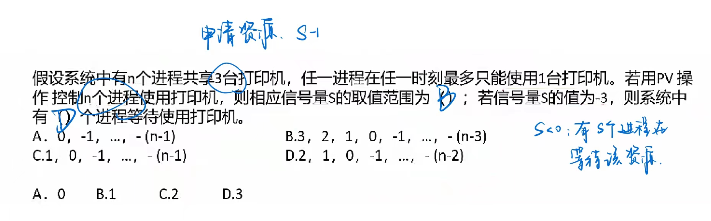

## 进程调度

进程调度方式是指**当有更高优先级的进程到来时如何分配 CPU**。分为**可剥夺和不可剥夺两种**，可剥夺指当有更高优先级进程到来时，强行将正在运行进程的 CPU 分配给高优先级进程；不可剥夺是指高优先级进程必须等待当前进程自动释放CPU。

在某些操作系统中，一个作业从提交到完成需要经历高、中、低三级调度

1. 高级调度。高级调度又称“长调度”、“**作业调度**”或“接纳调度"，它决定**处于输入池中的哪个后备作业可以调入主系统做好运行的准备**，成为一个或组就绪进程。在系统中一个作业只需经过一次高级调度。（作业可以理解为一组进程、一组程序）
2. 中级调度。中级调度又称“中程调度”或“对换调度”，它决定**处于交换区中的哪个就绪进程可以调入内存**，以便直接参与对CPU的竞争。（还没有获取 CPU，把相当于把就绪进程调入到就绪队列里）
3. 低级调度。低级调度又称“短程调度”或“**进程调度**”它**决定处于内存中的哪个就绪进程可以占用CPU**。低级调度是操作系统中**最活跃、最重要**的调度程序，对系统的影响很大。

### 调度算法

- 先来先服务FCFS：先到达的进程优先分配CPU。用于宏观调度。

- 时间片轮转：分配给每个进程CPU时间片，轮流使用CPU，每个进程时间片大小相同，很公平，用于微观调度。

- 优先级调度：每个进程都拥有一个优先级，优先级大的先分配CPU。（如果当前有程序在运行，就看可剥夺）

- 多级反馈调度：时间片轮转和优先级调度结合而成，设置多个就绪队列1,2,3...n，每个队列分别赋予不同的优先级，分配不同的时间片长度；新进程先进入队列1的末尾，按FCFS原则，执行队列1的时间片；若未能执行完进程，则转入队列2的末尾，如此重复。 

  可参考[【RL Base】多级反馈队列（MFQ）算法-云社区-华为云](https://bbs.huaweicloud.com/blogs/441277)

### 死锁

当一个进程在等待永远不可能发生的事件时，就会产生死锁，若系统中有多个进程处于死锁状态，就会造成系统死锁。

🔺 死锁产生的四个必要条件：**资源互斥、每个进程占有资源并等待其他资源、系统不能剥夺进程资源、进程资源图是一个环路**。

死锁产生后解决措施是打破四大条件，有下列方法：

- 死锁预防：采用某种策略限制并发进程对于资源的请求，破坏死锁产生的四个条件之一使系统任何时刻都不满足死锁的条件。
- 死锁避免：一般采用银行家算法来避免，银行家算法，就是提前计算出一条不会死锁的资源分配方法，才分配资源，否则不分配资源，相当于借贷，考虑对方还得起才借钱，提前考虑好以后，就可以避免死锁。
- 死锁检测：允许死锁产生，但系统定时运行一个检测死锁的程序，若检测到系统中发生死锁，则设法加以解除。
- 死锁解除：即死锁发生后的解除方法，如强制剥夺资源，撤销进程等。
- 🔺**死锁资源计算**：系统内有n个进程，每个进程都需要R个资源，那么**其发生死锁的最大资源数为`n*(R-1)`。其不发生死锁的最小资源数况为 `n*(R-1)+1`** （n 个进程每个都给 R-1 个资源，会死锁；有一个给了 R 个资源就会执行成功并释放资源）

#### 银行家算法

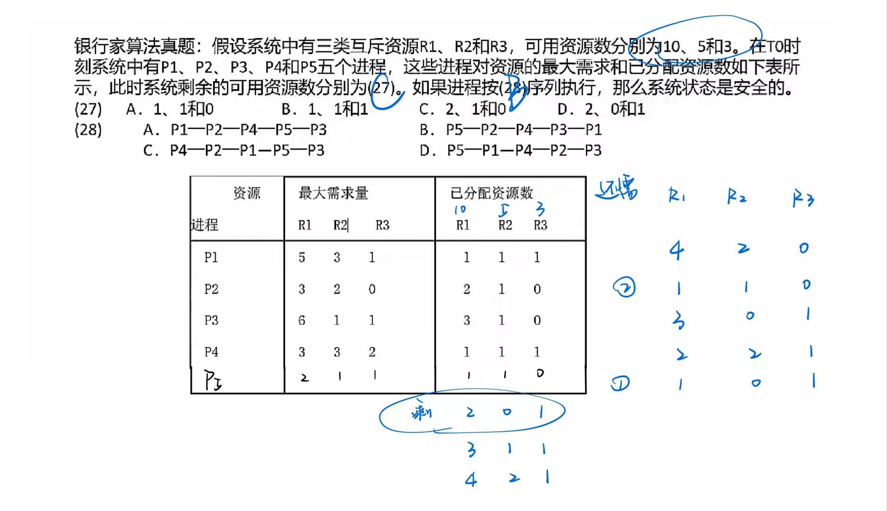

### 线程

- 传统的进程有两个属性：**可拥有资源的独立单位**；**可独立调度和分配的基本单位**。

（🔺线程是比进程更小的单位，一个进程里可以有多个线程）

- 引入线程的原因是进程在创建、撤销和切换中，系统必须为之付出较大的时空开销，故在系统中设置的**进程数目不宜过多**，进程切换的频率不宜太高，这就**限制了并发程度的提高**。引入线程后，将传统进程的两个基本属性分开，**线程作为调度和分配的基本单位，进程作为独立分配资源的单位**（进程里的资源被进程中的线程所共享，考虑加锁、并发机制...）。用户可以通过创建线程来完成任务，以减少程序并发执行时付出的时空开销。

- **线程是进程中的一个实体**，是被系统独立分配和调度的基本单位。**线程基本上不拥有资源，只拥有一点运行中必不可少的资源（如程序计数器、一组寄存器和栈）**，它**可与同属一个进程的其他线程共享进程所拥有的全部资源**，例如进程的公共数据、全局变量、代码、文件等资源，但不能共享线程独有的资源如线程的栈指针等标识数据。

## 存储管理

### 分区存储管理

所谓分区存储组织，就是**整存**，**将某进程运行所需的内存整体一起分配给它**，然后再执行。有三种分区方式：

- 固定分区：静态分区方法，将主存分为若干个固定的分区，将要运行的作业装配进去，由于**分区固定**，大小和作业需要的大小不同，会**产生内部碎片**。
- 可变分区：动态分区方法，主存空间的分区是在**作业转入时划分**，正好划分为作业需要的大小，这样就**不存在内部碎片**，**但容易将整片主存空间切割成许多块，会产生外部碎片**。
- 可重走位分区：可以解决碎片问题，移动所有已经分配好的区域，使其成为一个连续的区域，这样其他外部细小的分区碎片可以合并为大的分区，满足作业要求。只在外部作业请求空间得不到满足时进行。

> 🔺 固定分区-产生内部碎片；可变分区（按需分配）-产生外部碎片

#### 系统分配内存算法（可变分区，按需分配）

根据分配前的内存情况，还需要分配 9K 的空间，对不同算法的结果如下：

- 首次适应法：按内存地址顺序从头查找，找到第一个 >=9K 空间的空闲块，即切割 9K 空间分配给进程。
- 最佳适应法：将内存中所有空闲内存块按从小到大排序，找到第一个 >=9K 空间的空闲块，切割分配，这个将会找到与 9K 空间大小最相近的空闲块。
- 最差适应法：和最佳适应法相反，将内存中空闲块空间最大的，切割 9K 空间分配给进程，这是为了预防系统中产生过多的细小空闲块。
- 循环首次适应法：按内存地址顺序查找，找到第一个 >=9K 空间的空闲块，而后若还需分配，则找下一个，不用每次都从头查找，这是与首次适应法不同的地方。

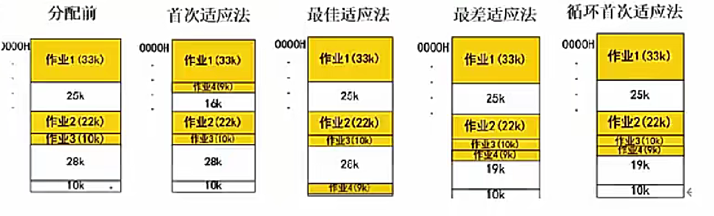

## 固定分页分段

 ### 🔺分页存储管理

> 属于静态的固定分配方法，会有静态碎片

原理：不用一次性把进程所需要的内存空间全分配出来（内存不够），利用程序的局部性原理，把内存分成页，进程被分成页帧（物理），一页页调（分区是整存）

**逻辑页分为页号和页内地址**，页内地址就是物理偏移地址，而页号与物理块号并非按序对应的，需要查询页表，才能得知页号对应的物理块号，再用物理块号加上偏移地址才得出了真正运行时的物理地址。

优点：利用率高，碎片小，分配及管理简单

缺点：增加了系统开销，可能产生抖动现象（页数多但算法不好，效率会下降）

逻辑地址（页） --> 物理地址（页帧 ）转换

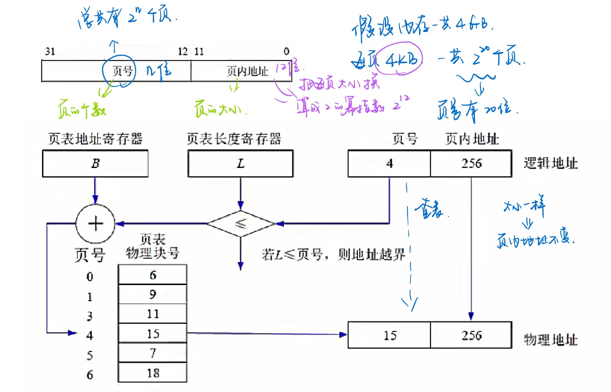

#### 页面置换算法

- 最优算法：OPT（理论上的算法，无法实现），是在进程执行完后进行的最佳效率计算，用来让其他算法比较差距。原理是选择未来最长时间内不被访问的页面置换，这样可以保证未来执行的都是马上要访问的。
- 先进先出算法：FIFO，先调入内存的页先被置换淘汰，会产生抖动现象，即分配的页数越多，缺页率可能越多（即效率越低）
- 最近最少使用：LRU，在最近的过去，进程执行过程中，过去最少使用的页面被置换淘汰，根据局部性原理，这种方式效率高，且不会产生抖动现象，使用大量计数器，但是没有 LFU 多。
- 淘汰原则：优先淘汰最近未访问的，而后淘汰最近未被修改的页面，

#### 快表

> 页表存了逻辑地址与物理地址的对应关系，快表存了页表访问最频繁的副本，类似于 Cache 和主存的关系
>
> 快表本质上是页表

是一块小容量的相联存储器由快速存储器组成，按内容访问，速度快，并且可以从硬件上保证按内容并行查找，一般用来存放当前访问最频繁的少数活动页面的页号。
**快表是将页表存于Cache中：慢表是将页表存于内存上**。慢表需要访问两次内存才能取出页，而快表是访问一次Cache和一次内存，因此更快。

例：

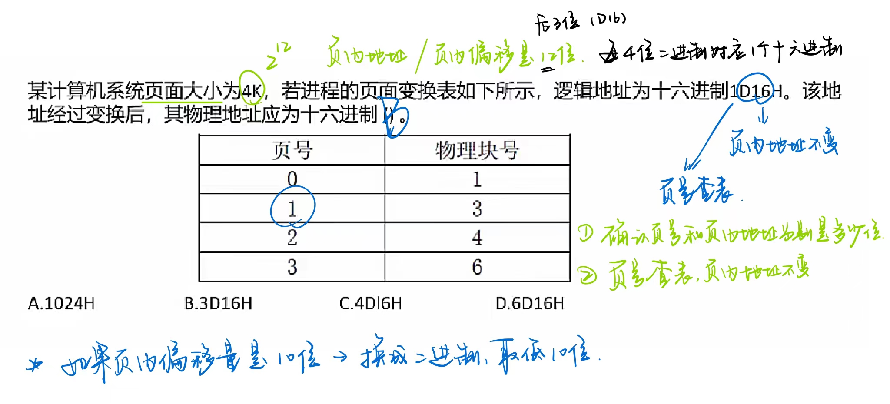

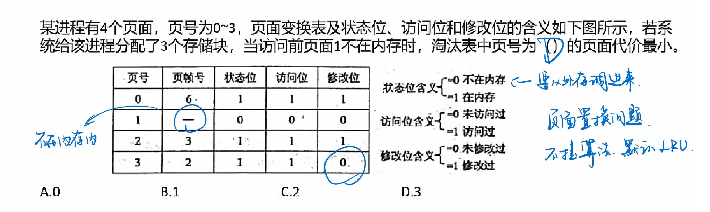

### 分段存储管理

将进程空间分为一个个段，**每段也有段号和段内地址**，与页式存储不同的是，**每段物理大小不同，分段是根据逻辑整体分段的**，因此，段表也与页表的内容不同，页表中直接是逻辑页号对应物理块号，而下图所示，段表有段长和基址两个属性，才能确定一个逻辑段在物理段中的位置。

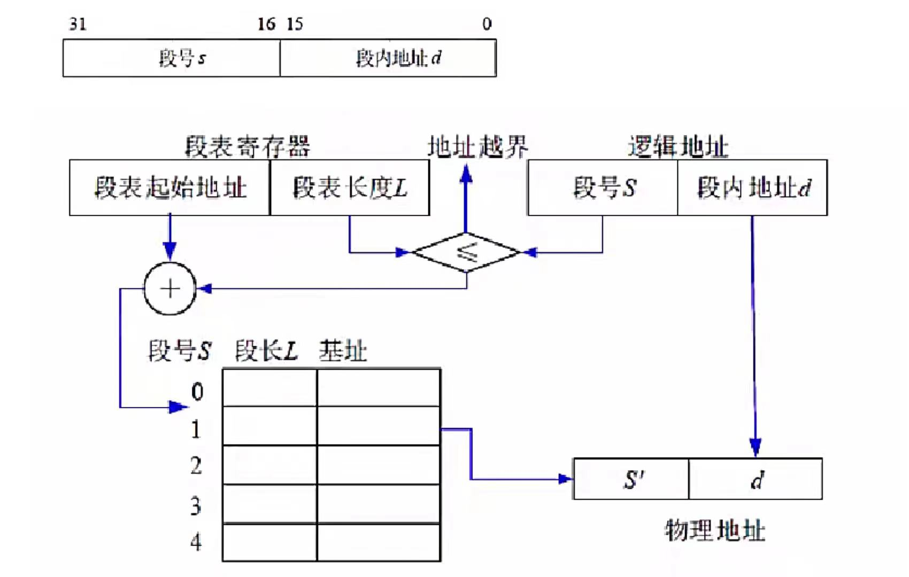

优点：多道程序共享内存，各段程序间**逻辑性强**，修改互不影响

缺点：内存利用率低，内存碎片浪费大

例：

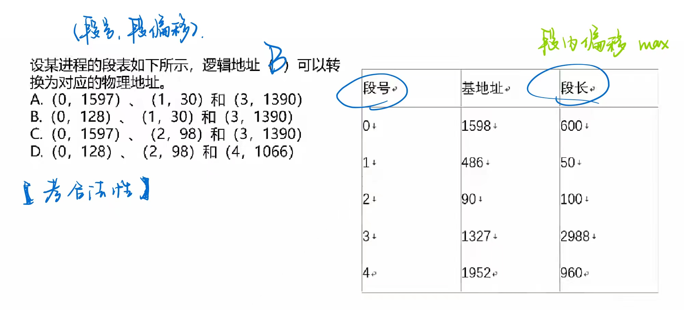

### 段页式存储管理

对进程空间**先分段，后分页**（先按逻辑分段，段里再分页）

优点：空间浪费小、存储共享容易、存储保护容易、能动态链接。

缺点：由于管理软件的增加，复杂性和开销也随之增加，需要的硬件以及占用的内容也有所增加，使得执行速度大大下降。

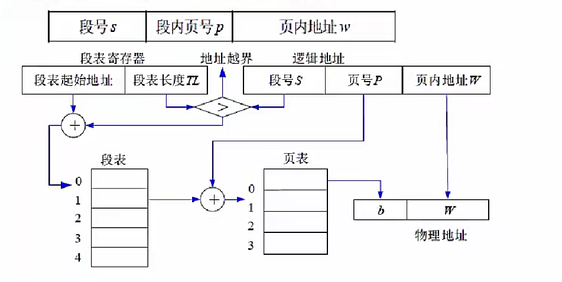

## 设备管理

### 设备管理概述

设备是**计算机系统与外界交互的工具**，具体负责**计算机与外部的输入/输出工作，所以常称为外部设备(简称外设)。**在计算机系统中，将负责管理设备和输入/输出的机构称为 I/O 系统。因此， I/O 系统由设备、控制器、通道（具有通道的计算ID设量机系统）、总线和 I/O 软件组成。

#### 设备的分类

- 按数据组织分类：块设备（高速设备，一块可以传输很多字节）、字符设备（按一个个字符传输，比特流 or 字节）。

- 按照设备功能分类：输入设备、输出设备、存储设备、网络联网设备、供电设备。

- 资源分配角度分类：独占设备（互斥的硬件资源，同一时间只有一台计算机能使用）、共享设备、虚拟设备（通过设备管理的技术，把独占设备转换成共享设备）。

- 数据传输速率分类：低速设备、中速设备、高速设备。

#### 设备管理的功能和任务

任务：保证在多道程序环境下，当**多个进程竞争使用设备时**，按定的策略**分配和管理各种设备**，控制设备的各种操作，完成 I/O 设备与主存之间的数据交换。

主要功能：**动态地掌握并记录设备的状态**、设备分配和释放、缓冲区管理、实现物理 I/O 设备的操作，提供设备使用的用户接口及设备的访问和控制。

### 🔺I/O 软件

I/O设备管理软件的所有层次及每一层功能如下图：

（🔺记住中间三层：设备无关软件、设备驱动程序、中断处理程序，越来越向硬件靠近）

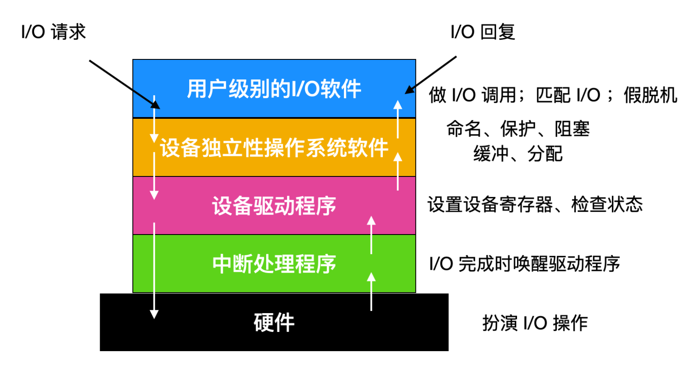

实例：当用户程序试图读一个硬盘文件时，需要通过操作系统实现这一操作。**与设备无关软件检查高速缓存中有无要读的数据块**，若没有，则**调用设备驱动程序，向 I/O 硬件发出一个请求**。然后，用户进程阻塞并等待磁盘操作的完成。当**磁盘操作完成时，硬件产生一个中断，转入中断处理程序**（告诉计算机需要的数据已经有了，可以处理了）。中断处理程序检查中断的原因，认识到**这时磁盘读取操作已经完成，于是唤醒用户进程取回从磁盘读取的信息，从而结束此次 I/O 请求**。用户进程在得到了所需的硬盘文件内容之，后继续运行。

### 设备管理技术

一台独占设备，在同一时间只能由一个进程使用，其他进程只能等待，且不知道什么时候打印机空闲，此时，极大的浪费了外设的工作效率。

引入**SPOOLING**（外围设备联机操作）技术，就是在外设上建立两个数据缓冲区，分别称为输入井和输出井，这样，无论多少进程，都可以共用这一台打印机，只需要将打印命令发出，数据就会排队存储在缓冲区中，打印机会自动按顺序打印，实现了物理外设的共享，使得每个进程都感觉在使用一个打印机，这就是物理设备的虚拟化。

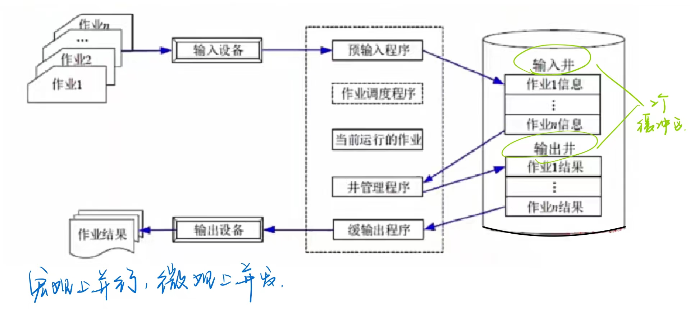

例：

## 文件管理

### 文件管理概述

文件是**具有符号名的、在逻辑上具有完整意义的**一组相关信息项的集合。（文件不只是文档，.exe, .dll之类的也是文件）

**信息项**是**构成文件内容的基本单位**，可以是一个字符，也可以是一个记录记录可以等长，也可以不等长。一个文件包括**文件体和文件说明**。文件体是文件真实的内容。文件说明是操作系统为了管理文件所用到的信息，包括文件名文件内部标识、文件的类型、文件存储地址、文件的长度、访问权限、建立时间和访问时间等。

文件管理系统，就是**操作系统中实现文件统一管理的一组软件和相关数据的集合，专门负责管理和存取文件信息的软件机构**，简称文件系统。文件系统的功能包括按名存取;统一的用户接口;并发访问和控制;安全性控制;优化性能;差错恢复。

#### 文件的类型

- 按文件性质和用途：系统文件、库文件和用户文件
- 按信息保存期限：临时文件、档案文件和永久文件
- 按文件的保护方式：只读文件、读/写文件、可执行文件、不保护文件
- Unix 系统将文件分为普通文件、目录文件和设备文件（特殊文件）

文件的逻辑结构可分为两大类：**有结构的记录式文件（有逻辑的结构）；无结构的流式文件（信息流，无结构）**。

文件的物理结构是**指文件在物理存储设备上的存放方法**，包括：

1. 连续结构。连续结构也称顺序结构，它将逻辑上连续的文件信息（如记录）依次存放在**连续编号的物理块**上。
2. 链接结构。链接结构也称串联结构，它是将逻辑上连续的文件信息（如记录）存放在**不连续的物理块上，每个物理块设有一个指针指向下一个物理块**。
3. 🔺索引结构。将逻辑上连续的文件信息（如记录）**存放在不连续的物理块中系统为每个文件建立一张索引表**。索引表记录了**文件信息所在的逻辑块号对应的物理块号**，并将索引表的起始地址放在与文件对应的文件目录项中。
4. 多个物理块的索引表。索引表是**在文件创建时由系统自动建立的**，并与文件一起存放在同一文件卷上。根据一个文件大小的不同，其索引表占用物理块的个数不等，一般占一个或几个物理块。

### 🔺索引文件结构

0-9 为直接索引，即每个索引结点存放的是内容

10 号索引为一级间接索引节点，大小为 4KB，存放的并非直接数据，而是链接到直接物理盘块的地址

二级索引节点类似，直接盘存放一级地址，一级地址再存放物理盘块地址，而后链接到存放数据的物理盘块

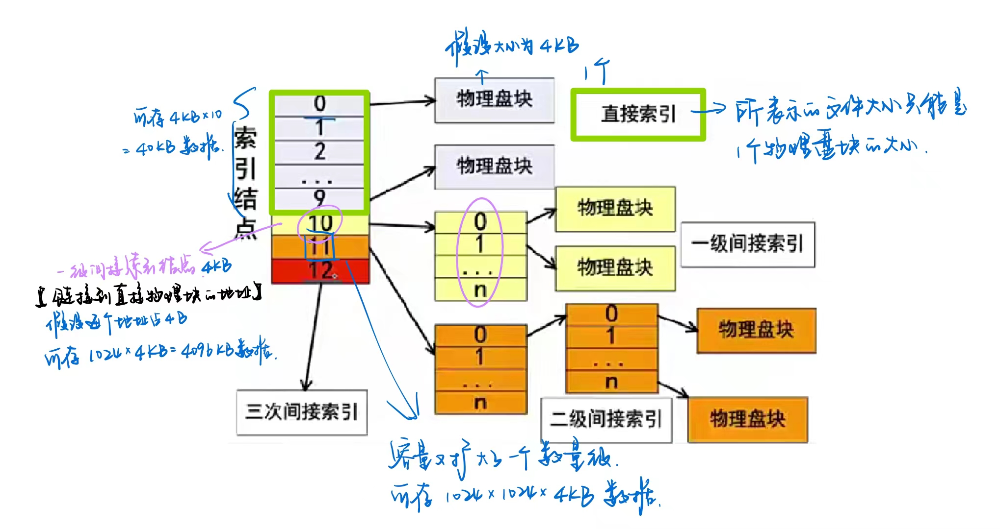

例：

 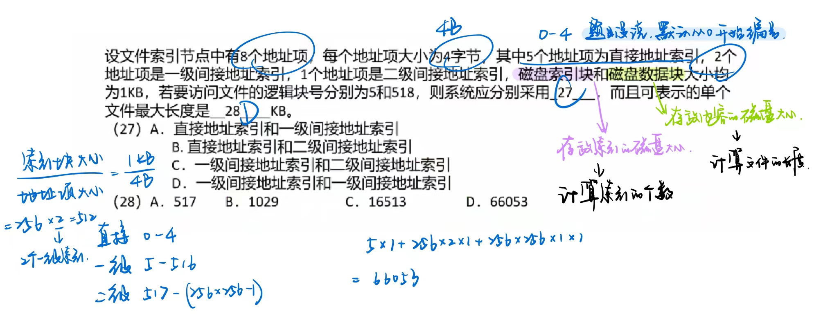

### 文件目录

文件控制块 FCB 中包含以下三类信息：基本信息类、存取控制信息类和使用信息类。

1. 基本信息类。例如文件名、文件的物理地址、文件长度和文件块数等。
2. 存取控制信息类。文件的存取权限，像UNIX 用户分成文件主、同组用户和一般用户三类，这三类用户的读/写执行RWX权限。
3. 使用信息类。文件建立日期、最后一次修改日期、最后一次访问的日期、当前使用的信息(如打开文件的进程数、在文件上的等待队列)等。

🔺**文件控制块的有序集合称为文件目录。**

  

相对路径：是**从当前路径开始的路径**

绝对路径：是**从根目录开始的路径**

全文件名=**绝对路径+文件名**。要注意，绝对路径和相对路径是不加最后的文件名的，只是单纯的路径序列。

（🔺!!!!!! 路径是不包含文件名的）

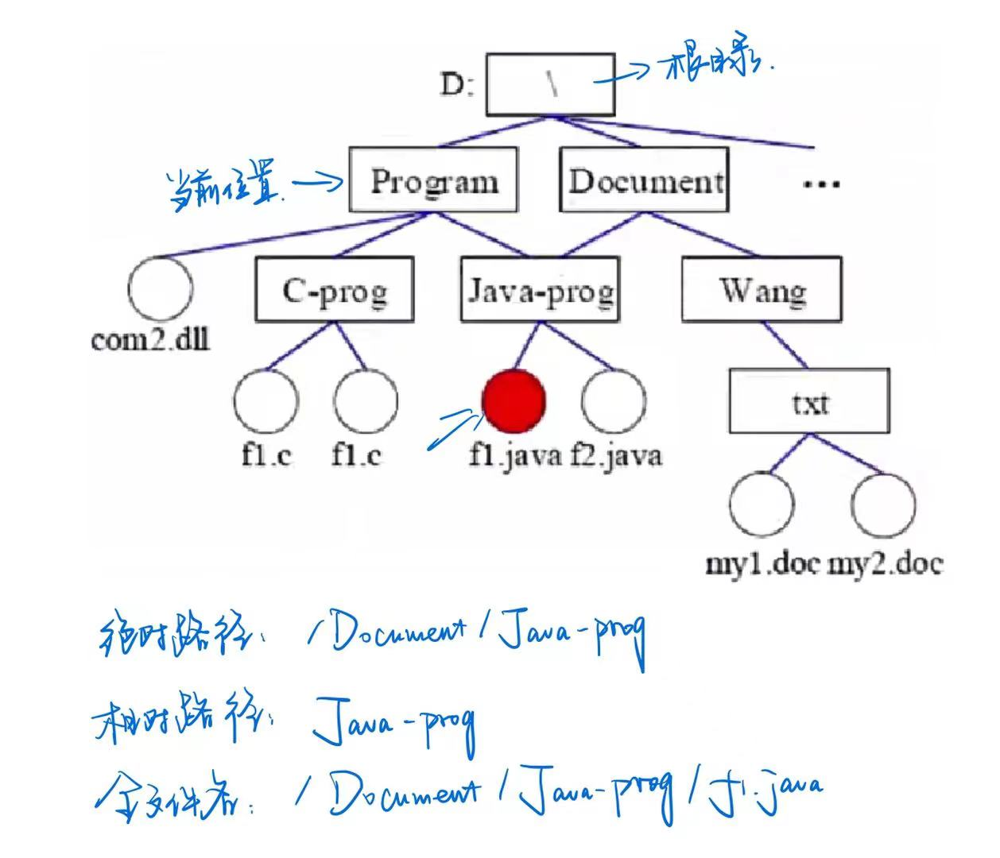

### 文件存储

文件的存取方法是**指读/写文件存储器上的一个物理块的方法**。通常有**顺序存取和随机存取**两种方法。顺序存取方法是指对文件中的信息按顺序依次进行读/写;随机存取方法是指对文件中的信息可以按任意的次序随机地读/写。

#### 文件存储空间的管理

1. 空闲区表。将外存空间上的一个连续的未分配区域称为“空闲区”。操作系统为磁盘外存上的所有空闲区建立一张空闲表，每个表项对应一个空闲区，**适用于连续文件结构**。

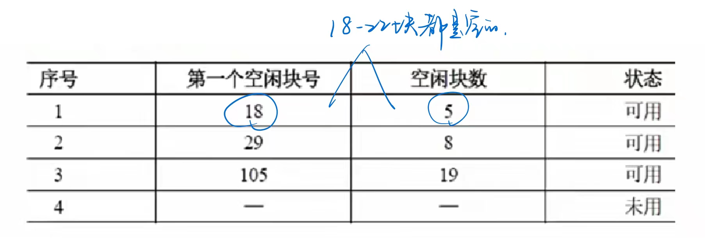

2. 🔺位示图。在外存上建立一张位示图（Bitmap），记录文件存储器的使用情况。**每一位对应文件存储器上的一个物理块，取值0和1（1个bit）分别表示空闲和占用。**

​	位示图的大小：每一个物理块占1bit，大小为 n*1bit

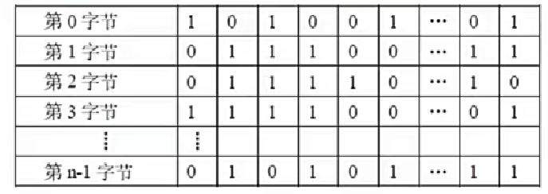

3. 空闲块链。每个空闲物理块中有指向下一个空闲物理块的**指针**，所有空闲物理块构成一个**链表**，链表的头指针放在文件存储器的特定位置上(如管理块中)，不需要磁盘分配表，节省空间。
4. 成组链接法。例如，在实现时系统将空闲块分成若干组，每100个空闲块为一组，每组的第一个空闲块登记了下一组空闲块的物理盘块号和空闲块总数（空闲块链的改进）。假如某个组的第一个空闲块号等于0，意味着该组是最后一组，无下一组空闲块。

位示图例：

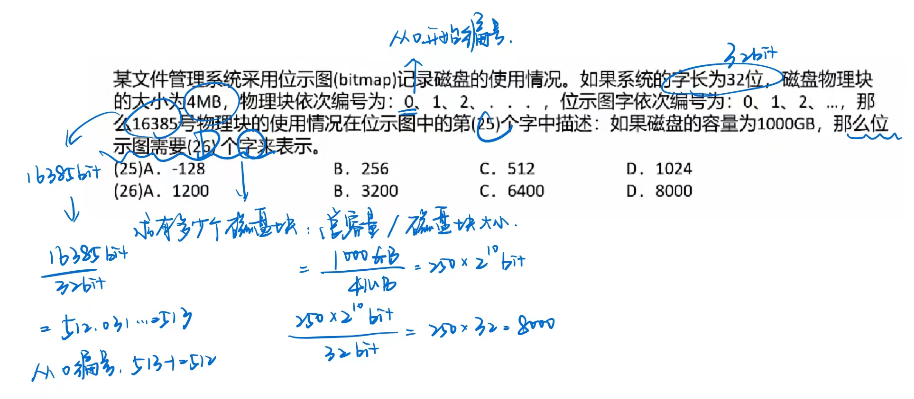

