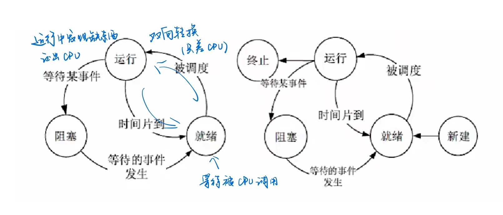
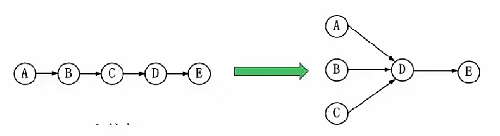
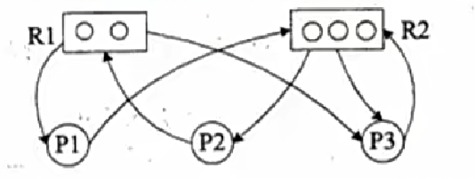
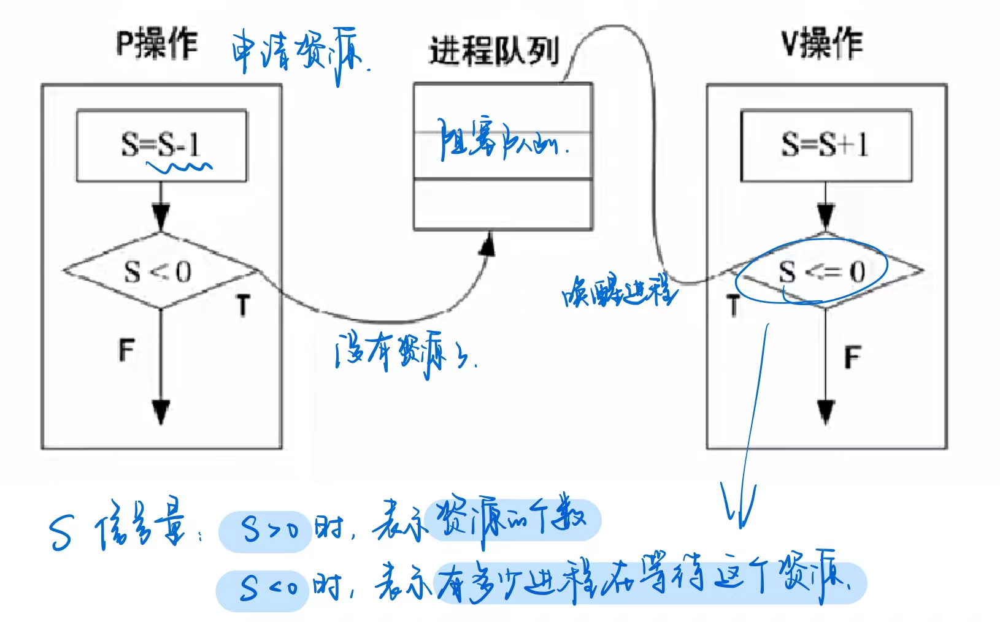
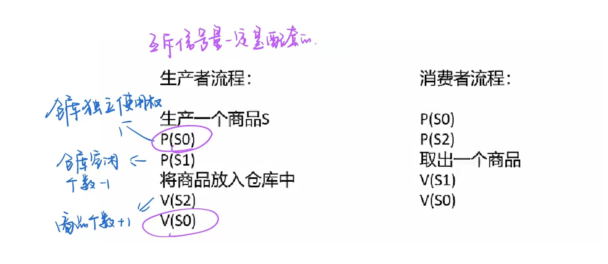
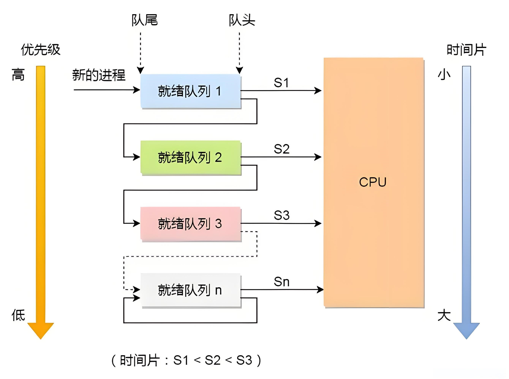

# 操作系统知识

## 操作系统概述
#### 定义

能有效地组织和管理系统中的各种软/硬件资源，合理地组织计算机工作流程，控制程序的执行，并且向用户提供一个良好的工作环境和友好的接口。

#### 作用

- 通过**资源管理**提高计算机系统的效率  
- 改善人机界面向用户提供友好的工作环境

#### 特征

**并发性、共享性、虚拟性和不确定性**

#### 功能

- 进程管理：实质上是对处理机（CPU）的执行“时间”进行管理，采用多道程序等技术将CPD的时间合理地分配给每个任务，主要包括进程控制、进程同步、进程通信和进程调度。
- 文件管理：主要包括文件存储空间管理、目录管理、文件的读/写管理和存取控制。
- 存储管理：存储管理是对**主存**储器“空间”进行管理，主要包括存储分配与回收、存储保护、地址映射（变换）和主存扩充。
- 设备管理：实质是对硬件设备的管理，包括对**输入/输出设备**的分配、启动、完成和回收。
- 作业管理：包括任务、界面管理、人机交互、图形界面、语音控制和虚拟现实等。

#### 分类（考过）

- 批处理操作系统：单道（一个任务处理完才能处理下一个任务）批处理和多道（能同时处理多个任务）批处理（主机与外设可并行）。
- 分时操作系统：一个计算机系统与多个终端设备连接。**将CPU的工作时间划分为许多很短的时间片**，轮流为各个终端的用户服务。（并发，不能让一个进程长时间占用 CPU）
- 实时操作系统：实时是指**计算机**对于外来信息能够以**足够快的速度进行处理**并在**被控对象允许的时间**范围内做出快速反应。实时系统对交互能力要求不高但要求**可靠性**有保障。
- 网络操作系统：是使**联网计算机**能方便而有效地**共享网络资源**，为网络用户提供各种服务的软件和有关协议的集合。三种模式：集中模式、客户端/服务器模式（C/S模式） 、对等模式（P2P模式）。
- 分布式操作系统：分布式计算机系统是由**多个分散的计算机**经连接而成的计算机系统，系统中的计算机无主、次之分，任意两台计算机可以通过通信交换信息。（物理层面远）
- 微型计算机操作系统:简称微机操作系统，常用的有Windows、Mac OS、Linux。

#### 嵌入式操作系统主要特点

- 微型化：从性能和成本角度考虑，希望占用的资源和系统代码量少，如内存少、字长短、运行速度有限、能源少（用微小型电池）。 
- 可定制：从减少成本和缩短研发周期考虑，要求嵌入式操作系统能运行在不同的微处理器平台上，能针对**硬件**变化进行结构与功能上的配置，以满足不同应用需要。
- 实时性：嵌入式操作系统主要应用于过程控制、数据采集、传输通信、多媒体信息及关键要害领域需要**迅速响应**的场合，所以**对实时性要求较高**。
- 可靠性：系统构件、模块和体系结构必须达到应有的可靠性，对关键要害应用还要提供容错和防故障措施。
- 易移植性。为了提高系统的易移植性，通常采用硬件抽象层和板级支撑包的底层设计技术

嵌入式系统**初始化过程**按照自底向上、从硬件到软件的次序依次为：**片级初始化**（芯片级别，类似于 CPU） --> **板级初始化**（板上的各种外设） --> **系统初始化**

## 进程管理

### 进程的组成

进程控制块 PCB（唯一标识）、程序（描述进程要做什么）、数据（存放进程执行时所需数据）。

> TCP 线程控制块、FPC 文件控制块

进程基础的状态是下左图中的**三态图**。↓

运行态：当前进程正在运行，需要 CPU 

就绪态：处于就绪队列里，等待被分配 CPU（除了 CPU 什么都有了）

阻塞态：除了 CPU 还缺其他条件（外设在传输数据...之类）

| 进程 | CPU | 资源 |
| --- | --- | --- |
| 运行 | √ | √ |
| 就绪 | × | √ |
| 阻塞 | × | × |

## 同步互斥

### 前趋图

反应**任务间的并行、任务间的先后顺序**

### 进程资源图

用来表示**进程和资源之间的分配和请求关系**

- P代表进程，R代表资源，R方框中有几个圆球就表示有几个这种资源，在上图中，**R1 指向P1，表示R1有一个资源已经分配给了P1**，**P1指向R2，表示P1还需要请求一个 R2 资源才能执行**。
- 阻塞节点：**某进程所请求的资源已经全部分配完毕，无法获取所需资源**，该进程被阻塞了无法继续。如上图中 P2
- 非阻塞节点：**某进程所请求的资源还有剩余，可以分配给该进程继续运行**。如上图中P1、P3。

当一个进程资源图中所有进程都是阻塞节点时，即陷入死锁状态。

### 进程同步与互斥

- 临界资源：**各进程间需要以互斥方式对其进行访问**的资源。（同一时间只能有一个进程访问）

- 临界区：指进程中**对临界资源实施操作的那段程序**。（本质是一段代码）

  

- 互斥：某资源（即临界资源）在**同一时间内只能由一个任务单独使用**，使用时需要**加锁**，使用完后解锁才能被其他任务使用；如打印机。

- 同步：**多个任务可以并发执行，只不过有速度上的差异**，在一定情况下停下等待，不存在资源是否单独或共享的问题；如自行车和汽车。

  

- 互斥信号量：对临界资源采用互斥访问，使用互斥信号量后其他进程无法访问，**初值为1**。

- 同步信号量：对共享资源的访问控制，**初值一般是共享资源的数量**。（有数量上限）

- P操作：申请资源，S=S-1，若S>=0，则执行P操作的进程继续执行；若S<0， 则置该进程为阻塞状态（因为无可用资源），并将其插入阻塞队列。
- V操作：释放资源，S=S+1，若S>0，则执行V操作的进程继续执行；若S<=0，则从阻塞状态唤醒一个进程，并将其插入就绪队列（此时因为缺少资源被P操作阻塞的进程可以继续执行），然后执行V操作的进程继续。

**经典问题**：生产者消费者问题

三个信号量：互斥信号量 S0（仓库独立使用权），同步信号量 S1（仓库空闲个数），同步信号量 S2（仓库商品个数）

## 进程调度

进程调度方式是指**当有更高优先级的进程到来时如何分配 CPU**。分为**可剥夺和不可剥夺两种**，可剥夺指当有更高优先级进程到来时，强行将正在运行进程的 CPU 分配给高优先级进程；不可剥夺是指高优先级进程必须等待当前进程自动释放CPU。

在某些操作系统中，一个作业从提交到完成需要经历高、中、低三级调度

1. 高级调度。高级调度又称“长调度”、“**作业调度**”或“接纳调度"，它决定**处于输入池中的哪个后备作业可以调入主系统做好运行的准备**，成为一个或组就绪进程。在系统中一个作业只需经过一次高级调度。（作业可以理解为一组进程、一组程序）
2. 中级调度。中级调度又称“中程调度”或“对换调度”，它决定**处于交换区中的哪个就绪进程可以调入内存**，以便直接参与对CPU的竞争。（还没有获取 CPU，把相当于把就绪进程调入到就绪队列里）
3. 低级调度。低级调度又称“短程调度”或“**进程调度**”它**决定处于内存中的哪个就绪进程可以占用CPU**。低级调度是操作系统中**最活跃、最重要**的调度程序，对系统的影响很大。

### 调度算法

- 先来先服务FCFS：先到达的进程优先分配CPU。用于宏观调度。

- 时间片轮转：分配给每个进程CPU时间片，轮流使用CPU，每个进程时间片大小相同，很公平，用于微观调度。

- 优先级调度：每个进程都拥有一个优先级，优先级大的先分配CPU。（如果当前有程序在运行，就看可剥夺）

- 多级反馈调度：时间片轮转和优先级调度结合而成，设置多个就绪队列1,2,3...n，每个队列分别赋予不同的优先级，分配不同的时间片长度；新进程先进入队列1的末尾，按FCFS原则，执行队列1的时间片；若未能执行完进程，则转入队列2的末尾，如此重复。 

  可参考[【RL Base】多级反馈队列（MFQ）算法-云社区-华为云](https://bbs.huaweicloud.com/blogs/441277)

## 死锁

## 存储管理

## 固定分页分段

