# 程序设计语言基础知识

## 程序语言基本概念

程序设计语言是为了书写计算机程序而人为设计的符号语言，用于对计算过程进行描述、组织和推导。 

低级语言：**机器语言（计算机硬件只能识别0和1的指令序列），汇编语言**。 

高级语言：功能更强，抽象级别更高，**与人们使用的自然语言比较接近**。 

🔺各程序设计语言特点：

- Fortran语言：科学计算，执行效率高。 （程序设计语言的起始）
- Pascal语言：为教学开发，表达能力强。   
- C语言：结构化语言，**指针操作能力强**，可以开发系统级软件，高效。 （用 C 语言写操作系统，没有封库，执行效率高）
- C++语言：面向对象，高效。  
- Java语言：面向对象，中间代码，跨平台。 （是用 C 语言写的，封了一系列的库）
- C#语言：面向对象，中间代码，.Net框架。  
- Python是一种面向对象、解释型计算机程序设计语言。  
- Prolog是逻辑型程序设计语言。 

---

汇编：将**汇编语言翻译成目标程序**执行。 

🔺解释和编译：将**高级语言翻译成目标程序**执行。不同之处在于**编译程序生成独立的可执行文件，直接运行，运行时无法控制源程序，效率高**。而**解释程序不生成可执行文件，可以逐条解释执行，用于调试模式，可以控制源程序**，因为还需要控制程序，因此**执行速度慢，效率低**。 

> 编译会生成可执行文件，无法控制源程序，效率高
>
> 解释不生成可执行文件（目标程序），可以控制源程序，效率低

### 程序设计语言定义三要素：语法、语义、语用 

语法是指由程序设计语言的基本符号组成程序中的**各个语法成分（包括程序）的一组规则**，其中**由基本字符构成的符号（单词）书写规则称为词法规则，由符号构成语法成分的规则称为语法规则**。 

语义是程序设计语言中**按语法规则构成的各个语法成分的含义**，可分为静态语义和动态语义。**静态语义指编译时可以确定的语法成分的含义，而运行时刻才能确定的含义是动态语义**。一个程序的执行效果说明了该程序的语义，它取决于构成程序的各个组成部分的语义。 

语用表示了**构成语言的各个记号和使用者的关系**，涉及符号的来源、使用和影响 。 

**语言的实现则有个语境问题**。语境是指理解和实现程序设计语言的环境，包括编译环境和运行环境。

### 程序设计语言的分类 

1. **命令式和结构化程序设计语言**，包括Fortran、PASCAL和C语言。
2. **面向对象程序设计语言**，包括C++、JAVA和Smalltalk语言。 
3. **函数式程序设计语言**，包括LISP、Haskell、Scala、Scheme、APL等。 
4. **逻辑型程序设计语言**，包括PROLOG。 

## 🔺程序设计语言的基本成分 

1.  **数据成分**：指一种程序设计语言的**数据和数据类型**。数据分为**常量（程序运行时不可改变）、变量（程序运行时可以改变）、全局量（存储空间在静态数据区分配）、局部量（存储空间在堆栈区分配）**。数据类型有整型、字符型、双精度、单精度浮点型、布尔型等。 

   > 局部量存在堆栈
   >
   > 全局量存在静态数据区

2. **运算成分**：指明**允许使用的运算符号及运算规则**。包括算术运算、逻辑运算、关系运算、位运算等。 

3. **控制成分**：指明**语言允许表述的控制结构**。包括**顺序结构、选择结构、循环结构**。如下图所示。   

   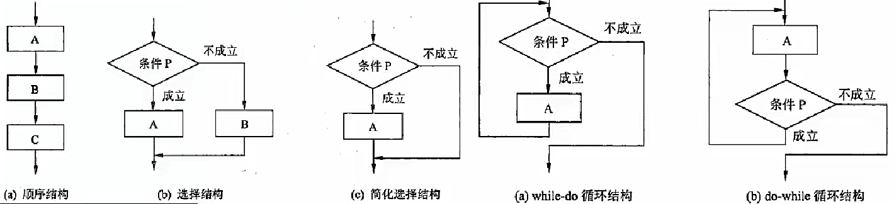

4. **传输成分**：指明语言允许的数据传输方式。如赋值处理、数据的输入输出等。 

5. **函数**：C程序由一个或多个函数组成，每个函数都有一个名字，其中**有且仅有一个名字为main的函数作为程序运行时的起点**。函数的使用涉及3个概念：**函数定义、函数声明和函数调用**。 

   - 函数的定义包括两部分：**函数首部和函数体**。函数的定义描述了函数做什么和怎么做。**函数定义的一般形式为**：

      返回值的类型 函数名(形式参数表) //函数首部

      { 

     ​	函数体; 

      } 

   - 函数首部说明了函数返回值的数据类型、函数的名字和函数运行时所需的参数及类型。函数所实现的功能在函数体部分进行描述。 

   - 函数应该**先声明后引用**。如果程序中对一个函数的调用在该函数的定义之前进行，则应该在调用前对被调用函数进行声明。**函数原型用于声明函数。函数声明的一般形式为**：

     返回值类型 函数名(参数类型表);  

## 函数

函数调用的一般形式为：

函数名（实参表）; 

> 实参出现在函数声明里
>
> 形参数学在函数调用里

函数调用时实参与形参间交换信息的方法有值调用和引用调用两种。 

1. **值调用（Call by Value）** 。

   - 若实现函数调用时将实参的值传递给相应的形参，则称为是**传值调用**。在这种方式下形参不能向实参传递信息。（传值）

   - 在C语言中，**要实现被调用函数对实参的修改，必须用指针作为参数**。即调用时需要先对实参进行**取地址运算**，然后将实参的地址传递给指针形参。其**本质**上仍属于**值调用**。这种方式**实现了间接内存访问**。（传址）

2. **引用调用（Call by Reference）** 。引用是**C++中引入的概念**，当形式参数为引用类型时，形参名实际上是实参的别名，函数中对形参的访问和修改实际上就是针对相应实参所做的访问和改变。 

例：

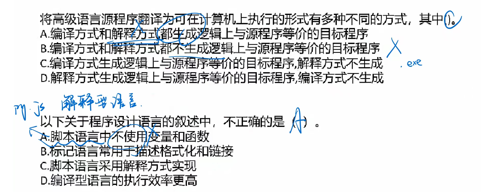

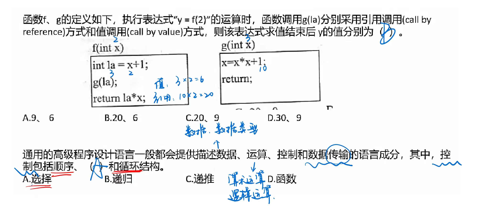

## 🔺编译程序基本原理

编译程序对高级语言源程序进行编译的过程中，要不断收集、记录和使用源程序中一些相关符号的类型和特征等信息，并将其存入符号表中，编译过程如下：

- **词法分析**：是编译过程的第一个阶段。这个阶段的任务是**从左到右一个字符一个字符地读入源程序**，即对构成源程序的**字符流进行扫描然后根据构词规则识别单词**（也称单词符号或符号）。 

  > 输入：字符流

- **语法分析**：是编译过程的一个逻辑阶段。语法分析的任务是**在词法分析的基础上将单词序列组合成各类语法短语**，如“程序”，“语句”，“表达式”等等.语法分析程序判断源程序在结构上是否正确。

  > 输入：记号流 （词法分析阶段产生的一个个单词）
  >
  > 检查各条语句结构的合法性

- **语义分析**：是编译过程的一个逻辑阶段。语义分析的任务是**对结构上正确的源程序进行上下文有关性质的审查,进行类型审查**。如类型匹配、除法除数不为0等。又分为**静态语义错误（在编译阶段能够查找出来）和动态语义错误（只能在运行时发现）**。 

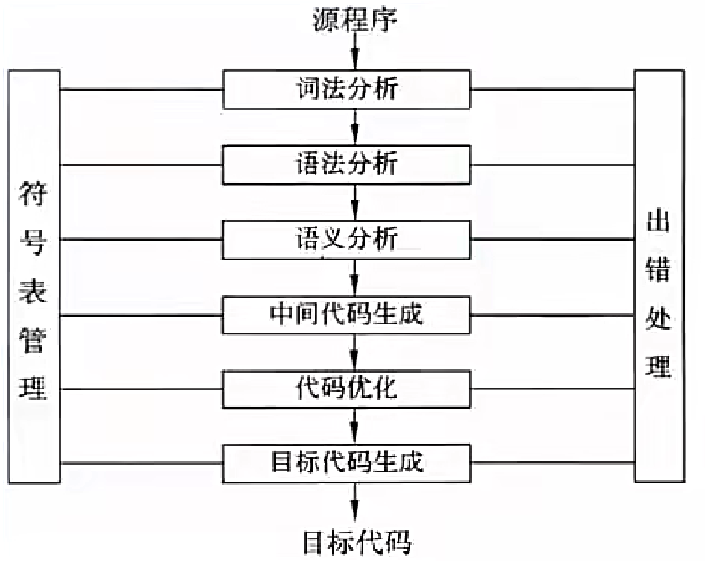

中间代码和目标代码：中间代码是**根据语义分析产生的**，需要**经过优化链接，最终生成可执行的目标代码**。引入中间代码的目的是进行与机器无关的代码优化处理。常用的中间代码有**后缀式（逆波兰式）、三元式（三地址码）、四元式和树等形式**。需要考虑三个问题（一是**如何生成较短的目标代码**；二是**如何充分利用计算机中的寄存器，减少目标代码访问存储单元的次数**；三是**如何充分利用计算机指令系统的特点，以提高目标代码的质量**）。

> 中间代码生成和代码优化 不是必要的
>
> 中间代码：支持跨平台，和硬件没有关系
>
> 目标代码：和平台是相关的 (win - .exe; linux - .bin ...)

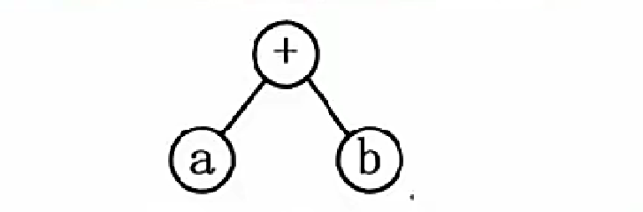

- 前缀表达式：+ab 
- 中缀表达式：a+b
- 后缀表达式：ab+ 

主要掌握上述三种表达式即可，其实就是树的三种遍历，一般**正常的表达式是中序遍历**，即中缀表达式，根据其构造出树，再按题目要求求出前缀或后缀式。 

简单求法：后缀表达式是**从左到右开始，先把表达式加上括号，再依次把运算符加到本层次的括号后面**。 

例：

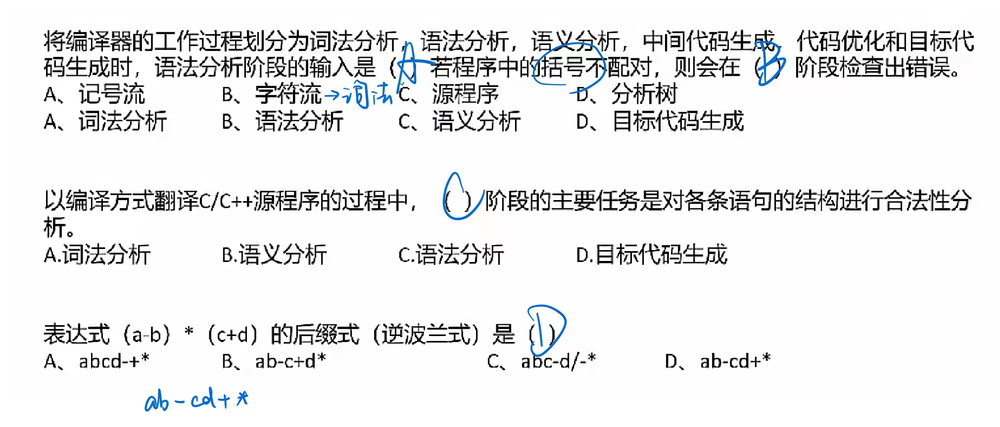

## 文法

### 文法定义

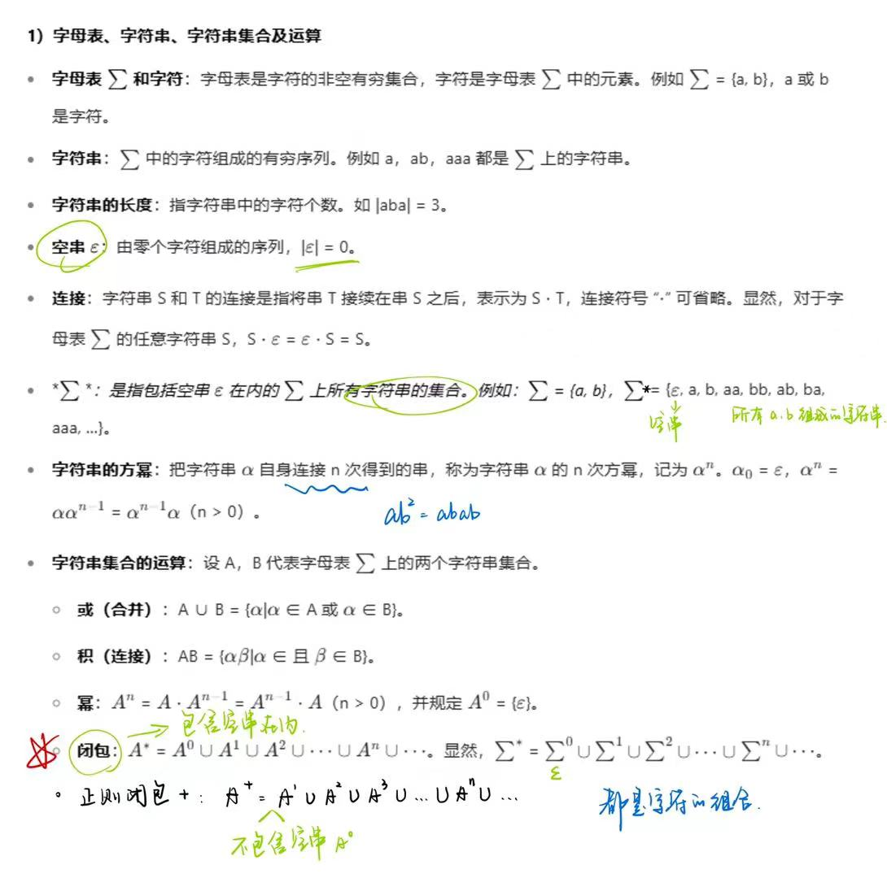

文法G是一个四元组，可表示为G = (V, T, P, S)，其中： 

V：非终结符，不是语言组成部分，不是最终结果，可以推导出其他元素。 

T：终结符，是语言的组成部分，是最终结果，不能再推导其他元素。 

S：起始符，是语言的开始符号。 

P：产生式，用终结符代替非终结符的规则，例如a->b。 

乔姆斯基（Chomsky）把文法分成4种类型，即0型、1型、2型和3型。

-  0型文法也称为短语文法，其功能相当于图灵机，任何0型语言都是递归可枚举的；反之，递归可枚举集也必定是一个0型语言。
- 1型文法也称为**上下文有关文法，这种文法意味着对非终结符的替换必须考虑上下文**，并且一般不允许替换成ε串。例如，若αAβ→αγβ是1型文法的产生式，α和β不全为空，则非终结符A只有在左边是α，右边是β的上下文中才能替换成γ。
- 2型文法就是**上下文无关文法，非终结符的替换无须考虑上下文。🔺程序设计语言中的大部分语法都是上下文无关文法**，当然语义上是相关的，要注意区分语法和语义。 
- 3型文法**等价于正规式**，因此也被称为正规文法或线性文法。更新&售后 认准三个 

## 正规式

语言中具有独立含义的最小语法单位是符号（单词），如标识符、无符号常数与界限符等。词法分析的任务是把构成源程序的字符串转换成单词符号序列。

**词法规则可用3型文法（正规文法）或正规表达式描述，它产生的集合是语言规定的基本字符集Σ(字母表)上的字符串的一个子集，称为正规集。**

正规式和正规集： 

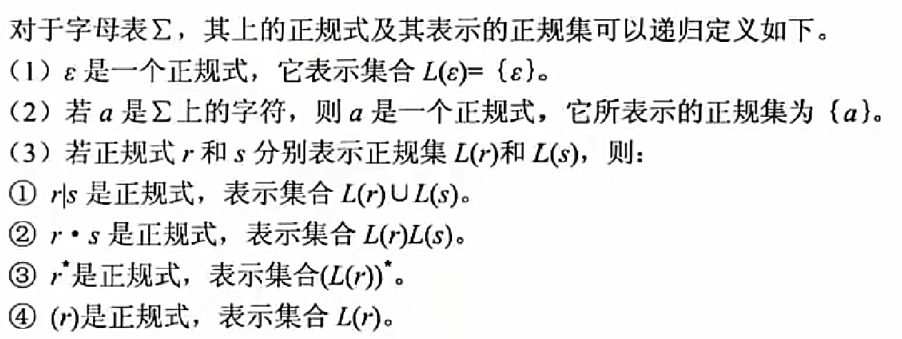

仅通过**有限次地使用上述 3 个步骤定义的表达式才是 Σ 上的正规式**，其中，运算符 `“|” “⋅” “*” `分别称为 “或” “连接” 和 “闭包” 。在正规式的书写中，连接运算符 “⋅” 可省略，运算的优先级从高到低顺序排列为 `“*” “⋅” “|” `。设 Σ = {a, b}，下表列出了 Σ 上的一些正规式和相应的正规集。

| 正规式     | 正规集                            |
| ---------- | --------------------------------- |
| ab         | 字符串 ab 构成的集合              |
| a\|b       | 字符串 a、b 构成的集合            |
| a*         | 由 0 个或多个 a 构成的字符串集合  |
| (a\|b)*    | 所有字符 a 和 b 构成的串的集合    |
| a(a\|b)*   | 以 a 为首字符的 a、b 字符串的集合 |
| (a\|b)*abb | 以 abb 结尾的 a、b 字符串的集合   |

例：

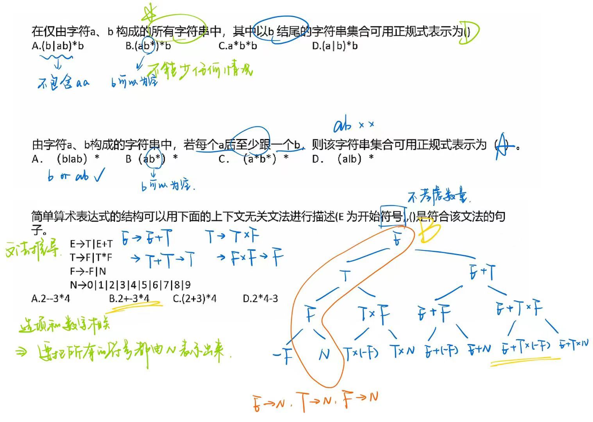

## 有限自动机

有限自动机是一种识别装置的抽象概念，它能**准确地识别正规集**。有限自动机分为确定的有限自动机和不确定的有限自动机两类。

> 确定有限自动机 DFA；不确定的有限自动机 NFA

1. **确定的有限自动机（DFA）**。 一个确定的有限自动机是个五元组(S, Σ, f, s0, Z)，其中：

   S是一个有限集，其每个元素称为一个状态。

   Σ是一个有穷字母表，其每个元素称为一个输入字符。

   f是S×Σ→S上的单值部分映像。f(A, a)=Q表示当前状态为A、输入为a时，将转换到下一状态Q。称Q为A的一个后继状态。

   s0∈S，是唯一的一个开始状态。

   Z是非空的终止状态集合，Z ⊆ S。 状态转换图实例如下：

​	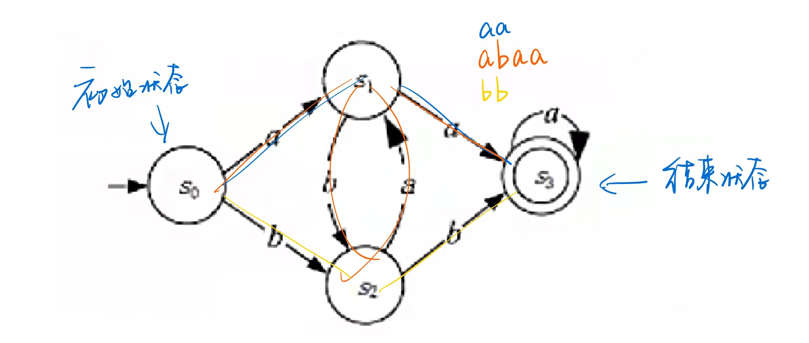

2. 不确定的有限自动机（NFA）。一个不确定的有限自动机也是一个五元组，它与确定有限自动机的区别如下。
   - f是S×Σ→2S上的映像。对于S中的一个给定状态及输入符号，返回一个状态的集合。即当前状态的后继状态不一定是唯一的。
   - 有向弧上的标记可以是ε。 

​	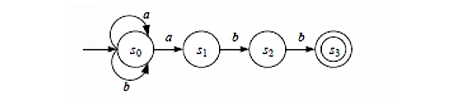

c.f. 确定的有限自动机和不确定的有限自动机：**输入一个字符，看是否能得出唯一的后继**，若能，则是确定的，否则若得出多个后继，则是不确定的。 

例：

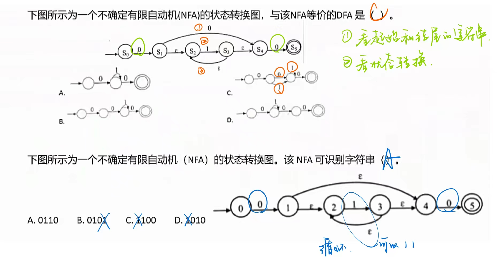

## 语法分析方法

自上而下语法分析：**最左推导，从左至右**。给定文法G和源程序串r。从G的开始符号s出发，通过反复使用产生式对句型中的非终结符进行替换(推导)，逐步推导出r。

**递归下降思想**：原理是利用函数之间的**递归调用模拟语法树自上而下的构造**过程，是一种自上而下的语法分析方法。

自下而上语法分析：**最右推导，从右至左**。从给定的输入串r开始，不断寻找子串与文法G中某个产生式P的候选式进行匹配，并用P的左部代替(归约)之，逐步归约到开始符号s。

**移进 - 规约思想**：设置一个**栈**，将输入符号逐个移进栈中，栈顶形成某产生式的右部时，就用左部去代替，称为归约。很明显，这个思想是通过右部来推导出左部，因此是自下而上语法分析的核心思想。 