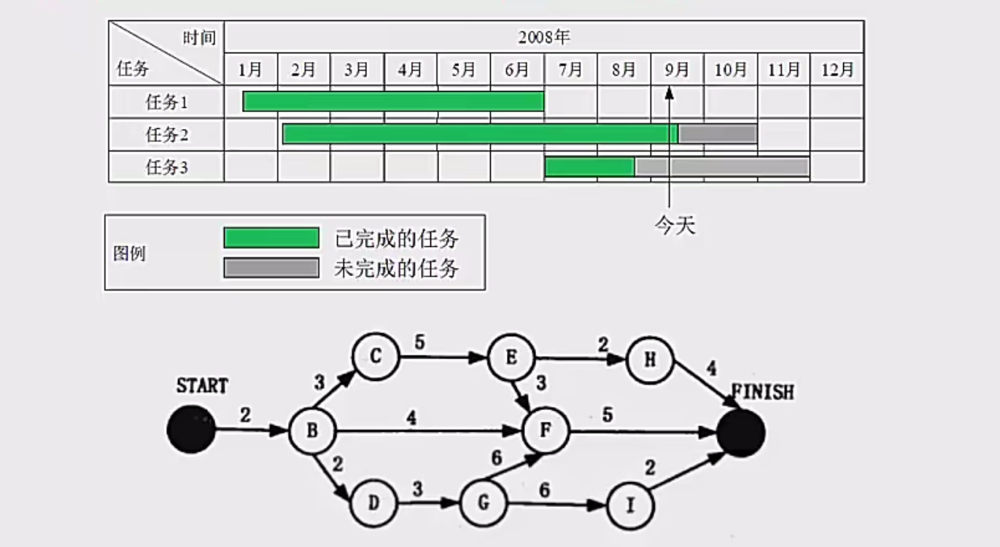
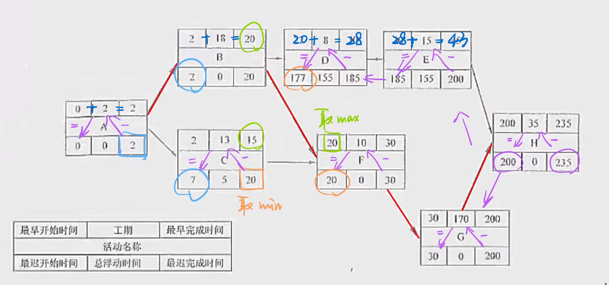
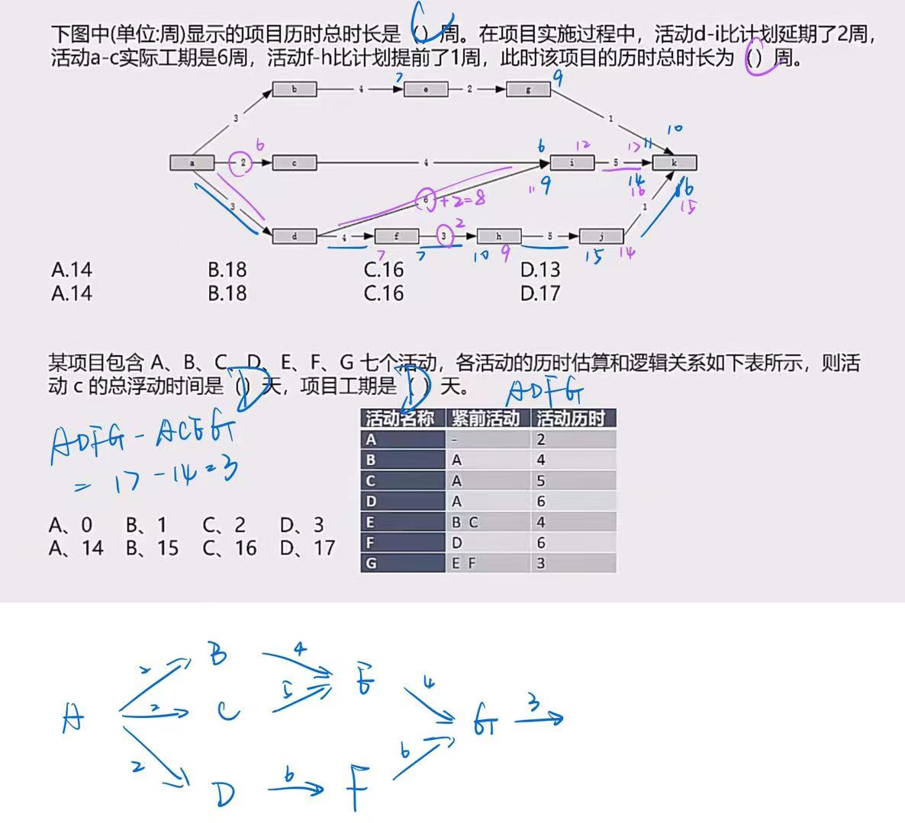
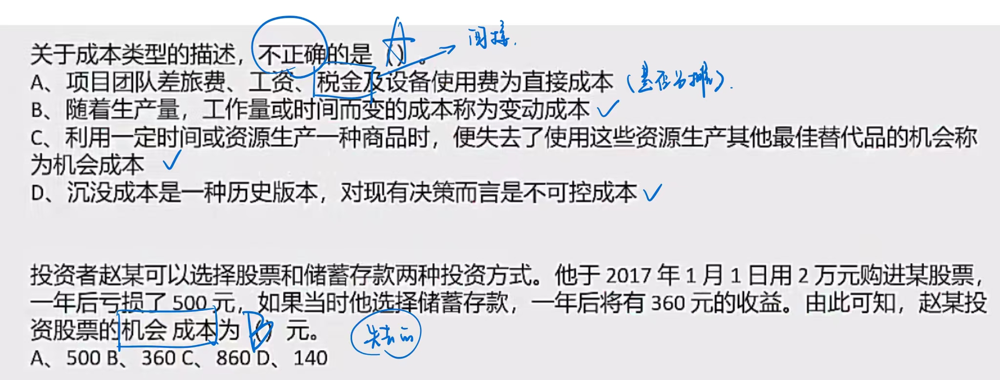
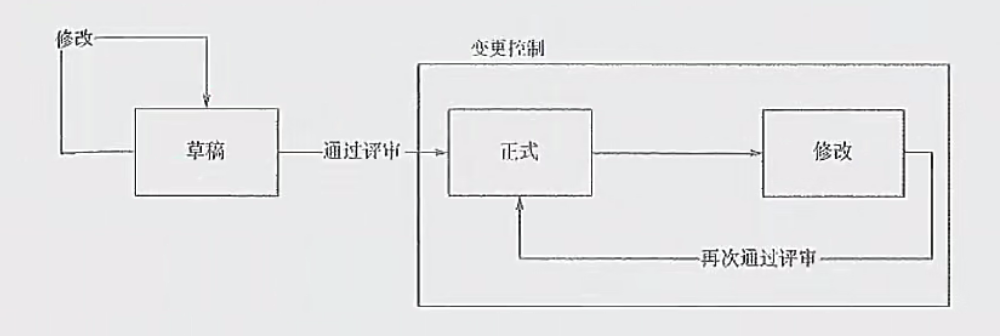
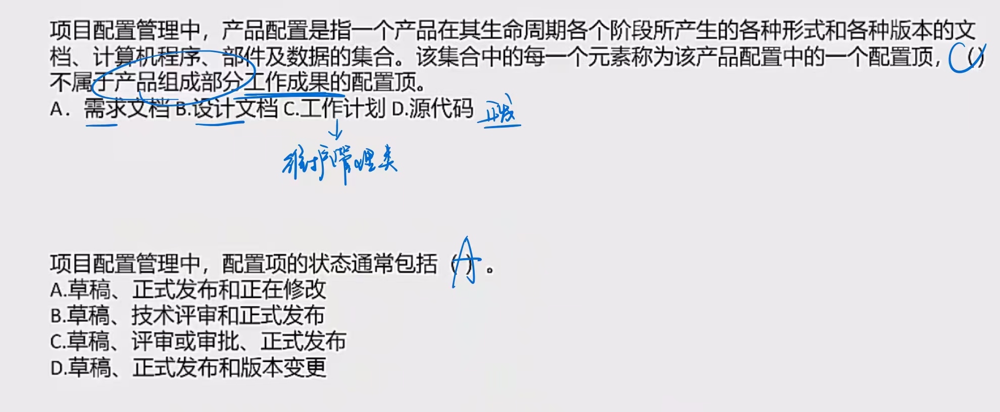
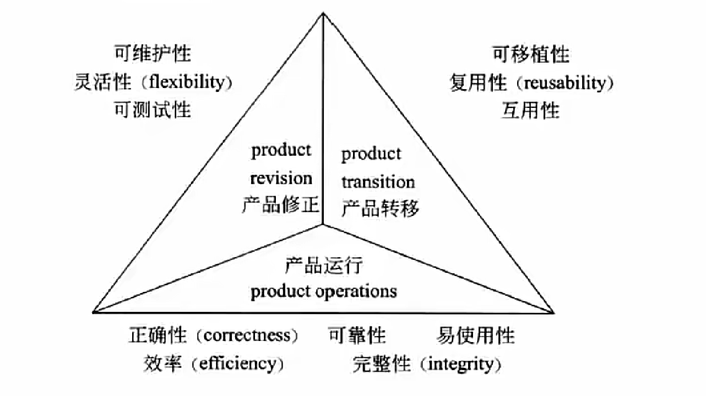
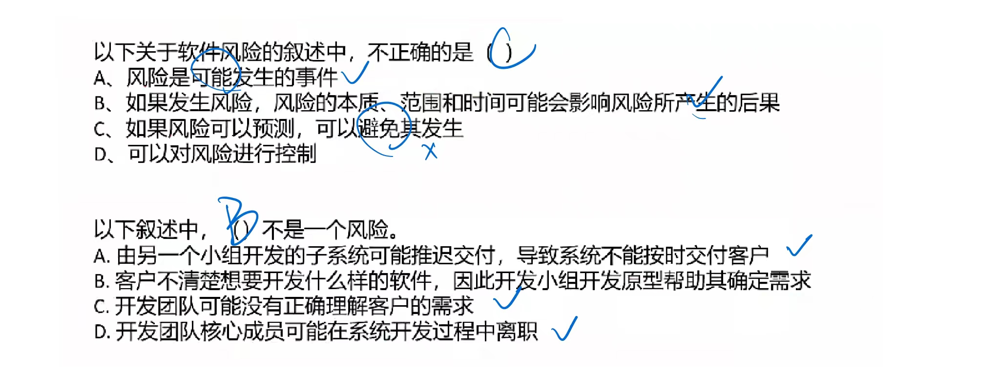

# 项目管理

## 范围管理

**范围管理定义**：范围管理确定在项目内**包括什么工作和不包括什么工作**，由此**界定的项目范围**在项目的全生命周期内可能因种种原因而变化，项目范围管理也要**管理项目范围的这种变化**。**项目范围的变化也叫变更**。

对项目范围的管理，是通过 5 个管理过程来实现的：

1. 规划范围管理（编制范围管理计划）。对**如何定义、确认和控制项目范围**的过程进行描述。
2. 定义范围。**详细描述产品范围和项目范围，编制项目范围说明书**，作为以后项目决策的基础。其🔺输入包括：**项目章程、项目范围管理计划、组织过程资产、批准的变更申请**。
3. 创建工作分解结构 WBS。把**整个项目工作分解为较小的、易于管理的组成部分**，形成一个自上而下的分解结构。
4. 确认范围。**正式验收已完成的可交付成果**。
5. 范围控制。**监督**项目和产品的范围状态、管理范围基准变更。

### 产品范围和项目范围

产品范围是指**产品或者服务所应该包含的功能**。产品范围是否完成，要根据产品**是否满足了产品描述**来判断。产品范围**是项目范围的基础**，产品范围的**定义是产品要求的描述**。 

项目范围是指**为了能够交付产品，项目所必须做的工作**。项目范围的**定义是产生项目管理计划的基础**。判断项目范围是否完成，要以**范围基准来衡量**。项目的范围**基准是经过批准的项目范围说明书、WBS和WBS词典**。 

产品范围描述是**项目范围说明书的重要组成部分**，因此，产品范围变更后，首先受到影响的是项目的范围。 

### WBS（工作分解结构）

WBS 将项目整体或者主要的可交付成果分解成容易管理、方便控制的若干个子项目或者**工作包**，子项目需要继续分解为工作包，持续这个过程，**直到整个项目部分解为可管理的工作包，这些工作包的总和是项目的所有工作范围**。最普通的 WBS 如下表所示：

例：

## 进度管理

进度管理就是采用科学的方法，确定进度目标，编制进度计划和资源供应计划，进行进度控制，在与质量、成本目标协调的基础上，**实现工期目标**。

> 活动是在工作包上进行进一步的分解

- **具体过程**：    
  - **活动定义**：确定**完成项目各项可交付成果而需要开展的具体活动**。  
  - **活动排序**：识别和记录各项**活动之间的先后关系和逻辑关系**。   
  - **活动资源估算**：估算完成各项活动**所需要的资源类型和效益**。  
  - **活动历时估算**：估算完成各项活动**所需要的具体时间**。 
  - **进度计划编制**：分析活动顺序、活动持续时间、资源要求和进度制约因素，**制订项目进度计划**。
  - **进度控制**：根据进度计划开展项目活动，**如果发现偏差，则分析原因或进行调整**。 

- **进行活动资源估算的方法**：主要有**专家判断法、替换方案的确定、公开的估算数据、估算软件和自下而上的估算**。 
  - **专家判断法**：通常是由**项目管理专家根据以往类似项目经验和对本项目的判断**，经过周密思考，进行合理预测，从而估算出项目资源。
  - **替换方案的确定**：资源估算是为了给项目预算明确空间，为早期的资源筹备提供数据，如果某项活动**存在替代方案**，或提供的资源有替代支持可能，则需要明确声明。
  - **公开的估算数据**：有些公司会**定期地公开一些生产率或人工费率数据**，其中包括很多国家和地区的劳动力交易、材料和设备信息。
  - **估算软件**：依靠软件的强大功能，可以定义资源可用性、费率，以及不同的资源日历。 
  - **自下而上的估算**（可以估算全新的项目）：把复杂的活动**分解为更小**的工作，以便于资源估算。将每项工作所需要的资源估算出来，然后汇总即是整个活动所需要的资源数量。 

> 相应也有自上而下（类比估算）：估算资源和时间，之前有类似项目

**COCOMO模型**：常见的软件规模估算方法。常用的**代码行分析方法**作为其中一种度量估计单位，以代码行数估算出每个程序员工作量，累加得软件成本。按详细程度可分为三级：

- **基本COCOMO模型**：是一个**静态单变量模型**，它用一个以已估算出来的**原代码行数(LOC)为自变量**的经验函数计算软件开发工作量。  
- **中间COCOMO模型**：在基本COCOMO模型的基础上，再用**涉及产品、硬件、人员、项目等方面的影响因素**调整工作量的估算。 
- **详细COCOMO模型**：包括中间COCOMO模型的所有特性，将软件系统模型分为**系统、子系统和模块**3个层次，**更进一步考虑了软件工程中每一步骤（如分析、设计）的影响**。 

**COCOMOⅡ 模型**：COCOMO的升级，也是以软件规模作为成本的主要因素，考虑多个成本驱动因子。该方法包括三个阶段性模型，即**应用组装模型、早期设计阶段模型和体系结构阶段模型**。包含三种不同规模估算选择：**对象点、功能点和代码行**。 

---

进度安排的常用图形描述方法有**Gantt图（甘特图）**和**项目计划评审技术（Program Evaluation& Review Technique, PERT）图**。 

#### 🔺工具与技术——关键路径法

**关键路径**：是项目的**最短工期，但却是从开始到结束时间最长的路径**。进度网络图中可能有多条关键路径，因为活动会变化，因此关键路径也在不断变化中。

**关键活动**：关键路径上的活动，最早开始时间=最晚开始时间。 通常，每个节点的活动会有如下几个时间：

1. **最早开始时间（ES）**：某项活动能够开始的最早时间。
2. **最早结束时间（EF）**：某项活动能够完成的最早时间。EF=ES+工期
3. **最迟结束时间（LF）**：为了使项目按时完成，某项活动必须完成的最迟时间。
4. **最迟开始时间（LS）**：为了使项目按时完成，某项活动必须开始的最迟时间。LS=LF-工期 

这几个时间通常作为每个节点的组成部分，如图所示：

**顺推**：最早开始ES=所有前置活动最早完成EF的最大值；最早完成EF=最早开始ES+持续时间。

**逆推**：最晚完成LF=所有后续活动最晚开始LS的最小值；最晚开始LS=最晚完成LF-持续时间。

**总浮动时间**：在**不延误项目完工时间且不违反进度制约因素**的前提下，活动**可以从最早开始时间推迟或拖延的时间量**，就是该活动的进度灵活性。正常情况下，关键活动的总浮动时间为零。

🔺**计算公式**：总浮动时间=`最迟开始LS - 最早开始ES || 最迟完成LF - 最早完成EF` | `关键路径 - 非关键路径时长`。

> 以 D 为例：完成-完成=185-28=开始-开始=177-20=157
>
> 关键路径: A-B-F-G-H: 2+18+10+170+35=235
>
> 包含D的非关键路径: A-B-D-E-H=2+18+8+15+35=78

**自由浮动时间**：是指在不延误任何紧后活动的最早开始时间且不违反进度制约因素的前提下，活动可以从最早开始时间推迟或拖延的时间量。

**🔺计算公式**：自由浮动时间=紧后活动最早开始时间的最小值 - 本活动的最早完成时间。 

> 以 B 为例：20-20 --> B 在关键路径，自由时差和总时差都是 0
>
> 以 C 为例：20-15=5

例：

## 成本管理

在整个项目的实施过程中，为确保项目在批准的预算条件下尽可能保质按期完成，而对所需的各个过程进行管理与控制。 

项目成本管理包括**成本估算、成本预算和成本控制**三个过程。

- **成本估算**：对完成项目**所需成本的估计和计划**，是项目计划中重要、关键且敏感的部分；主要靠分解和类推手段进行，基本估算方法分为**自顶向下的估算、自底向上的估算和差别估算法**三类。 

- **成本预算**：把**估算的总成本分配到项目的各个工作包**，建立成本基准计划以衡量项目绩效；涉及**应急储备和管理储备**。 

  > 应急储备：项目管理者准备
  >
  > 管理储备：项目管理者不知道，上层管理者准备

- **成本控制**：保证**各项工作在各自的预算范围内进行**。 

### 🔺成本类型

1. 可变成本：**随着生产量、工作量或时间而变**的成本为可变成本。可变成本又称变动成本。
2. 固定成本：**不随生产量、工作量或时间的变化而变化的非重复成本**为固定成本。
3. 直接成本：**直接可以归属于项目工作的成本**为直接成本。如项目团队差旅费、工资、项目使用的物料及设备使用费等。
4. 间接成本：来自**一般管理费用**科目或几个项目共同担负的项目成本所🔺**分摊**（区分直接和间接成本）给本项目的费用，就形成了项目的间接成本，如税金、额外福利和保卫费用等。
5. 机会成本：是利用一定的时间或资源生产一种商品时，而**失去的利用这些资源生产其他最佳替代品的机会**就是机会成本，泛指一切在做出选择后其中一个最大的损失。
6. 沉没成本：是指由于**过去的决策已经发生了的，而不能由现在或将来的任何决策改变的成本**。沉没成本是一种历史成本，对现有决策而言是不可控成本，会很大程度上影响人们的行为方式与决策，**在投资决策时应排除沉没成本的干扰**。

**学习曲线**：重复生成产品时，**产品的单位成本会随着产量的扩大呈现规律性递减**。估算成本时，也要考虑此因素。

## 软件配置管理

配置管理是为了**系统地控制配置变更**，在系统的**整个生命周期中维持配置的完整性和可跟踪性**，而标识系统在不同时间点上配置的学科。

> 配置项：软件开发生命中一系列开发和管理的文档或代码
>
> 配置管理是针对这些配置项进行管理，如版本管理等

在GB/T11457 - 2006中将“配置管理”正式定义为：“应用技术的和管理的指导和监控方法以**标识和说明配置项的功能和物理特征**，控制这些特征的变更，记录和报告变更处理和实现状态并验证与规定的需求的遵循性。” 

配置管理包括**6个主要活动**：制订配置管理计划、配置标识（识别配置项）、配置控制、配置状态报告、配置审计、发布管理和交付。 

### 配置项

GB/T11457 - 2006对配置项的定义为：“**为配置管理设计的硬件、软件或二者的集合**，在配置管理过程中**作为一个单个实体**来对待” 。

以下内容都可以作为配置项进行管理：**外部交付的软件产品和数据、指定的内部软件工作产品和数据、指定的用于创建或支持软件产品的支持工具、供方/供应商提供的软件和客户提供的设备/软件**。

典型配置项包括**项目计划书、需求文档、设计文档、源代码、可执行代码、测试用例、运行软件所需的各种数据**，它们经评审和检查通过后进入配置管理。

每个配置项的主要属性有：**名称、标识符、文件状态、版本、作者、日期**等。

配置项可以分为**基线配置项和非基线配置项**两类，例如，基线配置项**可能包括所有的设计文档和源程序**等；非基线配置项可能包括**项目的各类计划和报告**等。

> 基线：基准，基线配置项是很重要、不能随便更改的配置项

**所有配置项的操作权限应由CMO（配置管理员）严格管理**，基本原则是：**基线配置项向开发人员开放读取的权限；非基线配置项向PM、CCB及相关人员开放**。 

**配置项的状态**可分为**“草稿”“正式”和“修改”**三种。配置项**刚建立时，其状态为“草稿”**。配置项**通过评审后，其状态变为“正式”**。此后**若更改配置项，则其状态变为“修改”**。当配置项**修改完毕并重新通过评审时，其状态又变为“正式”**。

### 配置项版本号

- **草稿状态**：处于 “草稿” 状态的配置项的版本号格式为 **0.YZ**，YZ 的数字范围为 01 - 99。**随着草稿的修正，YZ 的取值应递增**。YZ 的初值和**增幅由用户自己把握**。
- **正式状态**：处于 “正式” 状态的配置项的版本号格式为 **X.Y**，X 为主版本号，取值范围为 1 - 9。Y 为次版本号，取值范围为 0 - 9。
  - 配置项**第一次成为 “正式” 文件时，版本号为 1.0**。
  - 如果配置项升级幅度比较小，可以将变动部分制作成配置项的附件，附件版本依次为 1.0，1.1...。当附件的变动积累到一定程度时，配置项的 Y 值可适量增加，**Y 值增加一定程度时，X 值将适量增加**。**当配置项升级幅度比较大时，才允许直接增大 X 值**。
- **修改状态**：处于 “修改” 状态的配置项的版本号格式为 **X.YZ**。配置项**正在修改时，一般只增大 Z 值**，X.Y 值保持不变。当配置**项修改完毕，状态成为 “正式” 时，将 Z 值设置为 0，增加 X.Y 值**。参见上述规则（2）。

#### 配置项版本管理

🔺在项目开发过程中，绝大部分的配置项**都要经过多次的修改**才能最终确定下来。对配置项的**任何修改都将产生新的版本**。由于我们不能保证新版本一定比旧版本 “好”，所以**不能抛弃旧版本**。版本管理的目的是**按照一定的规则保存配置项的所有版本，避免发生版本丢失或混淆等现象**，并且可以**快速准确地查找到配置项的任何版本**。

### 配置基线（常简称为基线）

由**一组配置项组成**，这些配置项**构成一个相对稳定的逻辑实体**。基线中的**配置项被“冻结”了**，不能再被任何人随意修改。对基线的**变更必须遵循正式的变更控制程序**。

基线通常对应于开发过程中的**里程碑，一个产品可以有多个基线，也可以只有一个基线**。交付给**外部顾客的基线一般称为发行基线**（Release），**内部开发使用的基线一般称为构造基线**（Build）。

一组拥有唯一标识号的需求、设计、源代码文卷以及相应的可执行代码、构造文卷和用户文档构成一条基线。

产品的一个测试版本（可能包括需求分析说明书、概要设计说明书、详细设计说明书、已编译的可执行代码、测试大纲、测试用例、使用手册等）是基线的一个例子。 

对于**每一个基线**，要定义**建立基线的事件、受控的配置项、建立和变更基线的程序、批准变更基线所需的权限**。在项目实施过程中，每个基线都要纳入配置控制，对这些基线的**更新只能采用正式的变更控制程序**。

> main 分支就是基线，每个人的开发分支可以从 main 分支 checkout -b 出来

建立基线的好处

- 基线为开发工作提供了一个**定点和快照**。
- 新项目可以**在基线提供的定点上建立**。新项目作为一个单独分支，将与随后对原始项目（在主要分支上）所进行的变更进行隔离。
- 当认为**更新不稳定或不可信时，基线为团队提供一种取消变更的方法**。
- 可以**利用基线重新建立基于某个特定发布版本的配置**，以重现已报告的错误。

### 配置库

配置库**存放配置项并记录与配置项相关的所有信息**，是配置管理的有力工具。主要作用：

1. 记录与配置相关的**所有信息**，其中**存放受控的软件配置项**是很重要的内容。
2. 利用库中的信息**评价变更的后果**，这对变更控制有着重要的意义。
3. 从库中**可提取各种配置管理过程的管理信息**。 

使用配置库可以帮助配置管理员把信息系统开发过程的各种工作产品，包括半成品或阶段产品和最终产品**管理得井井有条，使其不致管乱、管混、管丢**。 

🔺配置库可以分开发库、受控库、产品库 3 种类型。

1. **开发库**：也称为**动态库、程序员库或工作库**，用于保存**开发人员当前正在开发的配置实体**，如：新模块、文档、数据元素或进行修改的已有元素。动态中的配置项被置于版本管理之下。动态库是**开发人员的个人工作区，由开发人员自行控制**。库中的信息可能有**较为频繁的修改，只要开发库的使用者认为有必要，无需对其进行配置控制**，因为这通常不会影响到项目的其他部分，**可以任意的修改**。
2. **受控库**：也称为**主库**，包含**当前的基线加上对基线的变更**。受控库中的配置项**被置于完全的配置管理之下**。在信息系统开发的某个阶段工作**结束时，将当前的工作产品存入受控库。可以修改，需要走变更流程**。
3. **产品库**：也称为**静态库、发行库、软件仓库**，包含**已发布使用的各种基线的存档，被置于完全的配置管理之下**。在开发的信息系统产品完成系统测试之后，作为**最终产品**存入产品库内，等待交付用户或现场安装。**一般不再修改，真要修改的话需要走变更流程**。（.exe 程序之类的，一般不再进行修改）

例：

## 质量管理

质量是**软件产品特性的综合**，表示**软件产品满足明确（基本需求）或隐含（期望需求）要求的能力**。质量管理是指确定质量方针、目标和职责，并通过质量体系中的质量计划、质量控制、质量保证和质量改进来使其实现的所有管理职能的全部活动。

主要包括以下过程：

1. 质量规划：识别项目及其产品的质量要求和标准，并书面描述项目将如何达到这些要求和标准的过程。

2. 质量保证：一般是每隔一定时间（例如，每个阶段末）进行的，主要通过系统的**质量审计（软件评审）和过程分析**来保证项目的质量。

   > 阶段性的评审

3. 质量控制：**实时监控项目的具体结果，以判断它们是否符合相关质量标准**，制订有效方案，以消除产生质量问题的原因。 

#### 信息技术 软件产品评价 质量特性及其使用指南 GB/T 16260—2002

> 6大特性，21个子特性

| 质量特性及定义                                               | 质量子特性及定义                                             |
| ------------------------------------------------------------ | ------------------------------------------------------------ |
| **🔺功能性**：一组功能及其指定的性质有关的一组属性            | 适合性：与规定任务能否提供一组功能及这组功能的适合程度有关的软件属性 准确性：与能否得到正确或相符的结果或效果有关的软件属性 互用性 / 互操作性：与其他指定系统进行交互的能力有关的软件属性 依从性：使软件遵循有关标准、法律、法规及类似规定的软件属性 安全性：防止对程序及数据的非授权的故意或意外访问的能力 |
| **🔺可靠性**：在规定的一段时间和条件下，软件维持其性能水平有关的一组软件属性 | 成熟性：与由软件故障引起失效的频度有关的软件属性 容错性：与在与软件故障或违反指定接口情况下，维持规定的性能水平的能力有关的软件属性 易恢复性：与在失效发生后，重新建立其性能水平、恢复直接受影响数据的能力，以及为达到此目的所需的时间和努力有关的软件属性 |
| **🔺可用性**：与使用的难易程度及规定或隐含用户对使用方式所做的评价有关的软件属性 | 易理解性：与用户为认识逻辑概念及其应用范围所花的努力有关的软件属性 易学性：与用户为学习使用该软件系统所花的努力有关的软件属性 易操作性：与用户为操作和运行控制所花努力有关的软件属性 |
| **🔺效率**：与在规定条件下，软件的性能水平和所用资源之间的关系有关的一组软件属性 | 时间特性：与软件执行其功能时相应和处理时间以及吞吐量有关的软件属性 资源特性：与在软件执行其功能时，所使用的资源量及使用资源、持续时间有关的软件属性 |
| **🔺可维护性**：与进行指定的修改所需的努力有关的一组软件属性  | 易分析性：与为诊断缺陷或失效原因、判定待修改的部分所需努力有关的软件属性 可修改性：与进行修改、排除错误或适应环境变化所需努力有关的软件属性 稳定性：与修改所造成的未预料结果的风险有关的软件属性 可测试性：与确认已修改软件所需的努力有关的软件属性 |
| 🔺**可移植性**：与软件可从某一环境转移到另一环境的能力有关的一组软件属性 | 适应性：与软件无需采用有别于为该软件准备的活动或手段就可能适应不同的规定环境有关的软件属性 易安装性：与在指定环境下安装软件所需努力有关的软件属性 一致性（遵循性）：使软件遵循与可移植有关的标准或约定的软件属性 可替换性：软件在特定环境中用来替代指定的其他软件的可能性和难易程度 |

#### McCall 质量模型

> 产品修正 --> 可维护性
>
> 产品运行 --> 可用性
>
> 产品转移 --> 可移植性

### 软件评审

质量两个必要条件：

**设计的规格说明书符合用户标准，称为设计质量**。

**程序按照设计规格说明书所规定的情况正确执行**，称为**程序质量**。

### 软件容错技术

容错就是软件遇到错误的处理能力，实现容错的手段主要是冗余，包括下面四种冗余技术：

- **结构冗余**：分为**静态、动态、混合冗余**三种，当**错误发生时对错误进行备份处理**。
- **信息冗余**：为检错和纠错在数据中**加上一段额外的信息**，例如校验码原理。
- **时间冗余**：**遇到错误时重复执行**，例如回滚，重复执行还有错，则转入错误处理逻辑。
- **冗余附加技术**：是指为实现结构、信息和时间冗余技术**所需的资源和技术**，包括程序、指令、数据、存放和调动它们的空间和通道等。在屏蔽硬件错误的容错技术中，

例：

## 风险管理

风险管理就是要对项目风险进行认真的分析和科学的管理，这样，是**能够避开不利条件、少受损失、取得预期的结果并实现项目目标的**，能够争取避免风险的发生或尽量减小风险发生后的影响。但是，**完全避开或消除风险，或者只享受权益而不承担风险是不可能的**。

### 风险管理流程

- **风险管理计划编制**：如何安排与实施项目的风险管理，制定下列各步的计划。

- **风险识别**：识别出项目中已知和可预测的风险，确定风险的来源、产生的条件、描述风险的特征以及哪些项目可以产生风险，形成一个风险列表。

- **风险定性分析**：对已经识别的风险进行排序，确定风险可能性与影响、确定风险优先级、确定风险类型。

- **风险定量分析**：进一步了解风险发生的可能性具体由多大，后果具体有多严重。包括灵敏度分析、期望货币价值分析、决策树分析、蒙特卡罗模拟。

  > 风险曝光度：10% * 100000 = 10000

- **风险应对计划编制**：对每一个识别出来的风险来分别制定应对措施，这些措施组成的文档称为风险应对计划。包括消极风险（避免策略、转移策略、减轻策略）；积极风险（开拓、分享、强大） 。

- **风险监控**：监控风险计划的执行，检测残余风险，识别新的风险，保证风险计划的执行，并评价这些计划对减少风险的有效性。

---

项目风险，作用于项目上的不确定的事件或条件，**既可能产生威胁，也可能带来机会**。

> 不一定都是坏的，好的叫机会

通过积极和合理的规划，超过90%的风险都可以进行提前应对和管理。

风险应该**尽早识别出来，高层次风险应记录在章程里**。

应由**对风险最有控制力的一方承担相应的风险**。

**承担风险程度与所得回报相匹配原则，承担的风险要有上限**。

### 风险的属性

1. **随机性**：风险事件**发生及其后果**都具有**偶然性**（双重偶然），遵循一定的**统计规律**。
2. **相对性**：风险是**相对项目活动主体而言的。承受力不同，影响不同**。风险承受力影响因素：**收益大小**（收益越大，越愿意承担风险）；**投入大小**（投入越大，承受能力越小）；**主体的地位和资源**（级别高的人能承担较大的风险）。
3. **风险的可变性**：**条件变化，会引起风险变化**。包括性质、后果的变化，以及出现新风险。 

### 风险的分类 

按后果划分：按照**后果的不同**，风险可划分为**纯粹风险（无任何收益）和投机风险（可能带来收益）**。

按来源划分：按**风险来源**划分，**自然风险（天灾）和人为风险**（人的活动，又可分为行为风险、经济风险、技术风险、政治和组织风险等）。

按可管理性划分：按**是否可管理**划分，**可管理（如内部多数风险）和不可管理（如外部政策）**，也要看主体管理水平。

按影响范围划分：按**影响范围**划分，**局部风险（非关键路径活动延误）和总体风险（关键路径活动延误）**。

按后果承担者划分：按**后果承担者**划分：业主、政府、承包商、投资方、设计单位、监理单位、保险公司等。

按可预测性划分：按**可预测性**划分：已知风险（已知的进度风险）、可预测风险（可能服务器故障）、不可预测风险（地震、洪水、政策变化等）。 

### 🔺风险的另一种分类

信息系统项目风险分类 在信息系统项目中，从宏观上来看，风险可以分为**项目风险、技术风险和商业风险**。

**项目风险**：指**潜在的预算、进度、个人（包括人员和组织）、资源、用户和需求方面的问题，以及它们对项目的影响**。项目复杂性、规模和结构的不确定性也构成项目的（估算）风险因素。项目风险**威胁到项目计划**，一旦项目风险成为现实，可能会拖延项目进度，增加项目的成本。

**技术风险**：指潜在的**设计、实现、接口、测试和维护方面的问题**。此外，**规格说明的多义性、技术上的不确定性、技术陈旧、最新技术（不成熟）**也是风险因素。技术风险**威胁到待开发系统的质量和预定的交付时间**。如果技术风险成为现实，开发工作可能会变得很困难或根本不可能。

**商业风险**：**威胁到待开发系统的生存能力**，主要有以下5种不同的商业风险：

- **市场风险**：开发的系统虽然很优秀但**不是市场真正所想要**的。 
- **策略风险**：开发的系统**不再符合企业的信息系统战略**。 
- **销售风险**：开发了销售部门不清楚如何推销的系统。
- **管理风险**：由于重点转移或人员变动而**失去上级管理部门的支持**。
- **预算风险**：开发过程没有得到预算或人员的保证。 

例：

## 补充

### 组织结构模式

**项目型**：项目经理绝对领导。

**职能型**：部门领导为主。

**矩阵型**：二者结合，既有项目经理也有部门领导，但权利分割不同。

### 程序设计小组的组织方式

1. **主程序员制小组**：主程序员全权负责，后援工程师必要时能替代主程序员，适合大规模项目。
2. **民主制小组**：也即无主程序员小组，成员之间地位平等，任何决策都是全员参与投票，适合于项目规模小，开发人员少，采用新技术和确定性较小的项目。
3. **层次式小组**：两个层次，一名组长领导若干个高级程序员，每个高级程序员领导若干个程序员。 

例：

