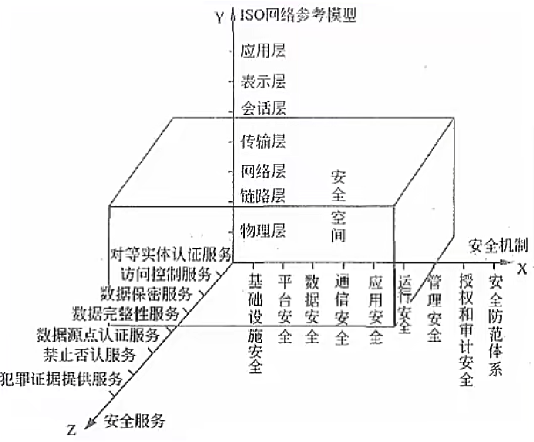
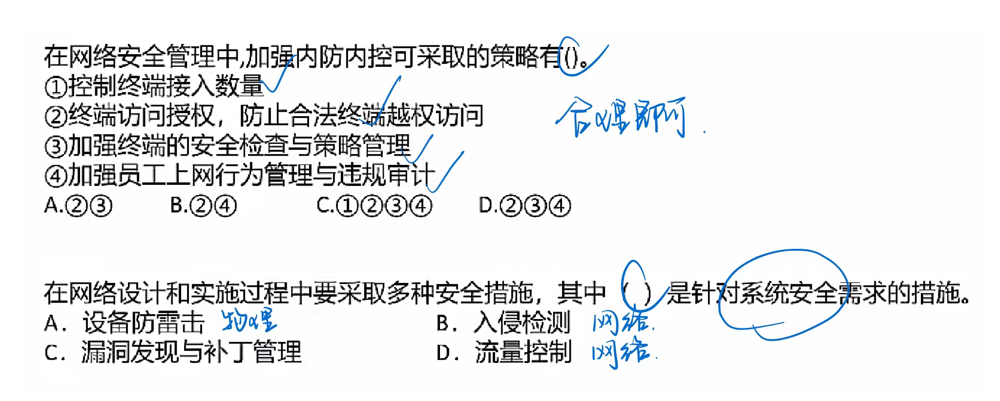
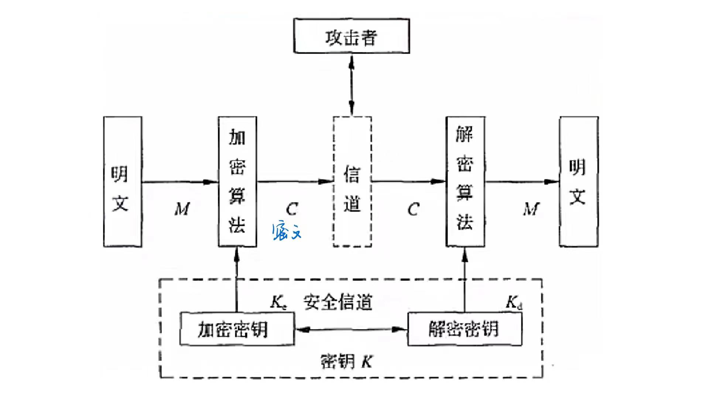
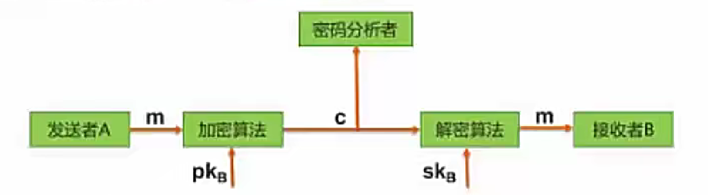
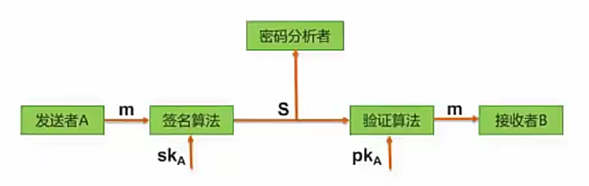
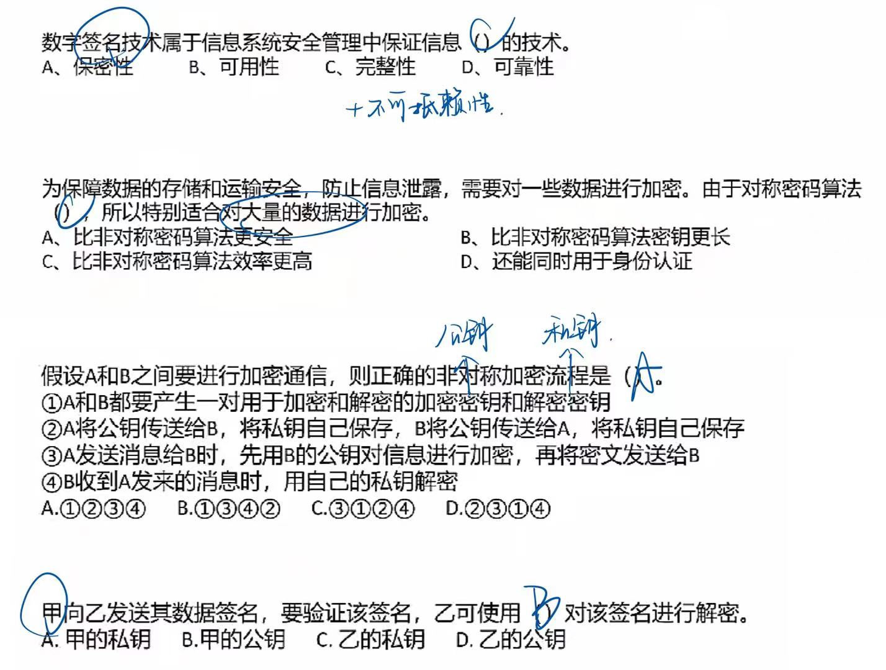
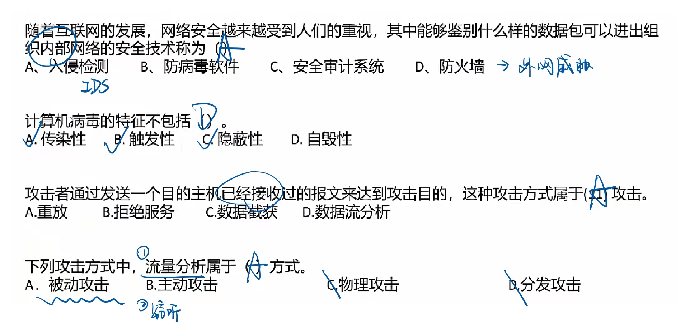
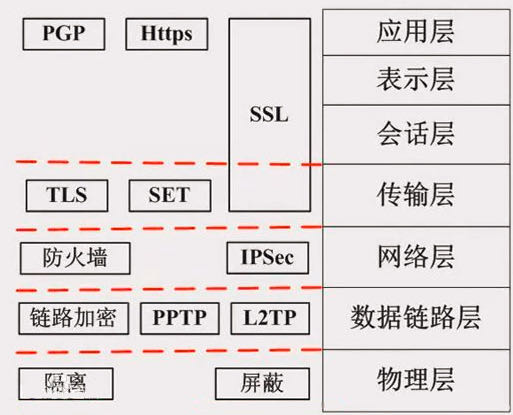
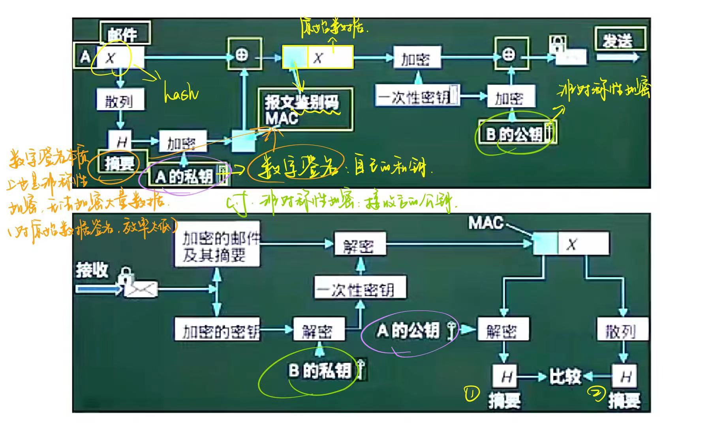
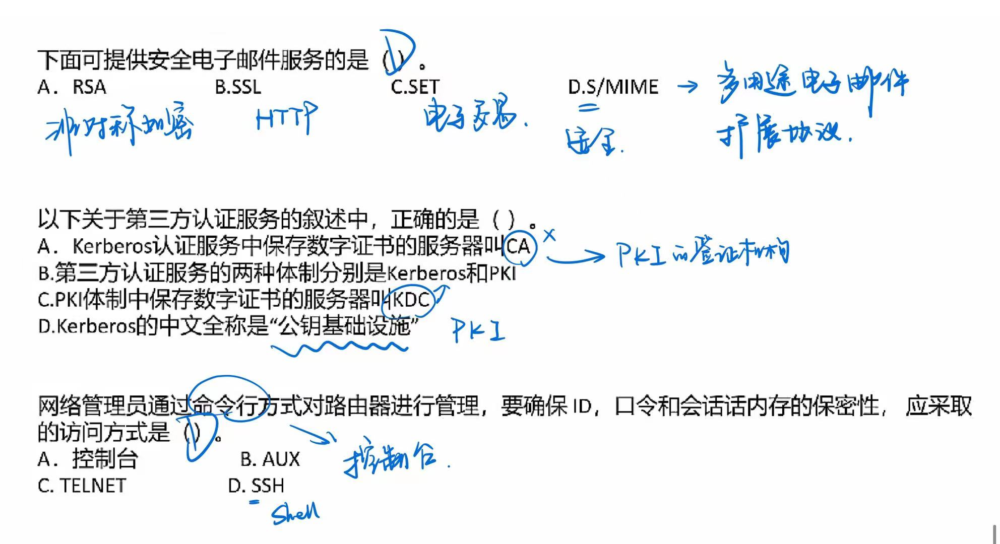

# 安全性知识

## 信息安全及技术

### 信息安全和信息系统安全

#### 信息安全系统的体系架构

**X轴是“安全机制”**，为提供某些安全服务，利用各种安全技术和技巧，所形成的一个较为完善的机构体系。（系统的不同方面，基础设施）

**Y轴是“OSI 网络参考模型”。**

**Z轴是“安全服务”。**就是从网络中的各个层次提供给信息应用系统所需要的安全服务支持。

由X、Y、2三个轴形成的信息安全系统三维空间就是**信息系统的“安全空间”**。

随着网络逐层扩展，这个空间不仅范围逐步加大，安全的内涵也就更丰富，达到具有🔺**认证、权限、完整、加密和不可否认**五大要素，也叫作“安全空间”的五大属性。

#### 信息安全含义及属性

信息安全含义及属性：保护信息的🔺**保密性（机密性）、完整性、可用性**，另外也包括其他属性，如：真实性、可核查性、不可抵赖性（不可否认性）和可靠性。

**🔺保密性**：信息**不被泄漏给未授权的个人、实体和过程或不被其使用的特性**。

包括：1. 最小授权原则（控制权限） 2. 防暴露 3. 信息加密 4. 物理保密（物理设备、电磁波）

**🔺完整性**：信息**未经授权不能改变的特性**。影响完整性的主要因素有设备故障误码、人为攻击和计算机病毒等。

保证完整性的方法包括：

1. 协议：通过安全协议检测出被删除、失效、被修改的字段。
2. 纠错编码方法：利用校验码完成检错和纠错功能。
3. 密码校验和方法。
4. 数字签名：能识别出发送方来源。
5. 公证：请求系统管理或中介机构证明信息的真实性。

🔺**可用性**：**需要时，授权实体可以访问和使用的特性**。一般用系统正常使用时间和整个工作时间之比来度量。

其他属性：

真实性、指对**信息的来源进行判断**，能对伪造**来源**的信息予以鉴别。

可核查性：系统实体的行为可以**被独一无二的追溯到该实体的特性**，这个特性就是要求该实体对其行为负责，为探测和调查安全违规事件提供了可能性。

不可抵赖性：是指建立有效的**责任机制**，**防止用户否认其行为**，这一点在电子商务中是极其重要的。

可靠性：系统在规定的时间和给定的条件下，**无故障地完成规定功能的概率**

#### 安全需求

可划分为**物理线路安全、网络安全系统安全和应用安全**；从各级安全需求字面上也可以理解：

物理线路就是**物理设备、物理环境**；（供电、温度、湿度...）

网络安全指**网络上的攻击、入侵**；（通过计算机网络进行的，病毒、木马...）

系统安全指的是**操作系统漏洞、补丁**等；

应用安全就是**上层的应用软件，包括数据库软件**。

例：

### 信息安全技术

#### 加密技术（保证保密性）

一个密码系统，通常简称为密码体制(Cryptosystem)，由五部分组成：

1. 明文空间M，它是全体明文的集合。
2. 密文空间C，它是全体密文的集合。
3. 密钥空间K，它是全体密钥的集合。其中每一个密钥K均由加密密钥Ke和解密密钥Kd 组成，即K=<Ke，Kd>。
4. 加密算法E，它是一组由M 至C的加密变换。
5. 解密算法D，它是一组由C到M 的解密变换。

对于明文空间M 中的每一个明文M，加密算法E在密钥Ke 的控制下**将明文M 加密成密文C：`C=E(M,Ke)`**

而解密算法D 在密钥Kd的控制下**将密文C解密出同一明文M：`M=D (C, Kd )=D (E(M, Ke),Kd)`**

 

#### 🔺对称加密技术

**数据的加密和解密的密钥（密码）是相同的**，属于**不公开密钥加密算法**。其**缺点是加密强度不高**（因为密钥简单，位数少），且**密钥分发困难**（因为密钥还需要传输给接收方，也要考虑保密性等问题）。**优点是加密速度快，适合加密大数据。**

常见的对称密钥加密算法如下：

- DES：替换+移位、56位密钥、64位数据块、速度快，密钥易产生。

- 3DES：三重DES，两个56位密钥K1、K2。

​		加密：`K1加密->K2解密->K1加密`

​		解密：`K1解密->K2加密->K1解密`

- AES：是美国联邦政府采用的一种区块加密标准，这个标准用来替代原先的DES。对其的要求是“至少像3DES一样安全"。

- RC-5：RSA数据安全公司的很多产品都使用了RC-5。

- IDEA：128位密钥，64位数据块，比DES的加密性好，对计算机功能要求相对低。

#### 🔺非对称加密技术

**数据的加密和解密的密钥是不同的**，分为公钥和私钥。是**公开密钥加密算法**。其缺点是**加密速度慢**。优点是**安全性高、不容易破解**。

非对称技术的原理是：发送者**发送数据时**，使用**接收者的公钥作加密密钥，私钥作解密密钥**，这样只有接收者才能解密密文得到明文。安全性更高，因为无需传输密钥。但**无法保证完整性**。如下：

（只有 B 能查看）

常见的非对称加密算法如下：

- RSA：512位(或1024位)密钥，计算机量极大，难破解。
- Elgamal、ECC（椭圆曲线算法）、包算法、Rabin、D-H等

相比较可知，对称加密算法密钥一般只有56位，因此**加密过程简单，适合加密大数据，也因此加密强度不高**；而非对称加密算法密钥有1024位，相应的**解密计算量庞大，难以破解，却不适合加密大数据**，一般用来加密对称算法的密钥，这样，就**将两个技术组合使用了，这也是数字信封的原理**。

#### 数字信封原理

**信是对称加密的密钥**，数字信封就是**对此密钥进行非对称加**，具体过程：发送方将数据用对称密钥加密传输，而将对称密钥用接收方公字钥加密发送给对方。接收方收到数字信封，用自己的私钥解密信封，取出对称密钥解密得原文。

数字信封运用了对称加密技术和非对称加密技术，🔺**本质是使用对称密钥加空数据，非对称密钥加密对称密钥，解决了对称密钥的传输问题**。

#### 信息摘要（保证完整性）

所谓信息摘要，**就是一段数据的特征信息，当数据发生了改变，信息摘要也会发生改变**，发送方会**将数据和信息摘要一起传给接收方**，接收方会根据接收到的数据**重新生成一个信息摘要**，若此摘要和接收到的摘要相同，则说明数据正确。**信息摘要是由哈希函数生成的**。

信息摘要的特点：

1. 不算数据多长，都会产生**固定长度的信息摘要**；
2. 🔺**任何不同的输入数据，都会产生不同的信息摘要**；
3. 单向性，即**只能由数据生成信息摘要不能由信息摘要还原数据**。

信息摘要算法：MD5（产生128位的输出）、SHA-1（安全散列算法，产生160信息位的输出，安全性更高）

#### 数字签名（保证完整性、不可抵赖性）

**🔺唯一标识一个发送方**

发送者发送数据时，使用**发送者的私钥进行加密**，接收者收到数据后，只能**使用发送者的公钥进行解密**，这样就能**唯一确定发送方**，这也是数字签名的过程但**无法保证机密性**。（基于公钥私钥体制，非对称加密，私钥才能唯一标识）

#### 公钥基础设施PKI

是**以不对称密钥加密技术为基础**，以数据机密性、完整性身份认证和行为不可抵赖性为安全目的，来实施和提供安全服务的具有普适性的**安全基础设施**。（相当于一套安全认证的集合）

1. 数字证书：一个数据结构，是一种由一个可信任的权威机构签署的信息集合。在不同的应用中有不同的证书。如X.509证书必须包含下列信息：(1) 版本字；(2) 序列号；(3) 签名算法标识符；(4) 认证机构；(5) 有效期限；(6) 主题信息；(7) 认证机构的数字签名；(8) **公钥信息**。（公开，供别人认证）

   > 把公钥和用户进行绑定
   >
   > 驾照：持有人、驾照本身、公安警方（权威机构） 

   **公钥证书主要用于确保公钥及其与用户绑定关系的安全。这个公钥就是证书所标识的那个主体的合法的公钥。**任何一个用户只要知道签证机构的公钥，就能检查对证书的签名的合法性。如果检查正确，那么用户就可以相信那个证书所携带的公钥是真实的，而且这个公钥就是证书所标识的那个主体的合法的公钥。**例如驾照。**

2. 签证机构 CA（权威机构，认证数字证书是否有效：验证数字签名）：负责**签发证书、管理和撤销证书**。是所有注册用户所信赖的权威机构，CA在给用户签发证书时**要加上自己的数字签名，以保证证书信息的真实性。任何机构可以用CA的公钥来验证该证书的合法性。**

例：

## 网络安全技术和协议

### 网络安全技术

#### 🔺防火墙

防火墙是在**内部网络和外部因特网之间增加的一道安全防护措施**（一道大门，用来隔离内外网），分为网络级防火墙和应用级防火墙。

网络级防火墙层次低，但是效率高，因为其使用包过滤和状态监测手段，一般只检验网络包外在（起始地址、状态）属性是否异常，若异常，则过滤掉，不与内网通信，因此对应用和用户是透明的。

但是这样的问题是，如果遇到伪装的危险数据包就没办法过滤，此时，就要依靠**应用级防火墙**，**层次高，效率低**，因为应用级防火墙会将网络包拆开，具体检查里面的数据是否有问题，会消耗大量时间，造成效率低下，但是安全强度高。

#### 🔺入侵检测系统 IDS

**防火墙**技术主要是分隔来自外网的威胁，却**对来自内网的直接攻击无能为力**，此时就要用到入侵检测 IDS 技术，位于防火墙之后的第二道屏障，作为防火墙技术的补充。

原理：**监控当前系统/用户行为**，使用入侵检测分析引警进行分析，这里包含一个知识库系统，囊括了历史行为、特定行为模式等操作，将当前行为和知识库进行匹配，就能检测出当前行为是否是入侵行为，如果是入侵，则记录证据并上报给系统和防火墙，交由它们处理。

不同于防火墙，**IDS入侵检测系统是一个监听设备，没有跨接在任何链路上无须网络流量流经它便可以工作**。（摄像头，一般对端口进行监听）因此，对IDS的部署，唯一的要求是：IDS应当挂接在**所有所关注流量都必须流经的链路上**。因此，IDS在交换式网络中的位置一般选择在：

1. 尽可能靠近攻击源
2. 尽可能靠近受保护资源（重要资源）

---

（没考过 ↓）

#### 入侵防御系统 IPS

IDS 和防火墙技术都是在入侵行为已经发生后所做的检测和分析，而 **IPS 是能够提前发现入侵行为，在其还没有进入安全网络之前就防御**。在**安全网络之前的链路上挂载入侵防御系统IPS，可以实时检测入侵行为，并直接进行阻断**，这是与IDS的区别，要注意。

#### 杀毒软件

用于**检测和解决计算机病毒**，与防火墙和IDS要区分，计算机病毒要靠杀毒软件，防火墙是处理网络上的非法攻击。

#### 蜜罐系统

**伪造一个蜜罐网络引诱黑客攻击**，蜜罐网络被攻击不影响安全网络，并且可以借此了解黑客攻击的手段和原理，从而对安全系统进行升级和优化。

### 网络攻击和威胁

|          |                  |                                                              |
| -------- | ---------------- | ------------------------------------------------------------ |
| 攻击类型 | 攻击名称         | 描述                                                         |
| 被动攻击 | 窃听（网络监听） | 用各种可能的合法或非法的手段窃取系统中的信息资源和敏感信息， 通过对系统进行**长期监听**，利用统计分折方法对诸如通信频度、通信的信息 |
|          | 业务流分析       | 通过对系统进行**长期监听**，利用统计分折方法对诸如通信频度、通信的信息流向、通信总量的变化等参数进行研究，从而发现**有价值的信息和规律**。 |
|          | 非法登录         | 有些资料将这种方式归为被动攻击方式。                         |
| 主动攻击 | 假冒身份         | 通过欺骗通信系统（或用户）达到非法用户冒充成为合法用户，或者特权小的用户目充成为特权大的用户的目的。黑客大多是采用假冒进行攻击。 |
|          | 抵赖             | 这是一种来自用户的攻击，比如：否认自己曾经发布过的某条消息、伪造份对方来信等。 |
|          | 旁路控制         | 攻击者利用系统的安全缺陷或安全性上的脆弱之处获得非授权的权利或特权。 |
|          | 🔺重放攻击        | 所截获的某次合法的通信数据持贝，出于非法的目的而被重新发送。（解决方法：在信息里加时间戳验证） |
|          | 🔺拒绝服务（DOS） | 对信息或其他资源的合法访问被无条件地组织。                   |

### 计算机病毒和木马

病毒（本质上是一段指令/程序）：编制或者在计算机程序中插入的**破坏计算机功能或者破坏数据，影响计算机使用并且能够自我复制**的一组**计算机指令或者程序代码**。

木马（监控，不会主动更改）：是一种**后门程序**，常被黑客用作控制远程计算机的工具，隐藏在被控制电脑上的一个小程序监控电脑一切操作并取信息。

代表性病毒实例

- 蠕虫病毒（感染EXE文件）：熊猫烧香，罗密欧与朱丽，恶鹰，尼姆达，冲击波，欢乐时光。

- 木马：QQ消息尾巴木马，特洛伊木马，X卧底。

- 宏病毒（感染word、excel等文件中的宏变量）:美丽沙，台湾1号。

- CIH病毒：史上唯一破坏硬件的病毒。

- 红色代码：蠕虫病毒+木马。

例：

### 🔺网络安全协议

物理层主要使用物理手段，隔离、屏蔽物理设备等，其他层都是靠协议来保证传输的安全

（SET 和 SSL 范围是一样的，跨越三层）

SSL协议：安全套接字协议（socket），被设计为**加强Web安全传输（HTTP/HTTPS/）的协议**，安全性高，和HTTP结合之后，形成 **HTTPS** 安全协议，端口号为443。

> https 的 s 就是 SSL
>
> http 的端口号是 80；https 的端口号是 443

SSH协议：安全外壳协议（shell），被设计为**加强 TeInet/FTP 安全的传输协议**。

SET协议：**安全电子交易协议**主要应用于**B2C模式（电子商务）中保障支付信息的安全性**。SET协议本身比较复杂，设计比较严格，安全性高，它能保证信息传输的机密性、真实性、完整性和不可否认性。SET协议是PKI框架下的一个典型实现，同时也在不断升级和完善，如SET2.0将支持借记卡电子交易。

Kerberos协议：是一种**网络身份认证协议**，该协议的基础是**基于信任第三方，它提供了在开放型网络中进行身份认证的方法**，认证实体可以是用户也可以是用户服务。这种认证不依赖宿主机的操作系统或计算机的IP地址，不需要保证网络上所有计算机的物理安全性，并且假定数据包在传输中可被随机窃取和篡改。

> c.f.
>
> 公钥基础设施 KPI 的签证机构是 CA
>
> Kerberos 认证服务中保存数字证书的服务器叫 KDC

PGP协议（安全电子邮件协议）：使用 **RSA公钥证书** （非对称加密）进行身份认证，使用 **IDEA（128位密钥）**（对称加密）进行数据加密，使用 **MD5** 进行数据完整性验证。

（本身不怎么考，但融汇贯通）

发送方A有三个密钥：A的私钥、B的公钥,、A生成的一次性对称密钥；

接收方B有两个密钥：B的私钥、A的公钥。

例：

