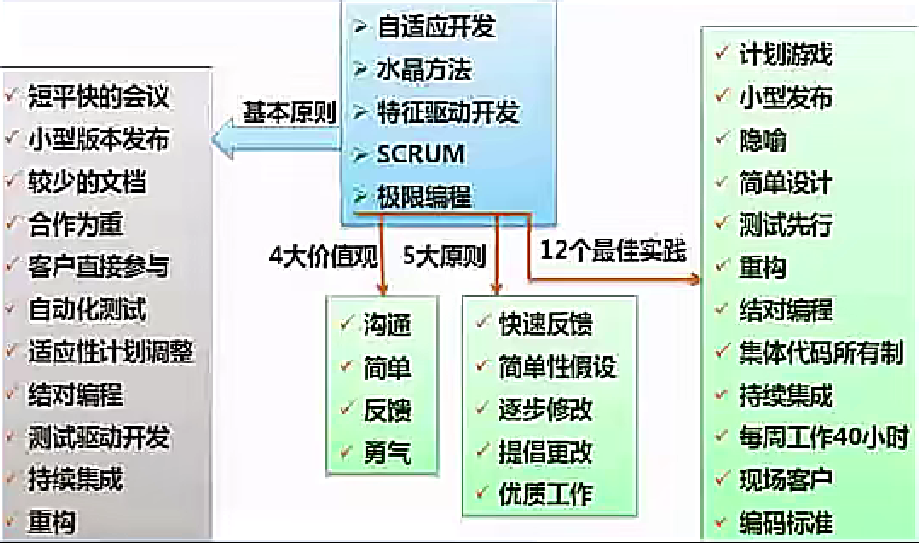

# 软件工程

## 信息系统生命周期

软件工程基本原理：用分阶段的生命周期计划严格管理、坚持进行阶段评审、实现严格的产品控制、采用现代程序设计技术、结果应能清楚的审查、开发小组的人员应少而精、承认不断改进软件工程实践的必要性。

🔺软件工程的基本要素：**方法、工具、过程**。

软件生存周期：可行性分析与项目开发计划、需求分析、概要设计（选择系统解决方案，规划子系统）、详细设计（设计子系统内部具体实现）、编码、测试、维护。


> 🔺五阶段生命周期（常考）【每个阶段是干什么的，及每个阶段的输出】
>
> 系统规划、系统分析、系统设计、系统实施、（官方定义不包括系统验收）、系统运行与维护

1. **系统规划阶段**：任务是对组织的环境、目标及现行系统的状况进行**初步调查**，根据组织目标和发展战略确定信息系统的发展战略，**对建设新系统的需求做出分析和预测**，同时考虑建设新系统所受的各种约束，研究建设新系统的必要性和可能性。根据需要与可能，给出制建系统的备选方案。 

   输出：**可行性研究报告、🔺系统设计任务书**。

2. **系统分析阶段**：任务是根据系统设计任务书所确定的范围，对现行系统进行详细调查，描述现行系统的业务流程，指出现行系统的局限性和不足之处，确定新系统的基本目标和逻辑功能要求，即**提出新系统的逻辑模型**。系统分析阶段又称为**逻辑设计阶段**。这个阶段是**整个系统建设的关键阶段，也是信息系统建设与一般工程项目的重要区别所在**。

   > 做什么 - 逻辑模型

   输出：**系统说明书**。

3. **系统设计阶段**：系统分析阶段的任务是回答系统“做什么”的问题，而系统设计阶段要回答的问题是“怎么做”。该阶段的任务是根据系统说明书中规定的功能要求，具体设计实现逻辑模型的技术方案，也就是设计新系统的物理模型。这个阶段又称为物理设计阶段，可分为总体设计（概要设计）和详细设计两个子阶段。

   > 怎么做 - 把逻辑模型转换为具体的物理模型

   输出：**系统设计说明书（概要设计、详细设计说明书）**。

4. **系统实施阶段**：是**将设计的系统付诸实施的阶段**。这一阶段的任务包括计算机等设备的购置、安装和调试、程序的编写和调试、人员培训、数据文件转换、系统调试与转换等。这个阶段的特点是几个互相联系、互相制约的任务同时展开，必须精心安排、合理组织。系统实施是按实施计划分阶段完成的，每个阶段应写出实施进展报告。系统测试之后写出系统测试分析报告。 

   输出：**实施进展报告、系统测试分析报告**。

5. **系统运行和维护阶段**：系统投入运行后，需要经常进行维护和评价，记录系统运行的情况，根据一定的规则对系统进行必要的修改，评价系统的工作质量和经济效益。 

## 能力成熟度模型

> 国际上认证公司/组织做软件的能力到了哪个级别

### 能力成熟度模型 CMM

| 能力等级                   | 特点                                                         | 关键过程区域                                                 |
| -------------------------- | ------------------------------------------------------------ | ------------------------------------------------------------ |
| 初始级（Initial）          | 软件过程的特点是**杂乱无章**，有时甚至很混乱，几乎没有明确定义的步骤，项目的成功**完全依赖个人的努力和英雄式核心人物的作用**。 | -                                                            |
| **可重复**级（Repeatable） | 建立了**基本的项目管理过程和实践**来跟踪项目费用、进度和功能特性，有**必要的过程**准则来重复以前在同类项目中的成功。 | 软件配置管理、软件质量保证、软件子合同管理、软件项目跟踪与监督、软件项目策划、软件需求管理 |
| 已定义级（Defined）        | 管理和工程两方面的**软件过程已经文档化、标准化，并综合成整个软件开发组织的标准软件过程**。所有项目都采用根据实际情况修改后得到的**标准软件过程来发和维护软件**。（定义了一些规则准则） | 同行评审、组间协调、软件产品工程、集成软件管理、培训大纲、组织过程定义、组织过程焦点 |
| 已管理级（Managed）        | 制定了软件过程和产品质量的**详细度量标准**。对软件过程和产品质量有定量的理解和控制。（定量管理，开发过程数字化） | 软件质量管理和定量过程管理                                   |
| 优化级（Optimized）        | 加强了定量分析，通过来自过程质量反馈和来自新观念、新技术的反馈使过程能**不断持续地改进**。 | 过程更改管理、技术改革管理和缺陷预防                         |

 ### 能力成熟度模型集成 CMMI

是**若干过程模型的综合和改进**，不仅仅针对软件，而是支持**多个工程学科和领域的**、系统的、一致的过程改进框架，能适应现代工程的特点和需要，能提高过程的质量和工作效率。

CMMI 两种表示方法：

1. **阶段式模型**：类似于 CMM，它**关注组织的成熟度**，五个成熟度模型如下：

| 能力等级     | 特点                   | 关键过程区域                                                 |
| ------------ | ---------------------- | ------------------------------------------------------------ |
| 初始级       | 过程不可预测且缺乏控制 | -                                                            |
| **已管理**级 | 过程为项目服务         | 需求管理、项目计划、配置管理、项目监督与控制、供应商合同管理、度量和分析、过程和产品质量保证 |
| 已定义级     | 过程为组织服务         | 需求开发、技术解决方案、产品集成、验证、确认组织级过程焦点、组织级过程定义、组织级培训、集成项目管理、风险管理、集成化的团队、决策分析和解决方案、组织级集成环境 |
| 定量管理     | 过程已度量和控制       | 组织过程性能、定量项目管理                                   |
| 优化级       | 集中于过程改进和优化   | 组织级改革与实施、因果分析和解决方案                         |

> 🔺 c.f. CMM & CMMI
>
> CMM：初始级、可重复级、已定义级、已管理级、优化级
>
> CMMI：初始级、已管理级、已定义级、定量管理、优化级

其中 CMMI 2 - 5 级对应的过程域如下图所示：

| 成熟度等级 | 过程域                                                       |
| ---------- | ------------------------------------------------------------ |
| 已管理级   | 需求管理、项目计划、配置管理、项目监督与控制、供应商合同管理、度量和分析、过程和产品质量保证 |
| 已定义级   | 需求开发、技术解决方案、产品集成、验证、确认、组织级过程焦点、组织级过程定义、组织级培训、集成项目管理、风险管理、集成化的团队、决策分析和解决方案、组织级集成环境 |
| 定量管理级 | 组织级过程性能、定量项目管理                                 |
| 优化级     | 组织级改革与实施、因果分析和解决方案                         |

2. 连续式模型（6个级别）：关注每个过程域的能力，一个组织对不同的过程域可以达到不同的过程域能力等级。

| 对应状态   | 具体说明                                                     |
| ---------- | ------------------------------------------------------------ |
| 未完成级   | 未执行过程，表明过程域的一个或多个特定目标没有被满足         |
| 已执行级   | 过程通过转化可识别的**输入**工作产品，产生可识别的输出工作产品，关注于过程域的特定目标的完成 |
| 已管理级   | 过程作为**已管理**的过程制度化，针对单个过程实例的能力       |
| 已定义级   | 过程作为**已定义**的过程制度化，关注过程的组织级标准化和部署 |
| 量化管理级 | 过程作为**定量管理**的过程制度化                             |
| 优化级     | 过程作为**优化的过程制度化**，表明过程得到很好地执行且持续得到改进 |

例：


## 软件过程模型

### 瀑布模型(SDLC)

瀑布模型是一个经典的软件生命周期模型，一般**将软件开发分为**：可行性分析（计划）、需求分析、软件设计（概要设计、详细设计）、编码（含单元测试）、测试、运行维护等几个阶段。

> 阶段和阶段之间一般来说只能往下，不能回头，像瀑布一样
>
> 把前一个阶段完全做完确认好，才能进行下一个阶段 
>
> 🔺不解决需求不明确的情况

瀑布模型特点：

1. 从**上一项开发活动接受该项活动的工作对象作为输入**。
2. 利用这一输入，**实施该项活动应完成的工作内容**。
3. 给出该项活动的**工作成果，作为输出**传给下一项开发活动。
4. 对**该项活动的实施工作成果进行评审**。若其工作成果得到确认，则继续进行下一项开发活动；否则返回前一项，甚至更前项的活动。尽量减少多个阶段间的反复。以相对来说较小的费用来开发软件 。


### 螺旋模型

螺旋模型是一个**演化软件过程模型**，将**原型实现的迭代特征与线性顺序（瀑布）模型中控制的和系统化的方面结合**起来。在螺旋模型中，**软件开发是一系列的增量发布**。（原型模型+瀑布模型）

> 瀑布模型的四个步骤 + 原先模型的不断迭代
>
> 🔺风险、大型项目 --> 螺旋模型

开发过程具有**周期性重复的螺旋线状**。四个象限分别标志每个周期所划分的四阶段：**制订计划、风险分析、实施工程和客户评估**。（包含维护周期）

螺旋模型**强调了风险分析**，特别**适用于庞大而复杂的、高风险的系统**。 


### V 模型

V模型从整体上看起来，就是一个V字型的结构，由左右两边组成。左边的下画线分别代表了需求分析、概要设计、详细设计、编码。右边的上画线代表了单元测试、集成测试、系统测试与验收测试。

> 测试应该贯穿信息系统的生命周期，在每个阶段都需要测试

V模型的特点如下：

> 🔺生命周期阶段和测试阶段的对应关系

1. **单元测试**的主要目的是针对**编码过程中**可能存在的各种错误；（单编）
2. **集成测试**的主要目的是针对**详细设计**中可能存在的问题；（集详）
3. **系统测试**主要针对**概要设计**，检查系统作为一个整体是否有效地得到运行；（系概）
4. **验收测试**通常由业务专家或者用户进行，以**确认产品能真正符合用户业务上的需要**。（验需）
5. V模型**用于需求明确和需求变更不频繁**的情形。

> 单元测试的**计划**：详细设计


### 原型化模型

原型化模型**第一步就是创建一个快速原型**，能够满足项目干系人与未来的用户可以与原型进行交互，再通过与相关干系人进行充分的讨论和分析，**最终弄清楚当前系统的需求**，进行了充分的了解之后，在原型的基础上开发出用户满意的产品。

> 先出个原型，逐步迭代，🔺**不适合大型模型**

原型法认为在很难一下子全面准确地提出用户需求的情况下，原型应当具备的特点如下。

1. **实际可行**
2. 具有**最终系统的基本特征**
3. **构造方便、快速，造价低**。原型法的特点在于原型法**对用户的需求是动态响应、逐步纳入的**。 

### 增量模型

增量模型：首先**开发核心模块功能**，而后与用户确认，之后再开发次核心模块的功能，即每次开发一部分功能，并与用户需求确认，最终完成项目开发，**优先级最高的服务最先交付**。（分期）

特点：但由于并不是从系统整体角度规划各个模块，因此**不利于模块划分**。难点在于**如何将客户需求划分为多个增量**。与原型不同的是增量模型的每一次**增量版本都可作为独立可操作的作品**，而原型的构造一般是为了演示。 


### 喷泉模型

是一种**以用户需求为动力，以对象作为驱动**的模型，适合于🔺**面向对象**的开发方法。使开发过程具有迭代性和无间隙性。 

### 基于构件的开发模型CBSD

利用**预先包装的构件来构造应用系统**。构件可以是组织内部开发的构件，也可以是商品化成品软件构件。特点是**增强了复用性**，在系统开发过程中，会构建一个构件库，供其他系统复用，因此可以提高可靠性，节省时间和成本。

### 形式化方法模型

建立在**严格数学基础**上的一种软件开发方法，主要活动是生成计算机软件形式化的数学规格说明。 

例：


## 信息系统开发方法

### 结构化方法

结构是指系统内各个组成要素（模块）之间的相互联系、相互作用的框架。

结构化方法也称为生命周期法，是一种传统的信息系统开发方法，**由结构化分析（Structured Analysis, SA）、结构化设计（Structured Design, SD）和结构化程序设计（Structured Programming, SP）**三部分有机组合而成，其精髓是自顶向下、逐步求精和模块化设计。（面向数据流、面向过程）

> 结构化分析 SA - 系统分析阶段
>
> 结构化设计 SD - 系统设计阶段
>
> 结构化程序设计 SP - 系统实施阶段
>
> 自顶向下、逐步求精和模块化设计 - 很像瀑布模型，各个阶段之间的界限非常清晰

结构化方法的主要特点:

1. **开发目标清晰化**。结构化方法的系统开发遵循“**用户第一**”的原则。
2. **开发工作阶段化**。每个阶段工作完成后，要**根据阶段工作目标和要求进行审查**，这使各阶段工作有条不紊地进行，便于项目管理与控制。
3. **开发文档规范化**。结构化方法每个阶段工作完成后，要**按照要求完成相应的文档**，以保证各个工作阶段的衔接与系统维护工作的遍历。
4. **设计方法结构化**。在**系统分析与设计时**，从整体和全局考虑，**自顶向下地分解**；在**系统实现时**，根据设计的要求，先编写各个具体的功能模块，然后**自底向上逐步实现整个系统**。 

> 结构化的思想是自顶向下，从整体和全局考虑
>
> 实现的时候是自底向上的

结构化方法的不足和局限：

1. **开发周期长**：按顺序经历各个阶段，直到实施阶段结束后，用户才能使用系统。
2. **难以适应需求变化**：不适用于需求不明确或经常变更的项目。
3. **很少考虑数据结构**：结构化方法是一种面向过程，面向数据流的开发方法，很少考虑数据结构。

结构化方法常用工具 结构化方法一般利用图形表达用户需求，常用工具有**数据流图、数据字典、结构化语言、判定表以及判定树等**。 

### 面向对象方法

面向对象（Object - Oriented, OO）方法认为，客观世界是由各种对象组成的，**任何事物都是对象，每一个对象都有自己的运动规律和内部状态，都属于某个对象类**，是该对象类的一个元素。复杂的对象可由相对简单的各种对象以某种方式而构成，不同对象的组合及相互作用就构成了系统。

 面向对象方法的特点：

1. 使用OO方法构造的系统具有🔺**更好的复用性**（继承），其关键在于建立一个全面、合理、统一的模型（**用例模型和分析模型**-用例图和类图）。 
2. OO方法也划分阶段，但其中的系统分析、系统设计和系统实现三个阶段之间已经**没有“缝隙”**。也就是说，这三个阶段的界限变得不明确，某项工作既可以在前一个阶段完成，也可以在后一个阶段完成；前一个阶段工作做得不够细，在后一个阶段可以补充。
3. 🔺面向对象方法可以**普遍适用于各类信息系统的开发**。 

面向对象方法的不足之处：**必须依靠一定的面向对象技术支持，在大型项目的开发上具有一定的局限性，不能涉足系统分析以前的开发环节**。

当前，一些大型信息系统的开发，通常是**将结构化方法和OO方法结合起来**。首先，使用结构化方法进行自顶向下的整体划分；然后，自底向上地采用OO方法进行开发。因此，结构化方法和OO方法仍是两种在系统开发领域中相互依存的、不可替代的方法。 

### 原型化方法

原型化方法也称为**快速原型法**，或者简称为**原型法**。它是一种根据用户初步需求，利用系统开发工具，**快速地建立一个系统模型展示给用户**，在此基础上与用户交流，最终实现用户需求的信息系统快速开发的方法。

- 按**是否实现功能**分类：分为水平原型（行为原型，功能的导航）、垂直原型（结构化原型，实现了部分功能）。 

- 按**最终结果**分类：分为抛弃式原型、演化式原型。 


#### 原型法的特点

原型法可以**使系统开发的周期缩短，成本和风险降低、速度加快，获得较高的综合开发效益**。 

原型法是🔺**以用户为中心**来开发系统的，用户参与的程度大大提高，开发的系统符合用户的需求，因而增加了用户的满意度，提高了系统开发的成功率。 由于用户参与了系统开发的全过程，对**系统的功能和结构容易理解和接受**，有利于系统的移交，有利于系统的运行与维护。 

#### 原型法的不足之处

**开发的环境要求高。管理水平要求高**（要和用户反复确认）。 

#### 原型法的适用场景及本质 

由以上的分析可以看出，原型法的**优点主要在于能更有效地确认用户需求**。从直观上来看，原型法**适用于那些需求不明确的系统开发**。事实上，对于**分析层面难度大、技术层面难度不大的系统**，适合于原型法开发。

从严格意义上来说，目前的原型法**不是一种独立的系统开发方法，而只是一种开发思想**，它只支持在系统开发早期阶段快速生成系统的原型，没有规定在原型构建过程中必须使用哪种方法。因此，它**不是完整意义上的方法论体系**。这就注定了**原型法必须与其他信息系统开发方法结合使用**。 

### 敏捷开发

敏捷开发是一种**以人为核心、迭代、循序渐进的开发方法**，相对于传统软件开发方法的“非敏捷”，更**强调程序员团队与业务专家之间的紧密协作、面对面的沟通（认为比书面的文档更有效）、频繁交付新的软件版本**、紧凑而自我组织型的团队、**能够很好地适应需求变化的代码编写和团队组织方法**，也**更注重软件开发中人的作用**。

敏捷软件开发宣言：

1. 个体和交互胜过过程和工具
2. 可以工作的软件胜过面面俱到的文档
3. 客户合作胜过合同谈判
4. 响应变化胜过遵循计划 



### 敏捷过程的开发方法

- 结对编程：**一个程序员开发，另一个程序在一旁观察审查代码**，能够有效的提高代码质量，在开发同时对代码进行初步审查，共同对代码负责。
- 自适应开发：强调开发方法的**适应性**（Adaptive）。不象其他方法那样有很多具体的实践做法，它更**侧重为软件的重要性提供最根本的基础**，并从更高的组织和管理层次来阐述开发方法为什么要具备适应性。
- 水晶方法：**每一个不同的项目都需要一套不同的策略、约定和方法论**。
- 特性驱动开发：是一套**针对中小型软件开发项目的开发模式**。是一个**模型驱动的快速迭代开发过程**，它强调的是简化、实用、 易于被开发团队接受，适用于需求经常变动的项目。
- 极限编程XP：核心是**沟通、简明、反馈和勇气**。因为知道计划永远赶不上变化，XP**无需开发人员在软件开始初期做出很多的文档**。XP提倡**测试先行**，为了将以后出现bug的几率降到最低。
- 并列争球法SCRUM：是一种**迭代的增量化过程**，把**每段时间（30天）一次的迭代称为一个“冲刺”** ，并按需求的优先级别来实现产品，多个自组织和自治的小组并行地递增实现产品。 

### 统一过程（RUP）

提供了在开发组织中**分派任务和责任的纪律化方法**。它的目标是**在可预见的日程和预算前提下，确保满足最终用户需求的高质量产品**。

- 3个显著特点：**用例驱动、以架构为中心、迭代和增量**。

- 4个流程：**初始阶段、细化阶段、构建阶段和交付阶段**。每个阶段结束时都要安排一次技术评审，以确定这个阶段的目标是否已经达到。

  > 初始 - 需求分析；细化 - 设计；构建 - 实施；交付 - 运行和维护

- 适用：一个**通用过程框架**，可以用于种类广泛的软件系统、不同的应用领域、不同的组织类型、不同性能水平和不同的项目规模。

例：


## 软件产品线

软件产品线是一个**产品集合**，这些产品**共享一个公共的、可管理的特征集，这个特征集能满足特定领域的特定需求**。软件产品线是一个十分适合专业的开发组织的软件开发方法，能有效地提高软件生产率和质量，缩短开发时间，降低总开发成本。（按业务领域，可复用）

**核心资源**：包括所有产品所共用的软件架构，**通用**的构件、文档等。

**产品集合**：产品线中的各种产品。

#### 产品线的建立方式

|              | 演化方式                                                     | 革命方式                                                     |
| ------------ | ------------------------------------------------------------ | ------------------------------------------------------------ |
| 基于现有产品 | 基于现有产品架构设计产品线的架构，经演化现有构件，开发产品线构件（在原来的产品上做升级 1.0 -> 2.0） | 核心资源的开发基于现有产品集的需求和可预测的、将来需求的超集（基于现有产品，重新做一个新的产品） |
| 全新产品线   | 产品线核心资源随产品新成员的需求而演化                       | 开发满足所有预期产品线成员的需求的核心资源                   |

## 软件复用

软件复用是**将已有软件的各种有关知识用于建立新的软件，以缩减软件开发和维护的花费**。软件复用是提高软件生产力和质量的一种重要技术。早期的软件复用主要是**代码级复用**，被复用的知识专指程序，后来扩大到包括**领域知识、开发经验、设计决定、体系结构、需求、设计、代码和文档等一切有关方面**。 

## 逆向工程

软件的逆向工程是**分析程序，力图在比源代码更高抽象层次上建立程序的表示过程**，逆向工程是**设计的恢复过程**。

> 通过一个二进制的 bin 文件，看是否能恢复其源代码，debug ...

逆向工程的四个级别：

- **实现级**：包括程序的抽象语法树、符号表、过程的设计表示。
- **结构级**：包括反映程序分量之间相互依赖关系的信息，例如调用图、结构图、程序和数据结构。
- **功能级**：包括反映程序段功能及程序段之间关系的信息，例如数据和控制流模型。
- **领域级**：包括反映程序分量或程序诸实体与应用领域概念之间对应关系的信息，例如E-R模型。

 其中，**领域级抽象级别最高，完备性最低，实现级抽象级别最低，完备性最高**。 

与逆向工程相关的概念有重构、设计恢复、再工程和正向工程。

- 重构是指在**同一抽象级别上转换系统描述形式**。
- 设计恢复是指借助工具**从已有程序中抽象出有关数据设计**、总体结构设计和过程设计等方面的信息。
- 再工程是指**在逆向工程所获得信息的基础上，修改或重构已有的系统，产生系统的一个新版本**。再工程是对**现有系统的重新开发过程**，包括**逆向工程、新需求的考虑过程和正向工程**三个步骤。它不仅能从已存在的程序中重新获得设计信息，而且还能使用这些信息来重构现有系统，以改进它的综合质量。在利用再工程重构现有系统的同时，一般会增加新的需求，包括增加新的功能和改善系统的性能。
- 正向工程是指不仅从现有系统中恢复设计信息，**而且使用该信息去改变或重构现有系统**，以改善其整体质量。 


软件系统工具通常可以按软件过程活动将软件工具分为软件开发工具、软件维护工具 、软件管理和软件支持工具。

- **软件开发工具**：需求分析工具、设计工具、编码与排错工具。
- **软件维护工具**：版本控制工具、文档分析工具、开发信息库工具、🔺逆向工程工具、再工程工具。
- **软件管理和软件支持工具**：项目管理工具、配置管理工具、软件评价工具、软件开发工具的评价和 选择。


例：


补充：

软件系统工具通常可以按软件过程活动将软件工具分为软件开发工具、软件维护工具 、软件管理和软件支持工具。

- **软件开发工具**：需求分析工具、设计工具、编码与排错工具。
- **软件维护工具**：版本控制工具、文档分析工具、开发信息库工具、逆向工程工具（已交付产品）、再工程工具。
- **软件管理和软件支持工具**：项目管理工具、配置管理工具、软件评价工具、软件开发工具的评价和选择。

## 软件需求

软件需求：是指用户**对系统在功能、行为、性能、设计约束等方面的期望**。是指**用户解决问题或达到目标所需的条件或能力**，是**系统或系统部件要满足合同、标准、规范或其他正式规定文档所需具有的条件或能力**，以及反映这些条件或能力的文档说明。

分为**需求开发**和**需求管理**两大过程，如下所示：


### 需求分类

#### 🔺系统角度分类

**业务需求**：反映**企业或客户对系统高层次的目标要求**，通常来自项目投资人、客户、市场营销部门或产品策划部门。通过业务需求可以确定项目视图和范围。

**用户需求**：描述的是**用户的具体目标，或用户要求系统必须能完成的任务**。即描述了**用户能使用系统来做什么**。通常采取用户访谈和问卷调查等方式，对用户使用的场景进行整理，从而建立用户需求。

**系统需求**：从**系统的角度来说明软件的需求**，包括🔺功能需求、非功能需求和设计约束等。

1. 功能需求：也称为行为需求，规定了**开发人员必须在系统中实现的软件功能**，用户利用这些功能来完成任务，满足业务需要。
2. 非功能需求：指**系统必须具备的属性或品质**，又可以细分为软件质量属性（如可维护性、可靠性、效率等）和其他非功能需求。（性能、质量属性）
3. 设计约束：也称为限制条件或补充规约，通常是**对系统的一些约束说明**，例如必须采用国有自主知识产权的数据库系统，必须运行在UNIX操作系统之下等。 （人为要求）

#### 用户角度分类

**质量功能部署（QFD）**是一种**将用户要求转化成软件需求的技术**，其目的是最大限度地提升软件工程过程中用户的满意度。为了达到这个目标，QFD将软件需求分为三类，分别是常规需求、期望需求和意外需求。

1. **常规需求**：用户认为**系统应该做到的功能或性能**，实现越多用户会越满意。
2. **期望需求**：用户**想当然认为系统应具备的功能或性能**，但**并不能正确描述**自己想要得到的这些功能或性能需求。如果期望需求没有得到实现，会让用户感到不满意。
3. **意外需求**：意外需求也称为兴奋需求，是**用户要求范围外的功能或性能**（但通常是软件开发人员很乐意赋予系统的技术特性），实现这些需求用户会更高兴，但不实现也不影响其购买的决策。 

例：


## 需求获取

**需求获取**：是一个确定和理解不同的项目干系人的需求和约束的过程。

**常见的需求获取法**包括：

> 适用范围、优缺点

1. 用户访谈：1对1 - 3，有代表性的用户。其形式包括结构化和非结构化两种。

   > 获取的需求不全面，但精准
   >
   > 结构化：事先准备题目
   >
   > 非结构化：随便聊和项目相关的

2. 问卷调查：用户多，无法一一访谈。

3. 采样：从种群中系统地选出有代表性的样本集的过程。样本数量 = 0.25 *（可信度因子/错误率）² 

   > 难点：样本选择

4. 情节串联板：一系列图片，通过这些图片来讲故事。

5. 🔺联合需求计划（`JRP`）：通过联合各个关键用户代表、系统分析师、开发团队代表一起，通过有组织的会议来讨论需求。

6. 需求记录技术：任务卡片、场景说明、用户故事、Volere白卡。 

例：


## 需求分析

一个好的需求应该具有无二义性、完整性、一致性、可测试性、确定性、可跟踪性、正确性、必要性等特性，因此，需要分析人员**把杂乱无章的用户要求和期望转化为用户需求**，这就是需求分析的工作。

需求分析的任务：

1. 绘制系统上下文范围关系图 - 数据流图
2. 创建用户界面原型
3. 分析需求的可行性
4. 确定需求的优先级
5. 为需求建立模型
6. 创建数据字典
7. 使用QFD（质量功能部署） - 需求和质量关联

### 结构化的需求分析

结构化特点：**自顶向下，逐步分解，面向数据**。

三大模型：**功能模型（数据流图）、行为模型（状态转换图）、数据模型（E-R图）**以及数据字典。 


#### 状态转换图 STD


#### 数据量图 DFD

数据流图描述**数据在系统中如何被传送或变换，以及如何对数据流进行变换的功能或子功能，用于对功能建模**，数据流图相关概念如图：

数据流图是可以分层的，从顶层（即上下文无关数据流）到 0 层、1 层等，顶层数据流图只含有一个加工处理表示整个管理信息系统，描述了系统的输入和输出，以及和外部实体的数据交互。数据流图示例如下：


## 需求定义

**需求定义（软件需求规格说明书 SRS）**：是需求开发活动的产物，编制该文档的目的是使项目干系人与开发团队对系统的初始规定有一个共同的理解，使之成为**整个开发工作的基础**。SRS是软件开发过程中最重要的文档之一，对于任何规模和性质的软件项目都不应该缺少。

需求定义方法：

1. 严格定义也称为预先定义，需求的严格定义**建立在以下的基本假设**之上：**所有需求都能够被预先定义**。开发人员与用户之间能够准确而清晰地交流。采用图形（或文字）可以充分体现最终系统。
2. 原型方法，**迭代的循环型开发方式**，需要注意的问题：并非所有的需求都能在系统开发前被准确地说明。项目干系人之间通常都存在交流上的困难，原型提供了**克服该困难的一个手段**。特点：需要实际的、可供用户参与的系统模型。有合适的系统开发环境。反复是完全需要和值得提倡的，需求一旦确定，就应遵从严格的方法。 

## 需求验证

需求验证：也称为需求确认，目的是**与用户一起确认需求无误**，对需求规格说明书 SAS 进行评审和测试，包括两个步骤：

- 需求评审：正式评审和非正式评审。
- 需求测试：设计概念测试用例。

需求验证通过后，要请用户签字确认，作为验收标准之一，此时，这个需求规格说明书就是需求基线，不可以再随意更新，如果需要更改必须走需求变更流程。 

## 需求管理

定义需求基线：**通过了评审的需求说明书就是需求基线**，下次如果需要变更需求，就需要按照流程来一步步进行。

需求的流程及状态如下图所示：


### 🔺需求变更和风险

主要关心需求变更过程中的需求风险管理，带有风险的做法有：**无足够用户参与、忽略了用户分类、用户需求的不断增加、模棱两可的需求、不必要的特性、过于精简的 SRS、不准确的估算**。

变更产生的原因：**外部环境的变化、需求和设计做的不够完整、新技术的出现、公司机构重组造成业务流程的变化**。

**变更控制委员会 CCB**：也称为配置控制委员会，其任务是对建议的配置项变更做出评价、审批，以及监督已经批准变更的实施。


### 需求跟踪

双向跟踪，两个层次，如下图所示：

> 正向-追溯；反向-回溯


> 有一行为空 - 有个用例没实现
>
> 有一列为空 - 有一个多余的用例

正向跟踪表示**用户原始需求是否都实现了**，反向跟踪表示**软件实现的是否都是用户要求的**，不多不少，可以用原始需求和用例表格（需求跟踪矩阵）来表示：

若原始需求和用例有对应，则在对应栏打对号，若某行都没有对号，表明原始需求未实现，正向跟踪发现问题；若某列都没有对号，表明有多余功能用例，软件实现了多余功能，反向跟踪发现问题。

例：


## 处理流程设计

### 业务流程建模 

**标杆瞄准**：以行业领先的标杆企业为目标，结合本企业情况分析建模。

> 电子商务网站以京东为标杆

**IDEF**：一系列建模、分析和仿真方法的统称。

**DEMO**：组织动态本质建模法。

**Petri网**  - **业务流程建模语言**：BPEL、BPML、BPMN、XPDL。

**基于服务的BPM**：基于Web服务的思想对业务流程进行建模。 

### IDEF 版本

```
IDEF0：业务流程（功能）建模；
IDEF1：信息建模；
IDEF1X：数据建模（如ER模型）；
IDEF2：仿真建模设计；
IDEF3：过程描述获取；
IDEF4：面向对象设计；
IDEF5：本体论描述获取；
IDEF6：设计原理获取；
IDEF7：信息系统审计；
IDEF8：用户界面建模；
IDEF9：场景驱动信息系统设计；
IDEF10：实施架构建模；
IDEF11：信息制品建模；
IDEF12：组织结构建模；
IDEF13：三模式映射设计；
IDEF14：网络规划。 
```

### 🔺流程表示工具

**程序流程图（Program Flow Diagram，PFD）**用一些图框表示各种操作，它独立于任何一种程序设计语言，比较直观、清晰，易于学习掌握。任何复杂的程序流程图都应该由顺序、选择和循环结构组合或嵌套而成。

**IPO图** 也是流程描述工具，用来描述构成软件系统的每个模块的**输入、输出和数据加工**。

> 数据流图也是一种 IPO 图

**N-S图** 容易表示嵌套和层次关系，并具有强烈的结构化特征。但是当问题很复杂时，N-S图可能很大，因此**不适合于复杂程序的设计**。（盒图）


**问题分析图（PAD）** 是一种支持🔺**结构化程序设计**的图形工具。PAD具有清晰的逻辑结构、标准化的图形等优点，更重要的是，它引导设计人员使用结构化程序设计方法，从而提高程序的质量。 


### 业务流程重组 BPR

BPR 是对企业的业务流程进行**根本性的再思考和彻底性的再设计**，从而获得可以用诸如成本、质量、服务和速度等方面的业绩来衡量的显著性的成就。**BPR 设计原则、系统规划和步骤如下**：

> 🔺基本原则
>
> - 以流程为中心的原则
> - 团队管理原则 (以人为本)
> - 以客户为导向的原则


### 业务流程管理BPM

BPM是一种以**规范化的构造端到端的卓越业务流程为中心**，以持续的**提高组织业务绩效为目的**的系统化方法。 

BPM与BPR管理思想最根本的不同就在于**流程管理并不要求对所有的流程进行再造**。构造卓越的业务流程并不是流程再造，而是**根据现有流程的具体情况，对流程进行规范化的设计**。

流程管理包含三个层面：**规范流程、优化流程和再造流程**。 

例：


## 系统设计

系统设计主要目的：为系统制定蓝图，在各种技术和实施方法中权衡利弊，精心设计，合理地使用各种资源，**最终勾画出新系统的详细设计方法**。

系统设计方法：**结构化设计方法，面向对象设计方法**。

系统设计的主要内容：**概要设计、详细设计**。

概要设计基本任务：又称为**系统总体结构设计**，是将系统的功能需求分配给软件模块，确定每个模块的功能和调用关系，**形成软件的模块结构图，即系统结构图**。

详细设计的基本任务：**模块内详细算法设计、模块内数据结构设计、数据库的物理设计、其他设计（代码、输入/输出格式、用户界面）**、编写详细设计说明书、评审。 

#### 系统设计基本原理

- 抽象化；

- 自顶而下，逐步求精；

  > 概要设计 --> 详细设计
  >
  > 🔺设计 - 自顶向下；实现 - 自底向上

- 信息隐蔽；

- 模块独立（高内聚，低耦合）。

#### 系统设计原则

- 保持模块的大小适中；
- 尽可能减少调用的深度；
- 多扇入（被调用），少扇出（调用别的模块）；
- 单入口，单出口；
- 模块的作用域应该在模块之内；
- 功能应该是可预测的。

例：


## 人机界面设计

🔺三大黄金原则

- 置于用户控制之下
- 减少用户的记忆负担
- 保持界面的一致性


## 测试原则

系统测试是**为了发现错误而执行程序的过程，成功的测试是发现了至今尚未发现的错误的测试**。

测试原则：
- 应尽早并不断的进行测试；
- 测试工作应该避免由原开发软件的人或小组承担；
- 在设计测试方案时，不仅要确定输入数据，而且要根据系统功能确定**预期的输出结果**；
- 既包含有效、合理的测试用例，也包含**不合理、失效**的用例；
- 检验程序**是否做了该做的事，且是否做了不该做的事**；
- 严格按照测试计划进行；
- 妥善保存测试计划和测试用例；
- 测试用例可以重复使用或追加测试。

软件测试方法可分为静态测试和动态测试。

- 静态测试：指被测试程序**不在机器上运行**，而采用**人工检测和计算机辅助静态分析的手段**对程序进行检测，包括对文档的静态测试和对代码的静态测试。对文档的静态测试主要以**检查单**的形式进行，而对代码的静态测试，包括**桌前检查、代码审查、代码走查**的方式。使用这种方法能够有效地发现30%-70%的逻辑设计和编码错误。

  > 不能运行代码，对代码逻辑进行检查

- 动态测试：指在计算机上**实际运行程序**进行软件测试，一般采用白盒测试和黑盒测试方法。
  - 黑盒测试法：**功能性测试**，不了解软件代码结构，根据功能设计用例，测试软件功能。
  - 白盒测试法：**结构性测试**，明确代码流程，根据代码逻辑设计用例，进行用例覆盖。

## 测试阶段

> 🔺顺序：单元测试 - 集成测试 - 系统测试 - 确认测试 - 验收测试

1. 单元测试：也称为模块测试，测试的对象是**可独立编译或汇编的程序模块**、软件构件或OO软件中的类（统称为模块），测试依据是🔺**软件详细设计说明书**。

   > 单个模块测试

2. 集成测试：目的是**检查模块之间，以及模块和已集成的软件之间的接口关系**，并验证已集成的软件是否符合设计要求。测试依据是🔺**软件概要设计文档**。

   > 模块间的接口

3. 确认测试：主要用于**验证软件的功能、性能和其他特性是否与用户需求一致**，依据是🔺需求文档（需求规格说明书）。🔺**根据用户的参与程度**，通常包括以下类型：

   - 内部确认测试：主要由**软件开发组织内部按照SRS进行测试**。（用户完全不参与）

   - Alpha测试：**用户在开发环境**下进行测试。

   - Beta测试：**用户在实际使用环境下**进行测试，通过改测试后，产品才能交付用户。

   - 验收测试：**针对SRS，在交付前以用户为主进行的测试**。其测试对象为完整的、集成的计算机系统。验收测试的目的是，在真实的用户工作环境下，检验软件系统是否满足开发技术合同或SRS。验收测试的结论是用户确定是否接收该软件的主要依据。除应满足一般测试的准入条件外，在进行验收测试之前，应确认被测软件系统已通过系统测试。

4. 系统测试：**测试对象是完整的、集成的计算机系统**；测试的目的是在真实系统工作环境下，验证完成的软件配置项能否和系统正确连接，并满足系统/子系统设计文档和软件开发合同规定的要求。测试依据是🔺**用户需求或开发合同**。主要内容包括功能测试、健壮性测试、性能测试、用户界面测试、安全性测试、安装与反安装测试等（交付前的内部测试），其中，最重要的工作是进行功能测试与性能测试。功能测试主要采用黑盒测试方法；性能测试主要指标有响应时间、吞吐量、并发用户数和资源利用率等。

5. 配置项测试：测试对象是**软件配置项**，测试目的是**检验软件配置项与SRS的一致性**。测试的依据是SRS。在此之间，应确认被测软件配置项已通过单元测试和集成测试。

6. 🔺回归测试：测试目的是**测试软件变更之后，变更部分的正确性和对变更需求的符合性，以及软件原有的、正确的功能、性能和其他规定的要求的不损害性**。

### 测试策略

- 自底向上：从**最底层模块开始测试，需要编写驱动程序**，而后开始逐一合并模块，最终完成整个系统的测试。优点是**较早的验证了底层模块**。
- 自顶向下：**先测试整个系统，需要编写桩程序，而后逐步向下直至最后测试最底层模块**。优点是**较早的验证了系统的主要控制和判断点**。
- 三明治：既有自底向上也有自顶向下的测试方法，**二者都包括**。**兼有二者的优点，缺点是测试工作量大**。

例：


## 测试用例设计

- **黑盒测试用例**：将程序看做一个黑盒子，只知道输入输出，不知道内部代码，由此设计出测试用例，分为下面几类：

  - **🔺等价类划分**：把所有的数据按照某种特性进行归类，而后在每类的数据里选取一个即可。等价类测试用例的设计原则：**设计一个新的测试用例，使其尽可能多地覆盖尚未被覆盖的有效等价类**，重复这一步，直到所有的有效等价类都被覆盖为止；**设计一个新的测试用例，使其仅覆盖一个尚未被覆盖的无效等价类**（能确认错误之处），重复这一步，直到所有的无效等价类都被覆盖为止。

  - 🔺边界值划分：将每类的边界值作为测试用例，边界值一般为**范围的两端值以及在此范围之外的与此范围间隔最小的两个值**。

    > 年龄范围为0-150，边界值为0,150，-1,151四个

  - 错误推测：没有固定的方法，凭经验而言，来推测有可能产生问题的地方，作为测试用例进行测试。

  - 因果图：由一个结果来反推原因的方法，具体结果具体分析，没有固定方法。

- **白盒测试用例**：知道程序的代码逻辑，按照程序的代码语句，来设计覆盖代码分支的测试用例，覆盖级别从低至高分为下面几种：

  - 语句覆盖SC：逻辑代码中的**所有语句都要被执行一遍，覆盖层级最低**，因为执行了所有的语句，不代表执行了所有的条件判断。

  - 判定覆盖DC：逻辑代码中的**所有判断语句的真假分支都要覆盖一次**。

    

  - 条件覆盖 CC：针对每一个判断条件内的**每一个独立条件都要执行一遍真和假**。

  - 条件判定组合覆盖 CDC：**同时满足判定覆盖和条件覆盖**。

    

  - 路径覆盖：逻辑代码中的所有可行路径都覆盖了，覆盖层级最高。

    

例：

 

## 调试

测试是发现错误，调试是**找出错误的代码和原因**。

调试需要**确定错误的准确位置；确定问题的原因并设法改正；改正后要进行回归测试**。

调试的方法有：**蛮力法、回溯法**（从出错的地方开始，向回找）、**原因排除法**（找出所有可能的原因，逐一进行排除，具体包括演绎法、归纳法、二分法）、**归纳法**（收集数据，分析关系）。 

## 软件度量

软件的两种属性：

- **外部属性指面向管理者和用户的属性，可直接测量**，一般为性能指标。

- **内部属性指软件产品本身的属性，如可靠性等，只能间接测量**。

**McCabe度量法**：又称为环路复杂度，假设有向图中**有向边数为m，节点数为n，则此有向图的环路复杂度为m - n + 2**。

> 注意m和n代表的含义不能混淆，可以用一个最简单的环路来做特殊值记忆此公式，另外，针对一个程序流程图，每一个分支边（连线）就是一条有向边，每一条语句（语句框）就是一个顶点。 

例：


## 系统转换

遗留系统是指任何基本上**不能进行修改和演化以满足新的变化了的业务需求的信息系统**，它通常具有以下特点：

1. 系统虽然完成企业中许多重要的业务管理工作，但仍然**不能完全满足要求**。一般实现业务处理电子化及部分企业管理功能，很少涉及经营决策。
2. 系统在性能上已经落后，采用的**技术已经过时**。例如，多采用主机/终端形式或小型机系统，软件使用汇编语言或第三代程序设计语言的早期版本开发，使用文件系统而不是数据库。
3. 通常是大型的软件系统，已经融入企业的业务运作和决策管理机制之中，**维护工作十分困难**。
4. 没有使用现代信息系统建设方法进行管理和开发，现在基本上已经没有文档，**很难理解**。 


> 高水平低价值 - 平台集成
>
> 高价值低水平 - 业务继承

系统转换是指**新系统开发完毕，投入运行，取代现有系统的过程**，需要考虑多方面的问题，以实现与老系统的交接，有以下三种转换计划：

- **直接转换**：现**有系统被新系统直接取代**，风险很大，适用于新系统不复杂，或者现有系统已经不能使用的情况。优点是节省成本。 
- **并行转换**：**新系统和老系统并行工作一段时间**，新系统经过试运行后再取代，若新系统在试运行过程中有问题，也不影响现有系统的运行，风险极小，在试运行过程中还可以比较新老系统的性能，适用于大型系统。缺点是耗费人力和时间资源，难以控制两个系统间的数据转换。
-  **分段转换**：分期分批逐步转换，是直接和并行转换的集合，**将大型系统分为多个子系统**，依次试运行每个子系统，成熟一个子系统，就转换一个子系统。同样适用于大型项目，只是更耗时，而且现有系统和新系统间混合使用，需要协调好接口等问题。 

**数据转换与迁移**：将数据从旧数据库迁移到新数据库中。有三种方法：**系统切换前通过工具迁移、系统切换前采用手工录入、系统切换后通过新系统生成**。 

 ## 🔺系统维护

系统的可维护性可以定义为**维护人员理解、改正、改动和改进这个软件的难易程度**，其评价指标如下：

1. **易分析性**：软件产品诊断软件中的缺陷或失效原因或识别待修改部分的能力。
2.  **易改变性**：软件产品使指定的修改可以被实现的能力，实现包括编码、设计和文档的更改。
3.  **稳定性**：软件产品避免由于软件修改而造成意外结果的能力。
4.  **易测试性**：软件产品使已修改软件能被确认的能力。
5.  **维护性的依从性**：软件产品遵循与维护性相关的标准或约定的能力。  

系统维护包括**硬件维护、软件维护和数据维护**，其中**软件维护类型**如下： 

- **正确性维护**：发现了**bug**而进行的修改。 
- **适应性维护**：由于**外部环境**发生了改变，被动进行的对软件的修改和升级。
- **完善性维护**：基于**用户主动对软件提出更多的需求，修改软件，增加更多的功能**，使其比之前的软件功能、性能更高，更加完善。  
- **预防性维护**：对**未来可能发生的bug**进行预防性的修改。 

## 系统评价

#### 系统评价分类 

- **立项评价**：系统开发前的预评价，分析是否立项开发，做可行性评价。
-  **中期评价**：项目开发中期每个阶段的阶段评审。或者项目在开发中途遇到重大变故，评价是否还要继续。 
- **结项评价**：系统投入正式运行后，了解系统是否达到预期的目的和要求而对系统进行的综合评价。  

#### 系统评价的指标 

1. 从信息系统的组成部分出发，信息系统是一个由人机共同组成的系统，所以可以按照运行效果和用户需求（人）、系统质量和技术条件（机）这两条线索构造指标。
2. 从信息系统的评价对象出发，对于**开发方**来说，他们所关心的是**系统质量和技术水平**；对于**用户方**而言，关心的是**用户需求和运行质量**；系统外部环境则主要通过社会效益指标来反映。
3. 从经济学角度出发，分别按**系统成本、系统效益和财务指标**3条线索建立指标。 

例：


