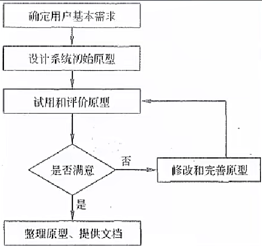

# 软件工程

## 信息系统生命周期

软件工程基本原理：用分阶段的生命周期计划严格管理、坚持进行阶段评审、实现严格的产品控制、采用现代程序设计技术、结果应能清楚的审查、开发小组的人员应少而精、承认不断改进软件工程实践的必要性。

🔺软件工程的基本要素：**方法、工具、过程**。

软件生存周期：可行性分析与项目开发计划、需求分析、概要设计（选择系统解决方案，规划子系统）、详细设计（设计子系统内部具体实现）、编码、测试、维护。

> 🔺五阶段生命周期（常考）【每个阶段是干什么的，及每个阶段的输出】
>
> 系统规划、系统分析、系统设计、系统实施、（官方定义不包括系统验收）、系统运行与维护

1. **系统规划阶段**：任务是对组织的环境、目标及现行系统的状况进行**初步调查**，根据组织目标和发展战略确定信息系统的发展战略，**对建设新系统的需求做出分析和预测**，同时考虑建设新系统所受的各种约束，研究建设新系统的必要性和可能性。根据需要与可能，给出制建系统的备选方案。 

   输出：**可行性研究报告、🔺系统设计任务书**。

2. **系统分析阶段**：任务是根据系统设计任务书所确定的范围，对现行系统进行详细调查，描述现行系统的业务流程，指出现行系统的局限性和不足之处，确定新系统的基本目标和逻辑功能要求，即**提出新系统的逻辑模型**。系统分析阶段又称为**逻辑设计阶段**。这个阶段是**整个系统建设的关键阶段，也是信息系统建设与一般工程项目的重要区别所在**。

   > 做什么 - 逻辑模型

   输出：**系统说明书**。

3. **系统设计阶段**：系统分析阶段的任务是回答系统“做什么”的问题，而系统设计阶段要回答的问题是“怎么做”。该阶段的任务是根据系统说明书中规定的功能要求，具体设计实现逻辑模型的技术方案，也就是设计新系统的物理模型。这个阶段又称为物理设计阶段，可分为总体设计（概要设计）和详细设计两个子阶段。

   > 怎么做 - 把逻辑模型转换为具体的物理模型

   输出：**系统设计说明书（概要设计、详细设计说明书）**。

4. **系统实施阶段**：是**将设计的系统付诸实施的阶段**。这一阶段的任务包括计算机等设备的购置、安装和调试、程序的编写和调试、人员培训、数据文件转换、系统调试与转换等。这个阶段的特点是几个互相联系、互相制约的任务同时展开，必须精心安排、合理组织。系统实施是按实施计划分阶段完成的，每个阶段应写出实施进展报告。系统测试之后写出系统测试分析报告。 

   输出：**实施进展报告、系统测试分析报告**。

5. **系统运行和维护阶段**：系统投入运行后，需要经常进行维护和评价，记录系统运行的情况，根据一定的规则对系统进行必要的修改，评价系统的工作质量和经济效益。 

## 能力成熟度模型

> 国际上认证公司/组织做软件的能力到了哪个级别

### 能力成熟度模型 CMM

| 能力等级                   | 特点                                                         | 关键过程区域                                                 |
| -------------------------- | ------------------------------------------------------------ | ------------------------------------------------------------ |
| 初始级（Initial）          | 软件过程的特点是**杂乱无章**，有时甚至很混乱，几乎没有明确定义的步骤，项目的成功**完全依赖个人的努力和英雄式核心人物的作用**。 | -                                                            |
| **可重复**级（Repeatable） | 建立了**基本的项目管理过程和实践**来跟踪项目费用、进度和功能特性，有**必要的过程**准则来重复以前在同类项目中的成功。 | 软件配置管理、软件质量保证、软件子合同管理、软件项目跟踪与监督、软件项目策划、软件需求管理 |
| 已定义级（Defined）        | 管理和工程两方面的**软件过程已经文档化、标准化，并综合成整个软件开发组织的标准软件过程**。所有项目都采用根据实际情况修改后得到的**标准软件过程来发和维护软件**。（定义了一些规则准则） | 同行评审、组间协调、软件产品工程、集成软件管理、培训大纲、组织过程定义、组织过程焦点 |
| 已管理级（Managed）        | 制定了软件过程和产品质量的**详细度量标准**。对软件过程和产品质量有定量的理解和控制。（定量管理，开发过程数字化） | 软件质量管理和定量过程管理                                   |
| 优化级（Optimized）        | 加强了定量分析，通过来自过程质量反馈和来自新观念、新技术的反馈使过程能**不断持续地改进**。 | 过程更改管理、技术改革管理和缺陷预防                         |

 ### 能力成熟度模型集成 CMMI

是**若干过程模型的综合和改进**，不仅仅针对软件，而是支持**多个工程学科和领域的**、系统的、一致的过程改进框架，能适应现代工程的特点和需要，能提高过程的质量和工作效率。

CMMI 两种表示方法：

1. **阶段式模型**：类似于 CMM，它**关注组织的成熟度**，五个成熟度模型如下：

| 能力等级     | 特点                   | 关键过程区域                                                 |
| ------------ | ---------------------- | ------------------------------------------------------------ |
| 初始级       | 过程不可预测且缺乏控制 | -                                                            |
| **已管理**级 | 过程为项目服务         | 需求管理、项目计划、配置管理、项目监督与控制、供应商合同管理、度量和分析、过程和产品质量保证 |
| 已定义级     | 过程为组织服务         | 需求开发、技术解决方案、产品集成、验证、确认组织级过程焦点、组织级过程定义、组织级培训、集成项目管理、风险管理、集成化的团队、决策分析和解决方案、组织级集成环境 |
| 定量管理     | 过程已度量和控制       | 组织过程性能、定量项目管理                                   |
| 优化级       | 集中于过程改进和优化   | 组织级改革与实施、因果分析和解决方案                         |

> 🔺 c.f. CMM & CMMI
>
> CMM：初始级、可重复级、已定义级、已管理级、优化级
>
> CMMI：初始级、已管理级、已定义级、定量管理、优化级

其中 CMMI 2 - 5 级对应的过程域如下图所示：

| 成熟度等级 | 过程域                                                       |
| ---------- | ------------------------------------------------------------ |
| 已管理级   | 需求管理、项目计划、配置管理、项目监督与控制、供应商合同管理、度量和分析、过程和产品质量保证 |
| 已定义级   | 需求开发、技术解决方案、产品集成、验证、确认、组织级过程焦点、组织级过程定义、组织级培训、集成项目管理、风险管理、集成化的团队、决策分析和解决方案、组织级集成环境 |
| 定量管理级 | 组织级过程性能、定量项目管理                                 |
| 优化级     | 组织级改革与实施、因果分析和解决方案                         |

2. 连续式模型（6个级别）：关注每个过程域的能力，一个组织对不同的过程域可以达到不同的过程域能力等级。

例：

## 软件过程模型

### 瀑布模型(SDLC)

瀑布模型是一个经典的软件生命周期模型，一般**将软件开发分为**：可行性分析（计划）、需求分析、软件设计（概要设计、详细设计）、编码（含单元测试）、测试、运行维护等几个阶段。

> 阶段和阶段之间一般来说只能往下，不能回头，像瀑布一样
>
> 把前一个阶段完全做完确认好，才能进行下一个阶段 
>
> 不解决需求不明确的情况

瀑布模型特点：

1. 从**上一项开发活动接受该项活动的工作对象作为输入**。
2. 利用这一输入，**实施该项活动应完成的工作内容**。
3. 给出该项活动的**工作成果，作为输出**传给下一项开发活动。
4. 对**该项活动的实施工作成果进行评审**。若其工作成果得到确认，则继续进行下一项开发活动；否则返回前一项，甚至更前项的活动。尽量减少多个阶段间的反复。以相对来说较小的费用来开发软件 。

### 螺旋模型

螺旋模型是一个**演化软件过程模型**，将**原型实现的迭代特征与线性顺序（瀑布）模型中控制的和系统化的方面结合**起来。在螺旋模型中，**软件开发是一系列的增量发布**。（原型模型+瀑布模型）

> 瀑布模型的四个步骤 + 原先模型的不断迭代
>
> 🔺风险、大型项目 --> 螺旋模型

开发过程具有**周期性重复的螺旋线状**。四个象限分别标志每个周期所划分的四阶段：**制订计划、风险分析、实施工程和客户评估**。（包含维护周期）

螺旋模型**强调了风险分析**，特别**适用于庞大而复杂的、高风险的系统**。 

### V 模型

V模型从整体上看起来，就是一个V字型的结构，由左右两边组成。左边的下画线分别代表了需求分析、概要设计、详细设计、编码。右边的上画线代表了单元测试、集成测试、系统测试与验收测试。

> 测试应该贯穿信息系统的生命周期，在每个阶段都需要测试

V模型的特点如下：

> 🔺生命周期阶段和测试阶段的对应关系

1. **单元测试**的主要目的是针对**编码过程中**可能存在的各种错误；（单编）
2. **集成测试**的主要目的是针对**详细设计**中可能存在的问题；（集详）
3. **系统测试**主要针对**概要设计**，检查系统作为一个整体是否有效地得到运行；（系概）
4. **验收测试**通常由业务专家或者用户进行，以**确认产品能真正符合用户业务上的需要**。（验需）
5. V模型**用于需求明确和需求变更不频繁**的情形。

> 单元测试的**计划**：详细设计

### 原型化模型

原型化模型**第一步就是创建一个快速原型**，能够满足项目干系人与未来的用户可以与原型进行交互，再通过与相关干系人进行充分的讨论和分析，**最终弄清楚当前系统的需求**，进行了充分的了解之后，在原型的基础上开发出用户满意的产品。

> 先出个原型

原型法认为在很难一下子全面准确地提出用户需求的情况下，原型应当具备的特点如下。

1. **实际可行**
2. 具有**最终系统的基本特征**
3. **构造方便、快速，造价低**。原型法的特点在于原型法**对用户的需求是动态响应、逐步纳入的**。 

### 增量模型

增量模型：首先**开发核心模块功能**，而后与用户确认，之后再开发次核心模块的功能，即每次开发一部分功能，并与用户需求确认，最终完成项目开发，**优先级最高的服务最先交付**。（分期）

特点：但由于并不是从系统整体角度规划各个模块，因此**不利于模块划分**。难点在于**如何将客户需求划分为多个增量**。与原型不同的是增量模型的每一次**增量版本都可作为独立可操作的作品**，而原型的构造一般是为了演示。 

### 喷泉模型

是一种**以用户需求为动力，以对象作为驱动**的模型，适合于🔺**面向对象**的开发方法。使开发过程具有迭代性和无间隙性。 

### 基于构件的开发模型CBSD

利用**预先包装的构件来构造应用系统**。构件可以是组织内部开发的构件，也可以是商品化成品软件构件。特点是**增强了复用性**，在系统开发过程中，会构建一个构件库，供其他系统复用，因此可以提高可靠性，节省时间和成本。

### 形式化方法模型

建立在**严格数学基础**上的一种软件开发方法，主要活动是生成计算机软件形式化的数学规格说明。 

例：

## 信息系统开发方法

### 结构化方法

结构是指系统内各个组成要素（模块）之间的相互联系、相互作用的框架。

结构化方法也称为生命周期法，是一种传统的信息系统开发方法，**由结构化分析（Structured Analysis, SA）、结构化设计（Structured Design, SD）和结构化程序设计（Structured Programming, SP）**三部分有机组合而成，其精髓是自顶向下、逐步求精和模块化设计。（面向数据流、面向过程）

> 结构化分析 SA - 系统分析阶段
>
> 结构化设计 SD - 系统设计阶段
>
> 结构化程序设计 SP - 系统实施阶段
>
> 自顶向下、逐步求精和模块化设计 - 很像瀑布模型，各个阶段之间的界限非常清晰

结构化方法的主要特点:

1. **开发目标清晰化**。结构化方法的系统开发遵循“**用户第一**”的原则。
2. **开发工作阶段化**。每个阶段工作完成后，要**根据阶段工作目标和要求进行审查**，这使各阶段工作有条不紊地进行，便于项目管理与控制。
3. **开发文档规范化**。结构化方法每个阶段工作完成后，要**按照要求完成相应的文档**，以保证各个工作阶段的衔接与系统维护工作的遍历。
4. **设计方法结构化**。在**系统分析与设计时**，从整体和全局考虑，**自顶向下地分解**；在**系统实现时**，根据设计的要求，先编写各个具体的功能模块，然后**自底向上逐步实现整个系统**。 

> 结构化的思想是自顶向下，从整体和全局考虑
>
> 实现的时候是自底向上的

结构化方法的不足和局限：

1. **开发周期长**：按顺序经历各个阶段，直到实施阶段结束后，用户才能使用系统。
2. **难以适应需求变化**：不适用于需求不明确或经常变更的项目。
3. **很少考虑数据结构**：结构化方法是一种面向过程，面向数据流的开发方法，很少考虑数据结构。

结构化方法常用工具 结构化方法一般利用图形表达用户需求，常用工具有**数据流图、数据字典、结构化语言、判定表以及判定树等**。 

### 面向对象方法

面向对象（Object - Oriented, OO）方法认为，客观世界是由各种对象组成的，**任何事物都是对象，每一个对象都有自己的运动规律和内部状态，都属于某个对象类**，是该对象类的一个元素。复杂的对象可由相对简单的各种对象以某种方式而构成，不同对象的组合及相互作用就构成了系统。

 面向对象方法的特点：

1. 使用OO方法构造的系统具有🔺**更好的复用性**（继承），其关键在于建立一个全面、合理、统一的模型（**用例模型和分析模型**-用例图和类图）。 
2. OO方法也划分阶段，但其中的系统分析、系统设计和系统实现三个阶段之间已经**没有“缝隙”**。也就是说，这三个阶段的界限变得不明确，某项工作既可以在前一个阶段完成，也可以在后一个阶段完成；前一个阶段工作做得不够细，在后一个阶段可以补充。
3. 🔺面向对象方法可以**普遍适用于各类信息系统的开发**。 

面向对象方法的不足之处：**必须依靠一定的面向对象技术支持，在大型项目的开发上具有一定的局限性，不能涉足系统分析以前的开发环节**。

当前，一些大型信息系统的开发，通常是**将结构化方法和OO方法结合起来**。首先，使用结构化方法进行自顶向下的整体划分；然后，自底向上地采用OO方法进行开发。因此，结构化方法和OO方法仍是两种在系统开发领域中相互依存的、不可替代的方法。 

### 原型化方法

原型化方法也称为**快速原型法**，或者简称为**原型法**。它是一种根据用户初步需求，利用系统开发工具，**快速地建立一个系统模型展示给用户**，在此基础上与用户交流，最终实现用户需求的信息系统快速开发的方法。

- 按**是否实现功能**分类：分为水平原型（行为原型，功能的导航）、垂直原型（结构化原型，实现了部分功能）。 

- 按**最终结果**分类：分为抛弃式原型、演化式原型。 

#### 原型法的特点

原型法可以**使系统开发的周期缩短，成本和风险降低、速度加快，获得较高的综合开发效益**。 

原型法是🔺**以用户为中心**来开发系统的，用户参与的程度大大提高，开发的系统符合用户的需求，因而增加了用户的满意度，提高了系统开发的成功率。 由于用户参与了系统开发的全过程，对**系统的功能和结构容易理解和接受**，有利于系统的移交，有利于系统的运行与维护。 

#### 原型法的不足之处

**开发的环境要求高。管理水平要求高**（要和用户反复确认）。 

#### 原型法的适用场景及本质 

由以上的分析可以看出，原型法的**优点主要在于能更有效地确认用户需求**。从直观上来看，原型法**适用于那些需求不明确的系统开发**。事实上，对于**分析层面难度大、技术层面难度不大的系统**，适合于原型法开发。

从严格意义上来说，目前的原型法**不是一种独立的系统开发方法，而只是一种开发思想**，它只支持在系统开发早期阶段快速生成系统的原型，没有规定在原型构建过程中必须使用哪种方法。因此，它**不是完整意义上的方法论体系**。这就注定了**原型法必须与其他信息系统开发方法结合使用**。 

### 敏捷开发

敏捷开发是一种**以人为核心、迭代、循序渐进的开发方法**，相对于传统软件开发方法的“非敏捷”，更**强调程序员团队与业务专家之间的紧密协作、面对面的沟通（认为比书面的文档更有效）、频繁交付新的软件版本**、紧凑而自我组织型的团队、**能够很好地适应需求变化的代码编写和团队组织方法**，也**更注重软件开发中人的作用**。

敏捷软件开发宣言：

1. 个体和交互胜过过程和工具
2. 可以工作的软件胜过面面俱到的文档
3. 客户合作胜过合同谈判
4. 响应变化胜过遵循计划 

### 敏捷过程的开发方法

- 结对编程：**一个程序员开发，另一个程序在一旁观察审查代码**，能够有效的提高代码质量，在开发同时对代码进行初步审查，共同对代码负责。
- 自适应开发：强调开发方法的**适应性**（Adaptive）。不象其他方法那样有很多具体的实践做法，它更**侧重为软件的重要性提供最根本的基础**，并从更高的组织和管理层次来阐述开发方法为什么要具备适应性。
- 水晶方法：**每一个不同的项目都需要一套不同的策略、约定和方法论**。
- 特性驱动开发：是一套**针对中小型软件开发项目的开发模式**。是一个**模型驱动的快速迭代开发过程**，它强调的是简化、实用、 易于被开发团队接受，适用于需求经常变动的项目。
- 极限编程XP：核心是**沟通、简明、反馈和勇气**。因为知道计划永远赶不上变化，XP**无需开发人员在软件开始初期做出很多的文档**。XP提倡**测试先行**，为了将以后出现bug的几率降到最低。
- 并列争球法SCRUM：是一种**迭代的增量化过程**，把**每段时间（30天）一次的迭代称为一个“冲刺”** ，并按需求的优先级别来实现产品，多个自组织和自治的小组并行地递增实现产品。 

### 统一过程（RUP）

提供了在开发组织中**分派任务和责任的纪律化方法**。它的目标是**在可预见的日程和预算前提下，确保满足最终用户需求的高质量产品**。

- 3个显著特点：**用例驱动、以架构为中心、迭代和增量**。

- 4个流程：**初始阶段、细化阶段、构建阶段和交付阶段**。每个阶段结束时都要安排一次技术评审，以确定这个阶段的目标是否已经达到。

  > 初始 - 需求分析；细化 - 设计；构建 - 实施；交付 - 运行和维护

- 适用：一个**通用过程框架**，可以用于种类广泛的软件系统、不同的应用领域、不同的组织类型、不同性能水平和不同的项目规模。

例：

## 软件产品线

软件产品线是一个**产品集合**，这些产品**共享一个公共的、可管理的特征集，这个特征集能满足特定领域的特定需求**。软件产品线是一个十分适合专业的开发组织的软件开发方法，能有效地提高软件生产率和质量，缩短开发时间，降低总开发成本。（按业务领域，可复用）

**核心资源**：包括所有产品所共用的软件架构，**通用**的构件、文档等。

**产品集合**：产品线中的各种产品。

#### 产品线的建立方式

|              | 演化方式                                                     | 革命方式                                                     |
| ------------ | ------------------------------------------------------------ | ------------------------------------------------------------ |
| 基于现有产品 | 基于现有产品架构设计产品线的架构，经演化现有构件，开发产品线构件（在原来的产品上做升级 1.0 -> 2.0） | 核心资源的开发基于现有产品集的需求和可预测的、将来需求的超集（基于现有产品，重新做一个新的产品） |
| 全新产品线   | 产品线核心资源随产品新成员的需求而演化                       | 开发满足所有预期产品线成员的需求的核心资源                   |

## 软件复用

软件复用是**将已有软件的各种有关知识用于建立新的软件，以缩减软件开发和维护的花费**。软件复用是提高软件生产力和质量的一种重要技术。早期的软件复用主要是**代码级复用**，被复用的知识专指程序，后来扩大到包括**领域知识、开发经验、设计决定、体系结构、需求、设计、代码和文档等一切有关方面**。 

## 逆向工程

软件的逆向工程是**分析程序，力图在比源代码更高抽象层次上建立程序的表示过程**，逆向工程是**设计的恢复过程**。

> 通过一个二进制的 bin 文件，看是否能恢复其源代码，debug ...

逆向工程的四个级别：

- **实现级**：包括程序的抽象语法树、符号表、过程的设计表示。
- **结构级**：包括反映程序分量之间相互依赖关系的信息，例如调用图、结构图、程序和数据结构。
- **功能级**：包括反映程序段功能及程序段之间关系的信息，例如数据和控制流模型。
- **领域级**：包括反映程序分量或程序诸实体与应用领域概念之间对应关系的信息，例如E-R模型。

 其中，**领域级抽象级别最高，完备性最低，实现级抽象级别最低，完备性最高**。 

与逆向工程相关的概念有重构、设计恢复、再工程和正向工程。

- 重构是指在**同一抽象级别上转换系统描述形式**。
- 设计恢复是指借助工具**从已有程序中抽象出有关数据设计**、总体结构设计和过程设计等方面的信息。
- 再工程是指**在逆向工程所获得信息的基础上，修改或重构已有的系统，产生系统的一个新版本**。再工程是对**现有系统的重新开发过程**，包括**逆向工程、新需求的考虑过程和正向工程**三个步骤。它不仅能从已存在的程序中重新获得设计信息，而且还能使用这些信息来重构现有系统，以改进它的综合质量。在利用再工程重构现有系统的同时，一般会增加新的需求，包括增加新的功能和改善系统的性能。
- 正向工程是指不仅从现有系统中恢复设计信息，**而且使用该信息去改变或重构现有系统**，以改善其整体质量。 

软件系统工具通常可以按软件过程活动将软件工具分为软件开发工具、软件维护工具 、软件管理和软件支持工具。

- **软件开发工具**：需求分析工具、设计工具、编码与排错工具。
- **软件维护工具**：版本控制工具、文档分析工具、开发信息库工具、逆向工程工具、再工程工具。
- **软件管理和软件支持工具**：项目管理工具、配置管理工具、软件评价工具、软件开发工具的评价和 选择。

例：

补充：

软件系统工具通常可以按软件过程活动将软件工具分为软件开发工具、软件维护工具 、软件管理和软件支持工具。

- **软件开发工具**：需求分析工具、设计工具、编码与排错工具。
- **软件维护工具**：版本控制工具、文档分析工具、开发信息库工具、逆向工程工具（已交付产品）、再工程工具。
- **软件管理和软件支持工具**：项目管理工具、配置管理工具、软件评价工具、软件开发工具的评价和选择。

