# 计算机系统知识

（补：硬件组成，CPU，编码，浮点数）

## 硬件组成

运算器、控制器、存储器、输入设备、输出设备

## CPU

### 运算器

功能：

1. 执行所有的算术运算
2. 执行所有的逻辑运算并进行逻辑测试

## 指令系统

#### 计算机指令的组成

一条指令由**操作码**和**操作数**两部分组成  --> **操作码 | 地址码**

操作码决定要完成的操作，操作数指参加运算的数据及其所在的单元地址。

在计算机中，操作要求和操作数地址都由二进制数码表示，分别称作操作码和地址码，整条指令以二进制编码的形式存放在存储器中。

#### 计算机指令执行过程

取指令 -- 分析指令 -- 执行指令

1. 将程序计数器PC（存储下一条指令的执行地址）中的指令地址取出，送入地址总线
2. CPU依据指令地址去内存中取出指令内容存入指令寄存器IR（暂存指令）
3. 由指令译码器ID（对指令进行分析）进行分析，分析指令操作码
4. 执行指令，取出指令执行所需的源操作数

#### 指令寻址方式

- 顺序寻址方式

当执行一段程序时，是一条指令接着一条指令地顺序执行 （地址都在程序计数器 PC 中）

- 跳跃寻址方式

指下一条指令的地址码**不是由程序计数器给出，而是由本条指令直接给出**。程序跳跃后，按新的指令地址开始顺序执行。因此，程序计数器的内容也必须相应改变，以便及时跟踪新的指令地址。

#### 指令操作数的寻址方式

- 立即寻址方式：指令的**地址码字段指出的不是地址，而是操作数本身**

 操作码 | 操作数本身

- 直接寻址方式：在指令的地址字段中直接指出**操作数在主存中的地址** （比较规矩）

  操作码 | 操作数地址（地址码）

- 间接寻址方式：指令地址码字段所指向的**存储单元中存储的是操作数的地址**

  操作码 | 存储操作数地址的地址（找两次，访问两次主存）

- 寄存器寻址方式：指令中的地址码是**寄存器的编号** （操作数存在寄存器里）

- 基址寻址方式：将基址寄存器的内容加上指令中的形式地址而形成操作数的有效地址，其优点是可以扩大寻址能力

- 变址寻址方式：变址寻址方式计算有效地址的方法与基址寻址方式很相似，它是将变址寄存器的内容加上指令中的形式地址而形成操作数的有效地址。

#### 指令系统类型

CISC (complex) 复杂指令系统，兼容性强，指令繁多、长度可变，由微程序实现

RISC (reduced) 精简指令系统，指令少，使用频率接近，主要依靠硬件实现（通用寄存器、硬布线逻辑控制）

|              |                                                              |            |                                                              |                            |
| ------------ | ------------------------------------------------------------ | ---------- | ------------------------------------------------------------ | -------------------------- |
| 指令系统类型 | 指令                                                         | 寻址方式   | 实现方式                                                     | 其它                       |
| CISC         | 数量多，使用频率差别大，可变长格式                           | 支持多种   | **微程序控制技术（微码）**                                   | 研制周期长                 |
| RISC         | 数量少，使用频率接近定长格式，大部分为单周期指令，操作寄存器，只有Load/Store操作内存 | 支持方式少 | 增加了**通用寄存器**；硬布线**逻辑控制为主**；适合采用**流水线** | 优化编译，有效支持高级语言 |

#### 流水线 （RISC 中才用）

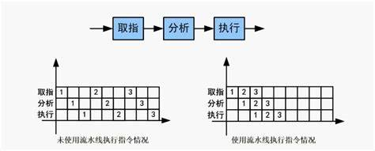

##### 流水线时间计算

- 流水线周期：指令分成不同执行段，其中执行时间最长的段为流水线周期。

- 时间公式：1条指令执行时间+(指令条数-1)*流水线周期

- 流水线吞吐率：单位时间内执行的指令条数

 公式：指令条数/流水线执行时间

- 流水线的加速比：加速比即使用流水线后的效率提升度，即比不使用流水线快了多少倍，越高表明流水线效率越高

 公式：不使用流水线执行时间/使用流水线执行时间

例：

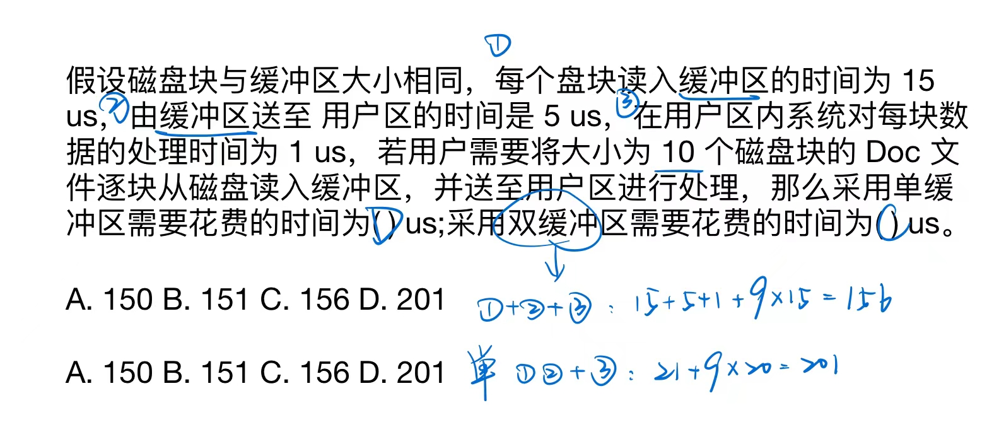

## 存储系统

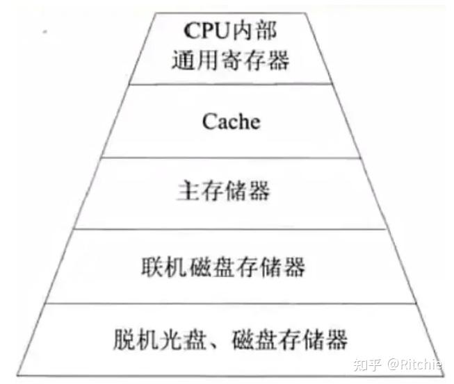

**上-下：速度快-慢，容量小-大**

计算机采用分级存储体系的主要目的是为了**解决存储容量、成本和速度之间的矛盾问题**

两级存储：cache-主存、主存-辅存（虚拟存储体系）

局部性原理：在CPU运行时，所访问的数据会趋向于一个较小的局部空间地址内（怎么知道哪些数据需要放在 cache 里）

- 时间局部性原理：如果一个数据项正在被访问，那么在近期它很可能会被再次访问，即在相邻的时间里会访问同一个数据项。
- 空间局部性原理：在最近的将来会用到的数据的地址和现在正在访问的数据地址很可能是相近的，即相邻的空间地址会被连续访问。

### Cache

Cache由**控制部分**和**存储器**组成，存储器存储数据，控制部分判断CPU要访问的数据是否在Cache中，在则命中，不在则依据一定的算法从主存中替换。

#### 地址映射

在CPU工作时，**送出的是主存单元的地址**，而**应从Cache存储器中读/写信息**。这就需要**将主存地址转换为Cache存储器地址**，这种地址的转换称为地址映像，**由硬件（!!!!!）自动完成映射**，分为下列三种方法：

- 直接映射：Cache 和 主存两者块号相同才能命中（无所谓区号）（**冲突大**）

- 全相联映射：主存中任意一块都与Cache中任意一块对应，因此可以随意调入Cache任意位置

  缺点：地址变换复杂，速度较慢

  优点：**不容易发生冲突**（主存可以随意调入Cache任意块，只有当Cache满了才会发生块冲突）

- 组组相连映像：自前面两种方式的**结合**，组间采用直接映像，即主存中组号与Cache中组号相同的组才能命中，但是组内全相联映像，也即组号相同的两个组内的所有块可以任意调换。

#### 替换算法

替换（Cache满了的时候）算法的目标就是使Cache 获得尽可能高的命中率。

- 随机替换算法：用随机数发生器产生一个要替换的块号，将该块替换出去

- 先进先出算法：将最先进入Cache的信息块替换出去
- 近期最少使用算法：将近期最少使用的Cache 中的信息块替换出去
- 优化替换算法：先执行一次程序，统计Cache的替换情况；有了这样的先验信息，在第二次执行该程序时便可以用最有效的方式来替换

#### 命中率及平均时间

命中率：当CPU所访问的数据在cache中时，命中，直接从Cache中读取数据

设读取一次Cache时间为`1ns`，若CPU访问的数据不在Cache中则需要从内存中读取，设读取一次内存的时间为 `1000ns`，若在CPU多次读取数据过程中，有90%命中Cache，则CPU读取一次的平均时间为`(90%*1+10%*1000)ns`

Cache 容量与命中率的关系↓：**容量越大，命中率越高**

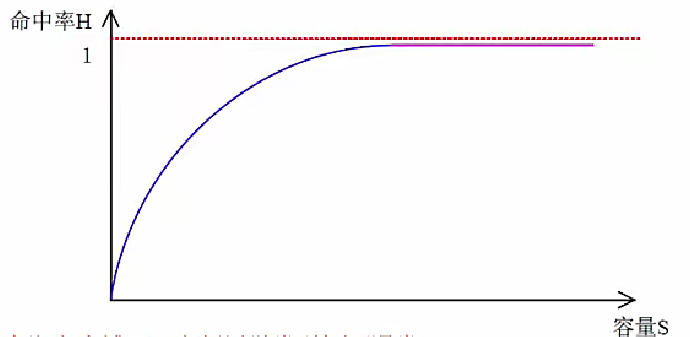

### 存储系统

> 基本概念：K, M, G 是数量但我，在存储器里相差 1024 (2^10) 倍，b, B 是存储单位，1B = 8b

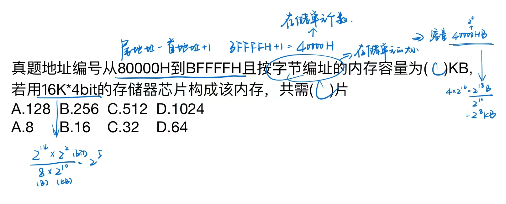

#### 磁盘结构和参数

磁盘有正反两个盘面，每个盘面有多个同心圆，每个同心圆是一个磁道，每个同心圆又被划分为多个扇区，数据就被存放在一个个**扇区**（最小计数单位）中。

磁头首先要寻找到对应的磁道，然后等待磁盘进行**周期旋转**，旋转到指定的扇区，才能读取到对应的数据（转速就是读取速 7200r/s 之类），因此，会产生**寻道时间**和**等待时间**。

公式为：存取时间=寻道时间+等待时间(平均定位时间+转动延迟)

注意：寻道时间是指磁头移动到磁道（同心圆）所需的时间；等待时间为等待读写的扇区转到磁头下方所用的时间。

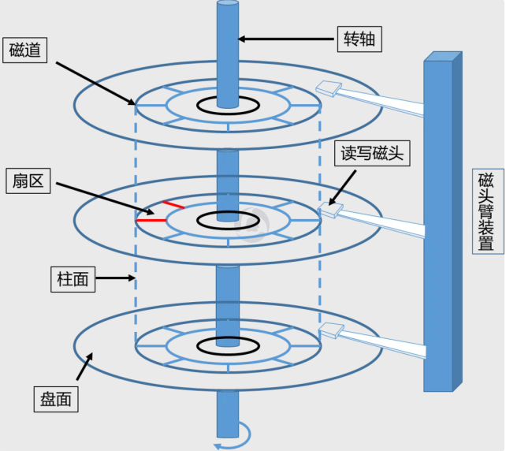

#### 磁盘调度算法

磁盘数据的读取时间：寻道时间+旋转时间

即先找到对应的磁道，而后再旋转到对应的扇区才能读取数据，其中**寻道时间耗时最长**

- 先来先服务`FCFS`：根据进程请求访问磁盘的先后顺序进行调度。

- 最短寻道时间优先`SSTF`：请求访问的磁道与当前磁道最近的进程优先调度，使得每次的寻道时间最短。会产生“饥饿”现象，即远处进程可能永远无法访问。

- （!!）扫描算法`SCAN`：又称“电梯算法”，磁头在磁盘上双向移动，其会选择离磁头当前所在磁道最近的请求访问的磁道，并且与磁头移动方向一致，**磁头永远都是从里向外或者从外向里一直移动完才掉头**，与电梯类似。

  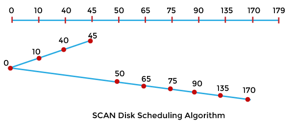

- 单向扫描调度算法`CSCAN`：与SCAN不同的是，其只做单向移动，即只能从里向外或者从外向里。（扫描到该方向的末端，会跳到另一个末端，服务于同一方向上的请求）

  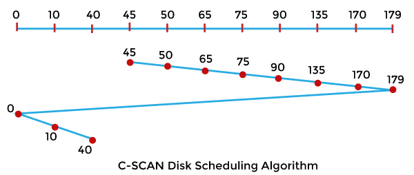

例：

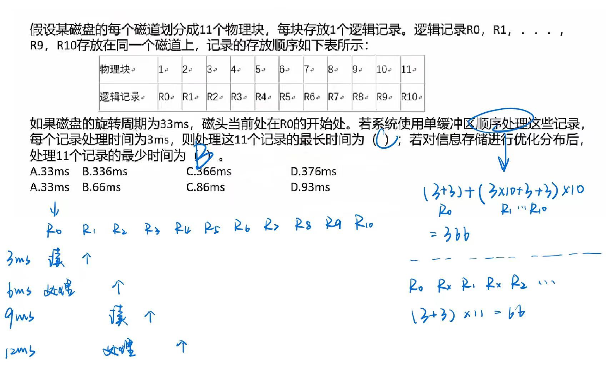

## 输入输出技术

#### 计算机系统中存在多种内存与接口（输入输出技术）地址的编址方法

- 内存与接口地址独立编址方法

内存地址和接口地址是**完全独立的两个地址空间**。访问数据时所使用的指令也完全不同，用于接口的指令只用于接口的读/写，其余的指令全都是用于内存的因此，在编程序或读程序时很易使用和辨认。这种编址方法的缺点是**用于接口的指令太少、功能太弱**。

- 内存与接口地址**统一编址**方法

内存地址和接口地址统一在一个公共的地址空间里，即内存单元和接口**共用地址空间**，优点是原则上**用于内存的指令全都可以用于接口**，这就大大地增强了对接口的操作功能，而且在指令上也不再区分内存或接口指令。该编址方法的**缺点就在于整个地址空间被分成两部分**，其中一部分分配给接口使用，剩余的为内存所用，这经常会**导致内存地址不连续**。

#### （!!!）计算机和外设间的数据交互方式

- 程序控制(查询)方式

  CPU主动查询外设是否完成数据传输，效率极低。（CPU 等待外设传输完成，再往下执行，外设相对于 CPU 来说效率极低，串行模式）

- 程序中断方式

  外设完成数据传输后，**向CPU发送中断**，等待CPU处理数据效率相对较高。**中断响应时间**指的是从发出中断请求到开始进入中断处理程序；**中断处理时间**指的是从中断处理开始到中断处理结束。**中断向量**提供中断服务程序的入口地址。多级中断嵌套，使用堆栈来保护断点和现场。（并行模式）

- `DMA`方式（直接主存存取）

  CPU只需完成必要的初始化等操作，数据传输的整个过程都由`DMA`控制器来完成，**在主存和外设之间建立直接的数据通路**（**!!! 整个过程不需要 CPU 参与**）效率很高。（并行模式）

在一个总线周期（`DMA`请求相当于建了个通道，相当于一个总线周期）结束后，CPU会响应`DMA`请求开始读取数据；

**CPU响应程序中断方式请求是在一条指令**（取值开始到分析执行结束  --> 一个指令周期）**执行结束时**（!!! 中断请求不会打断当前指令）。

> 时钟频率的倒数是时钟周期，CPU里最小的时间单位

#### 中断流程

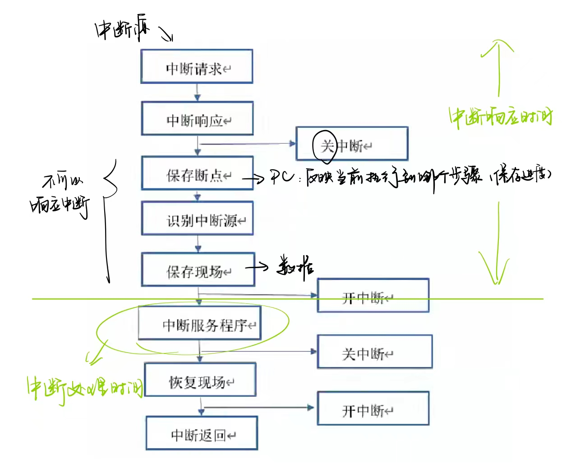

#### 总线结构

总线(Bus)，是指**计算机设备和设备之间传输信息的公共数据通道**。总线是连接计算机硬件系统内多种设备的通信线路，它的一个重要特征是**由总线上的所有设备共享**，因此可以将计算机系统内的多种设备连接到总线上。

从广义上讲，任何连接两个以上电子元器件的导线都可以称为总线，通常分为以下三类：

- 内部总线：内部芯片级别的总线（看不见），芯片与处理器之间通信的总线。

- 系统总线：是板级总线（计算机内部，拆机可见），用于计算机内各部分之间的连接，具体分为**数据总线（并行数据传输位数 64/32位）、地址总线（系统可管理的内存空间的大小）、控制总线（传送控制命令）**（!!!!!! 考试考的总线类型）。代表的有ISA总线、EISA总线、PCI总线。

- 外部总线：设备一级的总线，微机和外部设备的总线。代表的有RS232(串行总线)、SCSI(并行总线)、USB(通用串行总线，即插即用，支持热插拔)

例：

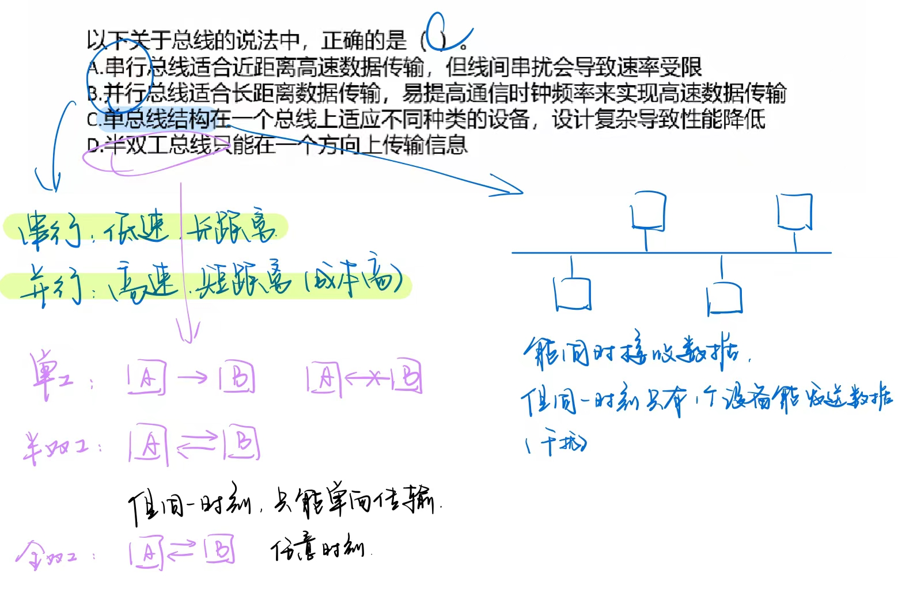

#### 计算机可靠性

**可靠性指标**

- 平均无故障时间 `MTTF=1/失效率`

- 平均故障修复时间 `MTTR=1/修复率`

- 平均故障间隔时间 `MTBF=MTTF+MTTR`

- 系统可用性 = `MTTF/(MTTF+MTTR)*100%`

**串并联系统可靠性**
假设每个设备的可靠性为`R1, R2, ..., Rn`，则不同的系统的可靠性公式如下：

- 串联系统，一个设备不可靠，整个系统崩溃，整个系统可靠性 `R=R1*R2*..*Rn`

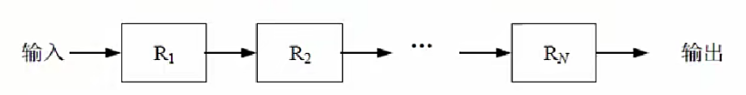

- 并联系统，所有设备都不可靠，整个系统才崩溃，整个系统可性`R=1-(1-R1)*(1-R2)*...*(1-Rn)`（用不可靠性计算可靠性）

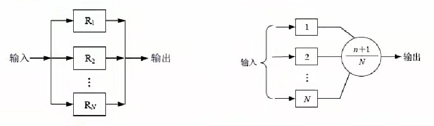

- N模冗余系统：N模冗余系统由N个`(N=2n+1)`相同的子系统和一个表决器组成，表决器把N个子系统中占多数相同结果的输出作为输出系统的输出，如图所示。在N个子系统中，只要有n+1个或n+1个以上子系统能正常工作，系统就能正常工作，输出正确的结果。（少数服从多数，表决器）
